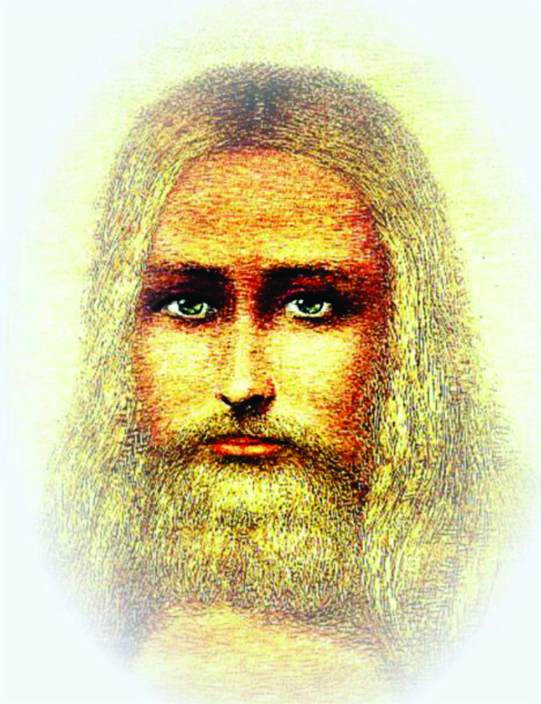

_“ Qual o tipo mais perfeito que Deus tem oferecido ao homem, para lhe servir de guia e modelo?_  
Jesus.

Para o homem, Jesus constitui o tipo da perfeição moral a que a Humanidade pode aspirar na Terra. Deus no-lo oferece como o mais perfeito modelo e a doutrina que ensinou é a expressão mais pura da lei do Senhor, porque, sendo ele o mais puro de quantos têm aparecido na Terra, o Espírito Divino o animava.

Quanto aos que, pretendendo instruir o homem na lei de Deus, o têm transviado, ensinando-lhe falsos princípios, isso aconteceu por haverem deixado que os dominassem sentimentos demasiado terrenos e por terem confundido as leis que regulam as condições da vida da alma, com as que regem a vida do corpo. Muitos hão apresentado como leis divinas simples leis humanas estatuídas para servir às paixões e dominar os homens.”  
(Allan Kardec. O livro dos Espíritos. FEB. 33.ed., perg. 625)

**A direção do planeta Terra**

“Jesus, cuja perfeição se perde na noite imperscrutável das eras, personificando a sabedoria e o amor, tem orientado todo o desenvolvimento da Humanidade terrena, enviando os seus iluminados mensageiros, em todos os tempos, aos agrupamentos humanos e, assim como presidiu à formação do orbe, dirigindo, como Divino Inspirador, a quantos colaboraram na tarefa da elaboração geológica do planeta e da disseminação da vida em todos os laboratórios da Natureza, desde que o homem conquistou a racionalidade, vem-lhe fornecendo a ideias da sua divina origem, o tesouro das concepções de Deus e da imortalidade do espírito, revelando-lhe, em cada época, aquilo que a sua compreensão pode abranger.” Emmanuel. _Emmanuel_. FEB. 7.ed., p.20)

**O Divino Legado**

“ O divino legado de Jesus, que a Humanidade Terrena ainda não quis aceitar e não pôde perceber, é o de um mundo feliz, de paz e amor, sem injustiças, sem opróbrios, sem miséria, sem orfandade, sem crimes e nem ódios, sem fratricídios e sem guerras, onde todos, solidários e progressistas, criarão a Beleza, desenvolverão a Ciência e as Artes, a Filosofia e a Técnica, com trabalho digno e repouso honesto, na nobreza do lar  na administração operosa e esclarecida.” (Áureo. _Universo e vida_. Psicografado por Hernani T. Sant’Anna.FEB. 4.ed., p.123-124)

**Deus e Jesus**

“Ao lermos as páginas lustrais dos Evangelhos, é emocionante constatarmos o amor supremo e constante que Jesus revela pelo seu Pai Celeste:

“Eu e o Pai somos um. Estou Nele e Ele em mim. Ninguém conhece o Filho senão o Pai, e ninguém conhece o Pai senão o Filho. O Pai ama Filho e tudo confiou às suas mãos. Tudo o que é dele é meu.

Meu Pai trabalha sempre, e eu trabalho também.

Pai, santificado seja o teu nome, venha o teu reino!

Todo aquele que meu Pai me dá virá a mim, e eu de modo algum o lançarei fora. Honro a meu Pai, e se alguém me servir, meu Pai o honrará.

Sede perfeitos com é o Vosso Pai Celeste. Se vós, que sois maus, sabeis dar boas dádivas aos vossos filhos, quanto mais vosso Pai que está nos céus. Sede misericordiosos como o vosso Pai.

Pai, nas tuas mãos entrego a meu espírito!

O Filho do Homem há de vir na glória do seu Pai, com os seus anjos, e então retribuirá a cada um conforme as suas obras.

Pai, tudo te é possível!

Subo para meu Pai e vosso Pai, meu Deus e vosso Deus.

Meu Pai é maior do que eu.”

(Mateus, 5:48, 7:11, 11:27, 16:27; Marcos 14:36; Lucas 6:36, 11:12, 23:34, 23:36 e João 5:17, 6:37, 8:49, 12:26, 14:2, 10 a 28, 16:15 e 20:17)

Em sua completa comunhão como Pai Criador, nosso divino Mestre foi modelo perfeito da completa obediência ao Supremo Senhor, a quem sempre fez questão de testemunhar fidelidade filial absoluta. “Quem fala por si mesmo – disse – está procurando a sua própria glória; mas o que procura a glória de quem o enviou, esse é verdadeiro.”

E acrescentou:

“Não vim de moto próprio, vim de Deus, que me enviou. Não falo por mim mesmo: digo no mundo o que aprendi de meu Pai, o que ele me ordenou anunciar. Quem é de Deus ouve as palavras de Deus. As Palavras que vos digo são espírito e vida (João 6:63, 8:28, 42-47, e 13:49-50).”(Hernani T. Sant’Anna, Notações de um aprendiz, P. 21-22).  

Quer saber mais? Estude o livro **_Conheça o Espiritismo_** [editoraautadesouza.com.br](http://www.editoraautadesouza.com.br/)