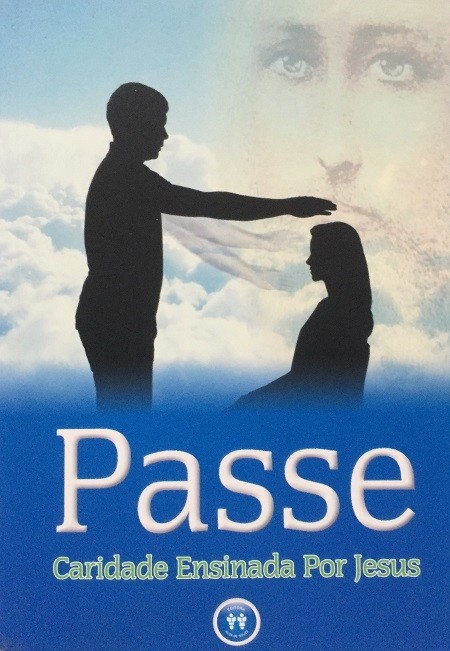

“Atualmente, no Cristianismo redivivo, temos, de novo, o movimento socorrista do plano invisível, através da imposição das mãos. Os passes \[…\] representam a continuidade do esforço do Mestre para atenuar os sofrimentos do mundo.”

Participemos deste movimento socorrista!

Auxiliemos o Cristo a atenuar os sofrimentos do mundo!

Preparemos as Casas Espíritas para ampliar o trabalho do passe, pois “Não tardará o dia em que se generalizar”. Para tanto, é urgente que organizemos cursos para formação de passistas e estabeleçamos procedimento homogêneo, “seguido, regular, metódico”, em que os médiuns “saibam conduzir-se convenientemente”. (Livro Passe. Editora Auta de Souza. 1.ed. Apresentação)

O livro Passe – Caridade Ensinada por Jesus está organizado em 14 capítulos que partem desde a aplicação do passe na revelação divina até a prática do passe na formação de médiuns para a Casa Espírita.

Para melhor compreensão acerca de seu conteúdo, segue um breve comentário de cada capítulo:

**1 – Progressividade da revelação divina na compreensão e aplicação do passe**

“Nenhuma ciência existe que haja saído prontinha do cérebro de um homem. Todas, sem exceção de nenhuma, são fruto de observações sucessivas, apoiadas em observações precedentes, como em um ponto conhecido, para chegar ao desconhecido. Foi assim que os Espíritos procederam, com relação ao Espiritismo. Daí o ser gradativo o ensino que ministram.” (g.n.) Allan Kardec. A Gênese, FEB. Cap. I. Item 54.

**2 – O Espiritismo amplia a compreensão e aplicação do magnetismo e do passe**

“O conhecimento da mediunidade é uma das conquistas que devemos ao Espiritismo; \[…\] embora parte integrante do Espiritismo, ela é, por si só, toda uma ciência, porque se liga ao magnetismo, e não só abarca todas as doenças propriamente ditas, mas todas as variedades, tão numerosas e tão complexas, das obsessões, que, por seu turno, também influem sobre o organismo.” Allan Kardec. Revista Espírita. Setembro de 1865. p. 345.

**3 – Fluido cósmico universal – princípio básico para a compreensão e aplicação do passe**

“O fluido cósmico universal é, \[…\], a matéria elementar primitiva, cujas modificações e transformações constituem a inumerável variedade dos corpos da Natureza.” Allan Kardec. A gênese. FEB. Cap. XIV. item 2.

**4 – O ser humano e seus corpos**

“Da sensação à irritabilidade, da irritabilidade ao instinto, do instinto à inteligência e da Inteligência ao discernimento, séculos e séculos correram incessantes. \[…\]

No corpo humano, temos na Terra o mais sublime dos santuários e uma das supermaravilhas da Obra Divina. \[…\]

O perispírito é, ainda corpo organizado que, representando o molde fundamental da existência para o homem, subsiste, além do sepulcro” Emmanuel. Roteiro. FEB. Cap. 3-6.

**5 – Aura e centros de Força**

“A alma não se acha encerrada no corpo, qual pássaro numa gaiola. Irradia e se manifesta exteriormente, como a luz através de um globo de vidro, ou como o som em torno de um centro de sonoridade. Neste sentido se pode dizer que ela é exterior, sem que por isso constitua o envoltório do corpo.” (g.n.) Allan Kardec. O Livro dos Espíritos. FEB. perg. 141.

**6 – Passe – energia humana, espiritual e divina**

“Todo efeito mediúnico, como já foi dito, resulta da combinação dos fluidos que emitem um Espírito e um médium. Pela sua conjugação esses fluidos adquirem propriedades novas, que separadamente não teriam, ou, pelo menos, não teriam no mesmo grau.” Allan Kardec. Obras póstumas. FEB. 1ª parte. Item 52.

**7 – Divina unidade entre plano físico e espiritual no passe e fluidificação da água**

“Os Emissários Espirituais dos Planos Divinos não ditam mensagens, desde os albores da Codificação Kardequiana, somente com interesse literário. Visam a elevado fim: a instrução da Humanidade.” Inácio Bittencourt. Autores Diversos. Seareiros de Volta, lição A conclusão da pesquisa. 

**8 – A prática do Passe**

“Atualmente, no Cristianismo redivivo, temos, de novo, o movimento socorrista do plano invisível, através da imposição das mãos. Os passes, como transfusões de forças psíquicas, em que preciosas energias espirituais fluem dos mensageiros do Cristo para os doadores e beneficiários, representam a continuidade do esforço do Mestre para atenuar os sofrimentos do mundo.” Emmanuel. Caminho, Verdade e Vida. FEB. Lição 153. 

**9 – Imposição de mãos, passe longitudinal e autopasse**

“\[…\] Podendo o Espírito encarnado atuar sobre a matéria elementar, pode do mesmo modo mudar-lhe as propriedades, dentro de certos limites. Assim se explica a faculdade de cura pelo contato e pela imposição das mãos, faculdade que algumas pessoas possuem em grau mais ou menos elevado.” Allan Kardec. O Livro dos médiuns. FEB. Item 131.

**10 – Passe Rotatório, transversal e perpendicular**

“Recorde-se de Pedro, exortando o paralítico, à entrada do Templo de Jerusalém: ‘Não tenho prata nem ouro para te dar; mas o que tenho dou-te: levanta-te e anda em nome de Nosso Senhor Jesus Cristo’ e faça o mesmo. Diversos Espíritos. Crestomatia da imortalidade. Lição 25.

**11 – Ação magnética da Prece e do tratamento à distância**

“A oração é divino movimento do espelho de nossa alma no rumo da Esfera Superior, para refletir-lhe a grandeza. Reportamos-nos aqui ao apelo vivo do espírito às Potências Celestes, quer vestido na fórmula verbal, quer absolutamente sem ela, na silenciosa mensagem da vibração. Imaginemos a face de um espelho voltada para o Sol, desviando-lhe o fulgor na direção do abismo.” Emmanuel. Pensamento e vida. FEB. Cap. 26.

**12 – Passe, eficaz em todos os tratamentos**

“Nesse estado de ambientação, ao influxo dos passes recebidos, as oscilações mentais do enfermo se condensam, mecanicamente, na direção do trabalho restaurativo, passando a sugeri-lo às entidades celulares do veículo em que se expressam, e os milhões de corpúsculos do organismo fisiopsicossomático tendem a obedecer, institivamente, às ordens recebidas, sintonizando-se com os propósitos do comando espiritual que os agrega.” André Luiz. Mecanismos da Mediunidade, cap. 22.

**13 – Rotina no serviço de passe**

“Não tardará o dia em que se generalizará o mecanismo, das transfusões de recursos vitalizantes de coração a coração e mente a mente, entre os encarnados.

Valorizemos o passe, esquecendo os preconceitos.

Não menospreza essa modalidade de tratamento, a mais antiga e mais razoável, mais barata e mais livre. Acima de tudo, a que mais resistirá pelo tempo afora por basear-se na essência mesma das necessidades espirituais. (g.n.) Kelvin Van Dine. Técnica de viver. Lição 58.

**14 – Cursos no plano espiritual – exemplos para a formação de médiuns na Casa Espírita**

“Dissemos que o Espiritismo é toda uma ciência, toda uma filosofia. Quem, pois, seriamente queira conhece-lo deve, como primeira condição, dispor-se a um estudo sério e persuadir-se de que ele não pode, como nenhuma outra ciência, ser aprendido a brincar.” Allan Kardec. O Livro dos Médiuns. FEB. Item 18. 

Conheça melhor a obra  Passe – Caridade Ensinada por Jesus em [Editora Auta de Souza](http://www.editoraautadesouza.com.br/index.asp?idproduto=353111)