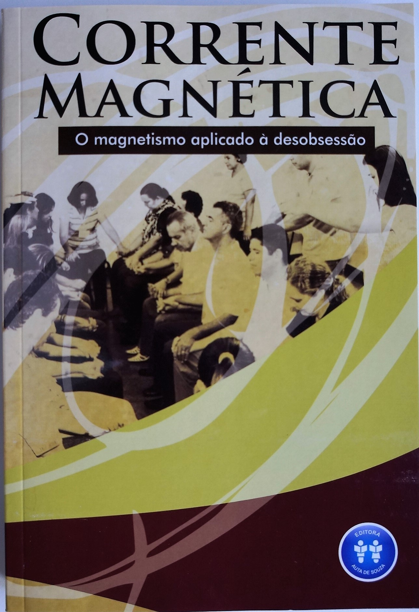

#### **O espiritismo e o magnetismo formam uma única ciência**

“O espiritismo e o magnetismo nos dão a chave de uma imensidade de fenômenos sobre os quais a ignorância teceu um sem número de fábulas, em que os fatos se apresentam exagerados pela imaginação. O conhecimento lúcido dessas duas ciências que, a bem dizer, formam uma única, mostrando a realidade das coisas e suas verdadeiras causas, constitui o melhor preservativo contra as ideias supersticiosas, por que revela o que é possível e o que é impossível, o que está nas leis da Natureza e o que não passa de ridícula crendice”  
Allan Kardec, O livro dos Espíritos, 77 ed., Perg 555 

#### A existência e a manifestação da alma são a base

“Quando aparecerem os primeiros fenômenos espíritas, algumas pessoas pensaram que essa descoberta – se podemos aplicar-lhes esse nome – ia desfechar um golpe fatal no magnetismo e que com ele ocorreria o mesmo que aconteceu com as demais invenções: a mais aperfeiçoada faz esquecer a precedente. Tal erro não tardou em dissipar-se e prontamente se reconheceu o parentesco dessas duas ciências. Ambas, com efeito, baseadas sobre a existência e a manifestação da alma, longe de se combateram, podem e devem prestar-se um mútuo apoio: completam-se e se explicam uma pela outra  
Allan Kardec, Revista Espírita, Março de 1858, 2 ed.,pág. 148 

#### A intervenção de seres espirituais no fenômeno magnético

“Fenômenos magnéticos tornam evidente não só a existência da alma, mas também a sua imortalidade; \[…\] Seres sobre-humanos, mas não sobrenaturais, vivem junto de nós, testemunhas mudas dos nossos atos, e só manifestando a sua existência em condições determinadas, sob a ação de leis naturais, exatas, rigorosas. Importa penetrar o segredo dessas leis, porque, de seu conhecimento, decorrerá para o homem a posse de forças consideráveis, cuja utilização prática pode transformar a face da Terra e a ordem das sociedades.”  
Leon Denis, Depois da Morte, 18 Ed, Pág. 157, 154 

#### O Magnetismo preparou o caminho do Espiritismo

“O Magnetismo preparou o caminho do Espiritismo, e o rápido progresso dessa última doutrina se deve, incontestavelmente, à vulgarização das ideias sobre a primeira. Dos fenômenos magnéticos, do sonambulismo e do êxtase às manifestações espíritas não há mais que um passo, tal é sua conexão que, por assim dizer, torna-se impossível falar de um sem falar do outro. Se tivéssemos que ficar fora da ciência magnética, nosso quadro seria incompleto e poderíamos se comparados a um professor de física que se abstivesse de falar da luz.”  
Allan Kardec, Revista Espírita, Março de 1858, 2ed. Pág. 149 

#### Todos os espíritas admitem o magnetismo

“O magnetismo e o Espiritismo são, com efeito, duas ciências gêmeas, que se completam e explicam uma pela outra, e das duas, a que não quer imobilizar-se não pode chegar ao seu complemento sem se apoiar na sua congênere; isoladas uma da outra, detêm-se num impasse; são reciprocamente como a Física e a Química, a Anatomia e a Fisiologia. A maioria dos magnetistas compreende de tal modo por intuição a relação íntima que deve existir entre as duas coisas, que geralmente se prevalecem de seus conhecimentos em magnetismo, como meio de introdução junto aos espíritas Em todos os tempos os magnetistas foram divididos em dois campos: os espiritualistas e os fluidistas. Estes últimos, muito menos numerosos, pelo menos fazendo abstração do princípio espiritual, quando não o negam absolutamente, referindo tudo à ação do fluido material, estão, por conseguinte, em oposição de princípios com os espíritas. Ora, é de notar que, se nem todos os magnetistas são espíritas, todos os espíritas, sem exceção, admitem o magnetismo. Em todas as circunstâncias, fizerem-se seus defensores e sustentáculos”

Allan Kardec, Revista Espírita, Janeiro 1869, 2ed. Pág. 28 29 Leia mais no livro: Corrente Magnética – O Magnetismo aplicado à desobsessão, da [Editora Auta de Souza](http://www.editoraautadesouza.com.br/)

