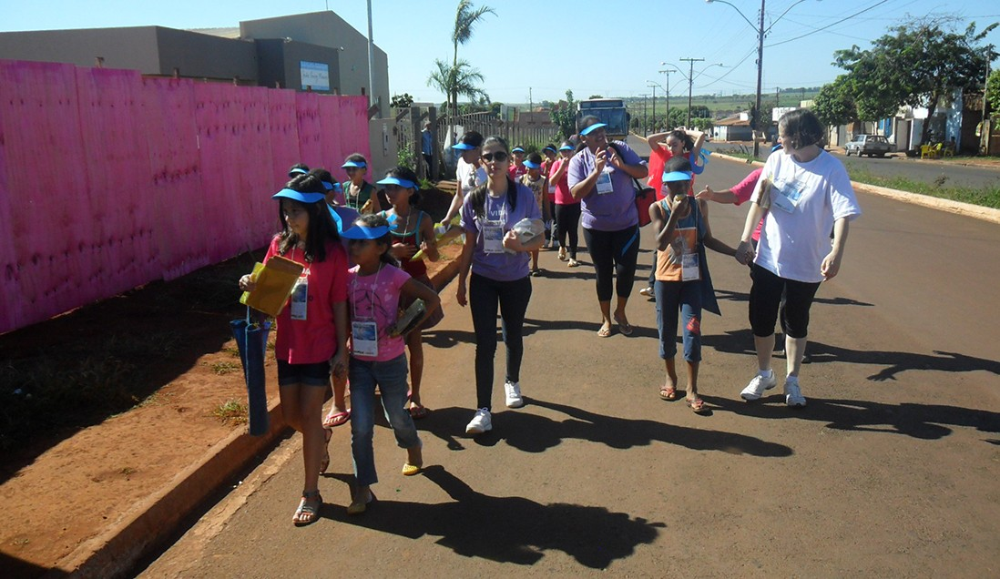

 La Campaña de Fraternidad Auta de Souza es un servicio donde ganamos el pan material para aquellos que no lo poseen. Es un servicio donde entregamos el pan Espiritual para los sedientos, divulgando la Doctrina.

La Campaña de Fraternidad Auta de Souza es realizada en dos fases distintas:

1 a semana: Distribución;

2 a semana: Colecta.

Cada una de las fases de la campaña es compuesta de tres etapas, que son:

1 a etapa: Reunión de preparación;

2 a etapa: Realización del trabajo en la calle;

3 a etapa: Ordenamiento del material y evaluación.

El libro “Campaña de Fraternidad Auta de Souza – Bases y Reglamento” trata detalladamente de éstas fases y etapas, en el capítulo IV.

## ¿Qué genera la Campaña de Fraternidad Auta de Souza?

**a) Para el caravanero**

“No olvidemos que el trabajo edificante de la Campaña es medio de reajuste para nuestros espíritus imperfectos y deudores. Al disponernos a salir a las calles, golpeando de puerta en puerta, cargando la bolsa de redención, y llevando el mensaje salvador, nos estamos redimiendo de pasados errores; estaremos ejercitando, o mejor, estamos adquiriendo la humildad y la paciencia y dando un paso, en principio tambaleante, mas con el tiempo seguro, para extirpar de dentro de nosotros, dos monstruos que impiden nuestra evolución: el egoísmo y el orgullo.”

Es importante también la participación, en la campaña, del joven y de los niños (…).

“A través del trabajo en la campaña, viendo el ejemplo edificante del mas viejo, principalmente del padre y de la madre, el joven y el niño reciben preciosas lecciones, que formarán al espirita y al caravanero de mañana”. (Editora Auta de Souza, Campaña de Fraternidad Auta de Souza: Bases y reglamento, 2 ed., p. 42).

**b) Para el hogar que dona**

“La campaña tiene por objetivo llevar a los hogares, a las almas afligidas y necesitadas, el mensaje cristiano de amor, de fe, de esperanza, de fraternidad y de caridad, transmitida por la Doctrina Espirita, y pedir de puerta en puerta, recursos materiales para asistencia de aquellos que pasan por la expiación o prueba de la miseria casi que absoluta. Es evidente que el éxito del segundo objetivo dependerá directamente del éxito del primero, pues solamente en la medida que el mensaje evangélico penetra el corazón de las personas visitadas, obtendremos la respuesta en términos de donación simbolizada por porciones de arroz, de frijol, un suéter, un calzado etc.” (Editora Auta de Souza, Campaña de Fraternidad Auta de Souza: Bases y reglamento, 2 ed., p. 41).

**c) Para el hogar que recibe**

“La distribución de los alimentos recolectados por la Campaña de Fraternidad Auta de Souza, conduce necesariamente a las familias a buscar a la Casa Espirita y a recibir estimulantes lecciones del Evangelio de Jesús a la luz de la Doctrina Espirita, auxiliando en la manutención del equilibrio en el hogar”. (Síntesis Doctrinaria – 43a Concafras-Pse, p. 84).

**d) Trabajo simple y envolvente**

Un trabajo de caravana absorbe los mas diferentes tipos de trabajadores: de la niño al anciano. La Campaña de Fraternidad Auta de Souza es un trabajo de caravana. Es por ésto que es simple y atractivo, proporcionando trabajo edificante a toda familia.

**e) Nuevos trabajadores**

Consecuencia natural de todos los aspectos anteriormente relacionados: trabajo de caravana simple y envolvente, ampliando la divulgación doctrinaria, practicando la desobsesión colectiva y trayendo familias y nuevos frecuentadores al Centro. Estos pasan a recibir orientación y formación doctrinaria, integrandose en la Casa Espirita como trabajadores.

**f) Participación de la niñez, del joven y del adulto**

La Campaña de Fraternidad Auta de Souza es una de las pocas actividades que envuelven trabajo y estudio en la Casa Espirita, permitiendo la participación conjunta de niños, jóvenes y adultos. La familia puede trabajar unida en la Campaña de Fraternidad Auta de Souza.

**g) Divulgación de la Doctrina**

La Campaña de Fraternidad Auta de Souza divulga de puerta en puerta la Doctrina Espirita, a través de millares de páginas de consuelo que distribuye. La Casa Espirita, a través de la campaña, divulga todas sus actividades, aumentando así el número de frecuentadores. Todos los trabajadores que participan de esa caravana están insertados en el proceso de divulgación de la Doctrina Espirita.

**h) Nuevos dirigentes**

Cuando formamos nuevos trabajadores, estamos naturalmente estimulando la formación de nuevos dirigentes. El trabajo de caravana incentiva el surgimiento de nuevos liderazgos, en las funciones de coordinadores y orientadores de grupo, revelando nuevos y futuros dirigentes de la Casa Espirita.

**i) Organización administrativa**

Con el desarrollo de las actividades y aumento del número de trabajadores, la Casa Espirita precisa contar con una mejor organización administrativa, en lo que es auxiliada por los nuevos dirigentes y líderes que surgirán.

**j) Trabajos asistenciales**

Al estimular el proceso de la caridad, yendo a la búsqueda del donador y de quién irá a recibir la donación, la Campaña de Fraternidad Auta de Souza inaugura el trabajo asistencial en la Casa Espirita, si ésta todavía no lo posee.

Al formar nuevos trabajadores, como consecuencia del trabajo de la Campaña, el Centro Espirita naturalmente amplia sus actividades asistenciales.

**k) Presencia de las familias en el Centro y viceversa**

La colecta de alimentos en la Campaña de Fraternidad Auta de Souza y su consecuente distribución conducen necesariamente a las familias a buscar el alimento en la Casa Espirita o la Casa Espirita se dirige hasta el lugar donde están los asistidos.

**l) Vínculos entre la Casa Espirita y las familias**

Con la implantación de la Campaña, la Casa Espirita pasa a tener un contacto con las familias de su región, visto que los hogares visitados periódicamente, lo que despierta en las familias el interés en conocer la Casa Espirita, creando así, un fuerte vínculo entre ambas.

**m) Desarrollo de los aspectos pedagógicos**

La presencia de las familias en el Centro, más allá de las personas estimuladas por la divulgación de la Campaña, lleva la Casa Espirita a preocuparse con la formación del asistido y mejorar el contenido doctrinario a los nuevos frecuentadores. Todas las veces que una Casa Espirita se preocupa con la educación de las personas que la frecuentan, se preocupa con el aspecto pedagógico. Consecuentemente, nuevas conferencias y nuevos Cursos, mejores y mas organizados son implantados.

**n) Educación de los espíritus**

Todos los aspectos relacionados con la Campaña naturalmente son mecanismos de reeducación de los espíritus encarnados (caravanero, donador, asistido), y de desencarnados; estos últimos son atendidos por la desobsesión colectiva generada por la Campaña de Fraternidad Auta de Souza, y transformados por los ejemplos de los encarnados.

**o) Ampliación de los espacios físicos de la Casa Espirita**

Con la implantación y/o ampliación de la actividad asistencial y consecuente aumento de asistidos, frecuentadores y tra

bajadores, más allá de la implantación de nuevos curso y nuevas conferencias, la Casa Espirita naturalmente necesitará ampliar sus espacios físicos.

**p) Un proceso de caridad donador X receptor**

El proceso de caridad ocurre cuando hay beneficencia. La Campaña estimula y desarrolla el proceso de caridad al pedir, sin ostentación, por los que sufren, evitando que éstos embrutezcan en la mendicidad, ni se humillen al recibir los alimentos. Con la campaña estaremos ampliando el campo de acción de la caridad, proporcionando también a aquel que dona, la oportunidad de practicar el bien.

**q) Desobsesión**

Incentivando el proceso de caridad, la Campaña de Fraternidad Auta de Souza estimula el pensamiento en el campo del bien, tanto en el caravanero como en el donador. El pensamiento en el campo del bien es eficaz instrumento para el trabajador, que ejercita la humildad al pedir, y para el donador que ejerce la caridad al donar.

**r) El encuentro con Jesús en las calles**

Llevando el mensaje Espirita de puerta en puerta la Campaña de Fraternidad Auta de Souza lleva a Jesús a las plazas, calles y hogares por donde pasa.