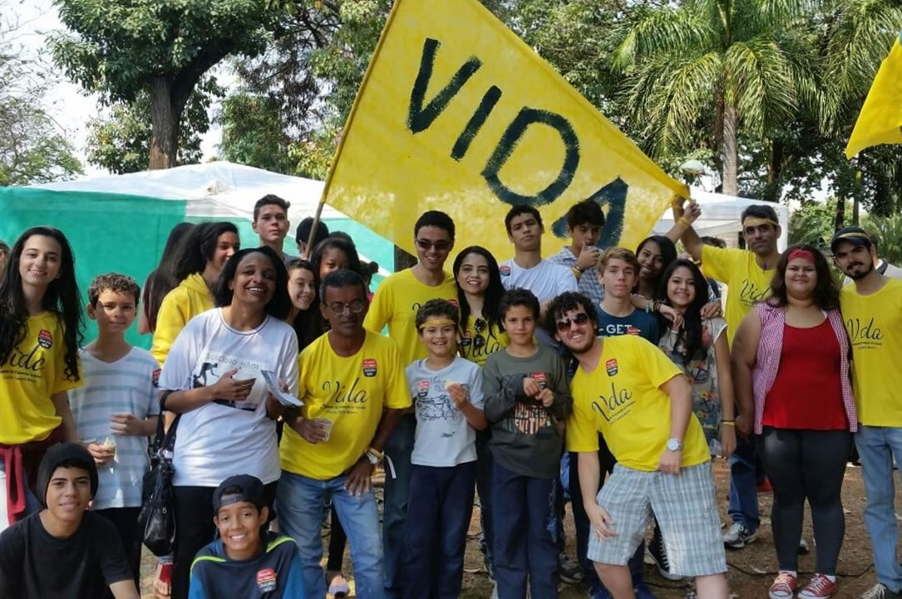
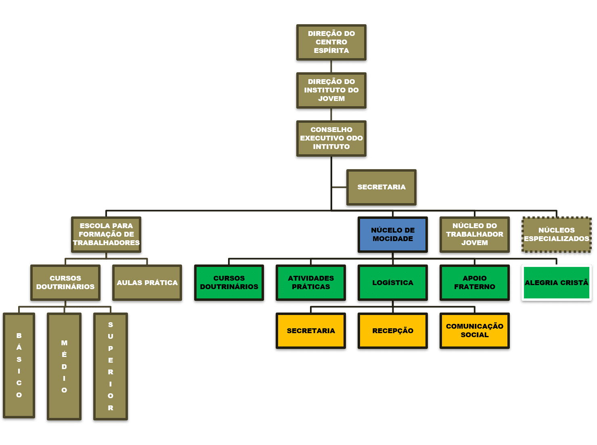
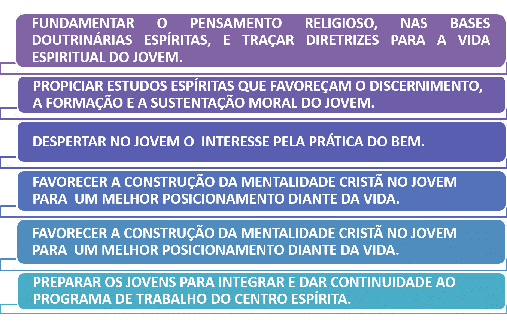
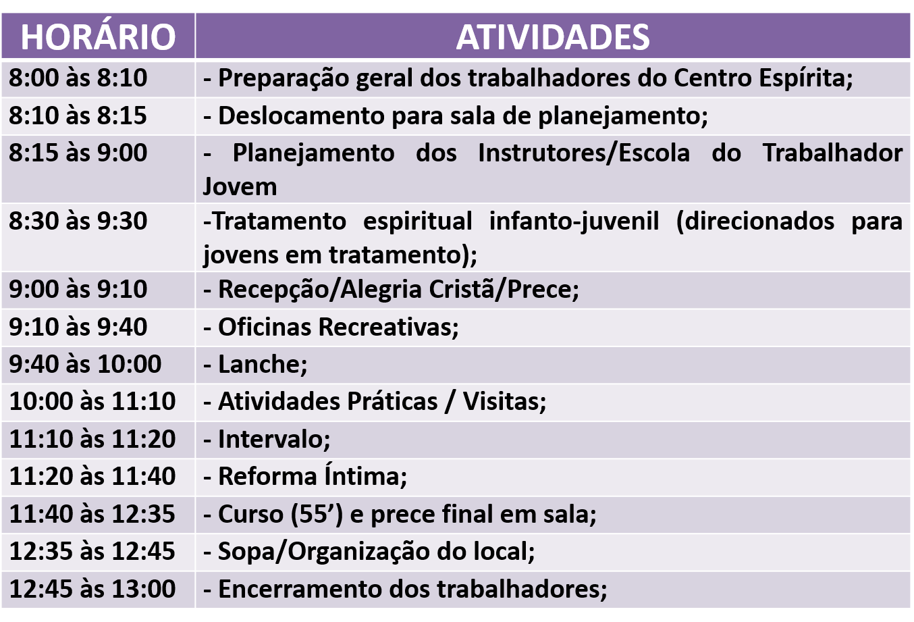
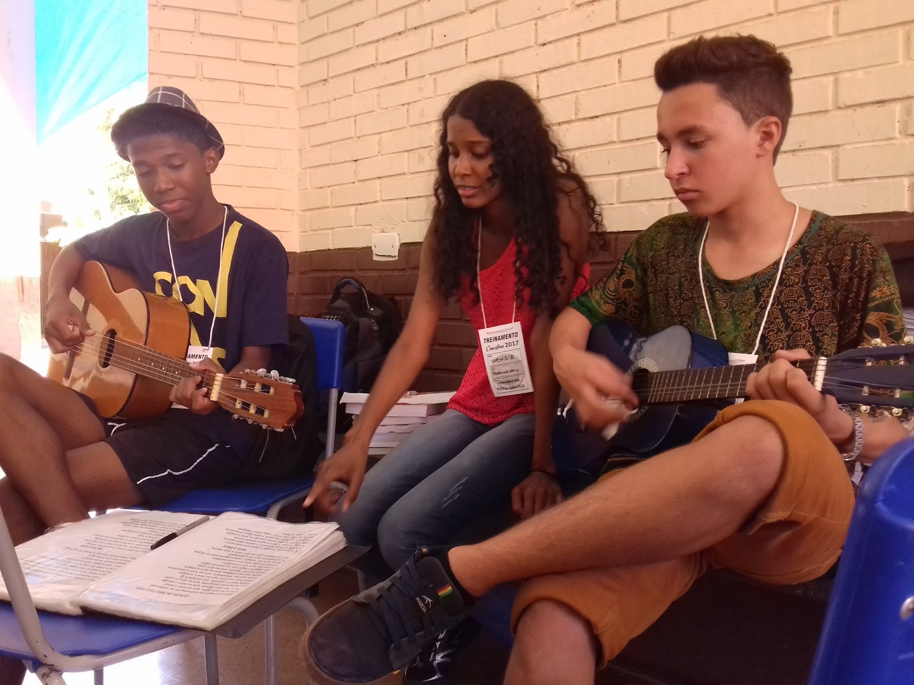
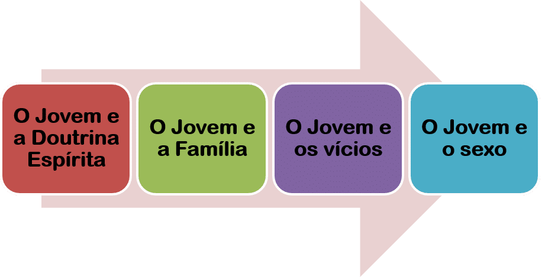
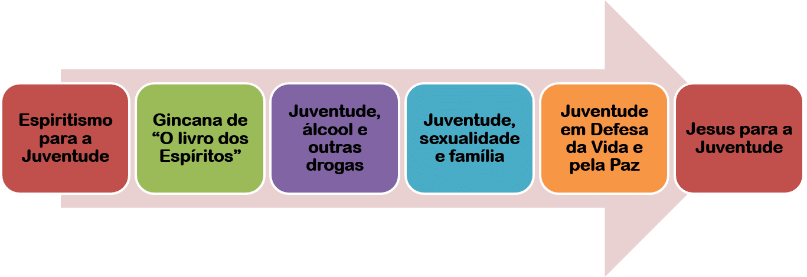
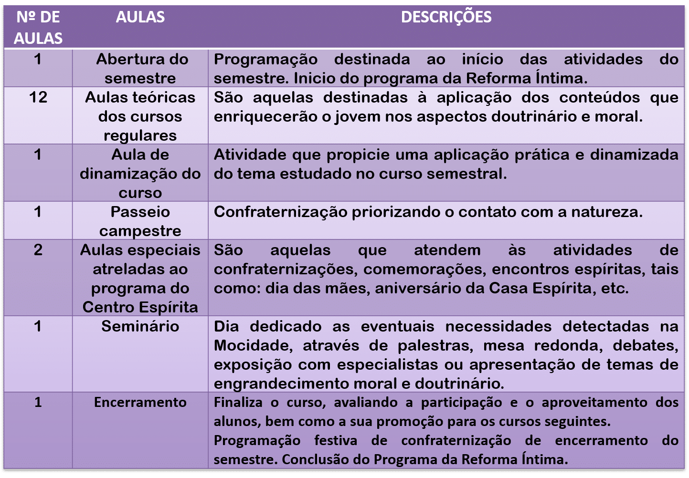
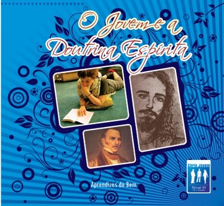
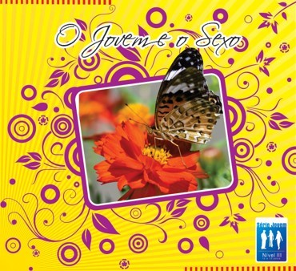

**Uma proposta de trabalho com os jovens no Centro Espírita**

Como integrar o jovem no Centro Esp**í**rita?

“A melhor forma de integração do jovem, na Casa Espírita, é através do trabalho. \[…\].

O jovem espírita é o nosso continuador. **Engajá-lo nas atividades habituais, procurando fazer com que ele sinta a responsabilidade da casa, que se vincule, que assuma compromissos dentro do seu nível de conhecimento e das suas possibilidades \[…\] para que nos ajudem a arrebentar os ranços que trazemos do passado e dêem ao nosso movimento uma dinâmica nova.**” (Divaldo Franco, _Diálogo com dirigentes e trabalhadores espíritas,_ 3\. ed., p. 67-69).

**O Instituto do Jovem**

_O Instituto do Jovem é um departamento da Casa Espírita que visa atender, evangelizar e acompanhar o jovem, a partir de 12 anos. Proporcionará à juventude um espaço participativo, criativo e de interação cristã. Dividir-se-á em duas ações: formação da mentalidade cristã do jovem e a especialização de trabalhadores para a Evangelização Juvenil._

### Como o Instituto do Jovem é organizado?

**Que objetivos queremos alcançar com o trabalho de Evangelização Juvenil?**

**Quem é o adolescente de hoje?**

“O adolescente atual é Espírito envelhecido, acostumado a realizações nem sempre meritórias, o que lhe produz anseios e desgostos aparentemente inexplicáveis, insegurança e medo sem justificativa, que são remanescentes de sua _consciência de culpa_, em razão dos atos praticados, que ora veio reparar, superando os limites e avançando com outro direcionamento pelo caminho da iluminação interior, que é o essencial objetivo da vida.” (Joanna de Ângelis_. Adolescência e vida._ 14\. ed. p. 26).

“O Espiritismo oferece ao jovem um projeto ideal de vida, explicando-lhe o objetivo real da existência na qual se encontra mergulhado, ora vivendo no corpo e, depois, fora dele, com um todo que não pode ser dissociado somente porque se apresenta em etapas diferentes. Explica-lhe que o Espírito é imortal e a viagem orgânica constitui-lhe recurso precioso de valorização do processo iluminativo, libertador e prazenteiro.” (Joanna de Ângelis. _Adolescência e vida_. 14. ed.,  p. 16).

**O que é a Mocidade Espírita?**

_A Mocidade é o Núcleo de Trabalho do Instituto do Jovem que irá atender, acompanhar e direcionar o jovem a partir de 12 anos nas atividades da Casa Espírita, bem como propiciar trocas de experiências e oportunidades de contribuição do jovem para a própria Mocidade e para o Centro Espírita a qual está vinculado._

“A mocidade tem capital importância, porque é a primeira orientação para o destino; nela, o esquecimento do passado é completo; este não existe mais, e todas as suas potências estão voltadas para o futuro. Eis por que os moralistas e os educadores concentraram sua experiência e seus esforços nesse prefácio da vida humana \[…\].” (Léon Denis. _O grande enigma_. 9. ed., p. 200).

**Quais os objetivos da Mocidade Espírita?**

*   Traçar diretrizes seguras, dentro do Evangelho, a fim de que, através da sua formação moral, seja o jovem a base de uma sociedade feliz.
*   Acompanhar o desenvolvimento físico, moral e psicológico do jovem, proporcionando estudos doutrinários e atividades práticas.
*   Estimular o jovem ao trabalho e à iniciativa da auto-educação.
*   Propiciar meios de integrar a juventude à Jesus.

**Como é a estrutura pedagógica da Mocidade?**

     _A editora Auta de Souza divulga a metodologia “O Centro Espírita: Escola da alma”, que em sua proposta de evangelização tem início na Escola de Evangelização Espírita Infantil com a divisão pedagógica em Nível I (Crianças de 0 a 5 anos) e Nível II (Crianças de 06 a 11 anos) dando continuidade na Mocidade com os níveis III (Jovens de 12 e 13 anos) e Nível IV(Jovens a partir de 14 anos), cada nível possui uma grade curricular própria com vistas a um atendimento adequado a cada realidade._

**NÍVEL III – JOVENS DE 12 E 13 ANOS**

_Atende aos jovens de I2 e I3 anos e onze meses, provindos ou não da Escola de Evangelização Espírita Infantil, da comunidade e aqueles encaminhados pelo tratamento espiritual da Casa Espírita._

**NÍVEL 4 – JOVENS A PARTIR DE 14 ANOS**

_Atende aos jovens a partir de 14 anos provindos do Nível III, da comunidade e aqueles encaminhados pelo tratamento espiritual da Casa Espírita._

**Horário da Mocidade no sábado**

**09h10 – 09h40: OFICINAS RECREATIVAS**

• São desenvolvidas atividades lúdicas com os jovens visando à integração do grupo e fortalecendo o relacionamento na Mocidade.

• Ex: oficina de violão, de culinária, de futebol,  jogos dinâmicos (ex: dama, xadrez), dinâmicas, roda de músicas, etc.

**09h – 09h10: RECEPÇÃO, ALEGRIA CRISTÃ E PRECE INICIAL**

*   Recepção dos Jovens na Casa Espírita
*   Momento de Alegria Cristã com músicas espíritas animadas e edificantes e dinâmicas de integração.
*   Prece

**09h40 – 10h: LANCHE**

• Momento em que os jovens e os trabalhadores tomam café-da-manhã juntos.

**10h – 11h10: ATIVIDADES PRÁTICAS**

Esta atividade visa associar os conhecimentos adquiridos no momento de estudo com o trabalho. As atividades práticas estão vinculadas à parte doutrinária.  
Ex: Campanha de Fraternidade Auta de Souza, Artesanato e Assistência, Campanha Jesus no Lar.  

**11h10 – 11h20: INTERVALO**

**11h20 – 11h40 : PROGRAMA DA REFORMA ÍNTIMA**

*   Será estimulado ao jovem a busca por sua Reforma Íntima, através de atividades reflexivas e avaliativas.
*   As atividades são realizadas com a utilização do Diário de Bordo
*   Há também neste momento a reflexão a cerca de um texto doutrinário e o momento da conversa fraterna.

**11h40 -12h35 : CURSOS DOUTRINÁRIOS**

É oferecido aos Jovens cursos destinados às reflexões de temas afetos à juventude tais como: O Jovem e a Família, O Jovem e os Vícios, O Jovem e o Sexo, dentre outros.  
Os cursos deve ser realizado de forma dinâmica e interativa de modo a cativar o interesse juvenil  
Os jovens são divididos em dois níveis:

*   Nível II: Jovens de 12 e 13 anos –
*   Nível IV: Jovens de 14 anos acima

**12h35 – 12h45: PRECE FINAL**

**Qual o currículo doutrinário para os jovens?**

**NÍVEL III**

**NÍVEL IV**

**Planejamento semestral**

PARA SABER MAIS, ACESSE: www.ocentroespírita.com e editoraautadesouza.com