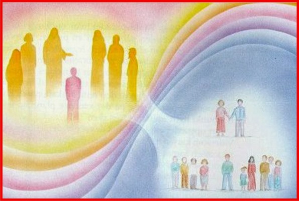

É muito comum dizer-se que nascemos na família que merecemos. Será isso verdade?

Todos nascem ou renascem nos núcleos familiares e sociais de que necessitam para aprimorar-se, e não conforme se assevera tradicionalmente: que merecem.

As cargas de genes e cromossomas, as condições psicossociais e econômicas formam o quadro dos processos de burilamento moral-espiritual, resultantes da reencarnação caldeadora dos dispositivos individuais para a evolução.

Tal razão prepondera na elucidação diferenças psicológicas dos indivíduos, mesmo entre os gêmeos uniovulados, defluentes das conquistas anteriores.

(Joanna de Ângelis. Joanna de Ângelis responde.  Pergunta 95)