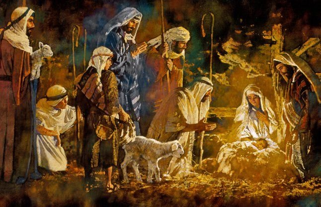

Diante do bolo iluminado, abraças, feliz, os entes amados que chegaram de longe…  
Ouves a música festiva que passa, de leve, por moldura de harmonia às telas da natureza… Entretanto, quando penetrarem o tempo da oração, reverenciando o Mestre que dizes amar, mentaliza o estábulo pobre.  
Ignoramos de que estrela chegando o Sublime Renovador, mas todos sabemos em que ponto da Terra começou ele o apostolado divino.  
Recorda as mãos fatigadas dos tratadores de animais, os dedos calosos dos  
homens do campo, o carinho das mulheres simples que lhes ofertaram as primeiras gotas do próprio leite e o sorriso ingênuo dos meninos descalços que lhe recebera, do olhar a primeira nota de esperança.  
Lembra-te do Senhor, renunciando aos caminhos constelados de luz para  
acolher-se, junto dos corações humildes que o esperavam, dentro da noite, e desce também da própria alegria, para ajudar no vale dos que padecem…  
Contemplará, de alma surpresa, a fila dos que se arrastam, de olhos  
enceguecidos pela garoa das lágrimas. Ladeando velhinhos que tossem ao desabrigo, há doentes e mutilados que suspiram pelo lençol de refúgio na terra seca. Surgem mães infelizes que te mostram filhinhos nus e crianças desajustadas para quem o pão farto nunca chegou. Trabalhadores cansados falam de abandono e jovens subnutridos se referem ao consolo da morte…  
Divide, porém, com eles o tesouro de teu conforto e de tua fé e, nos recintos de palha e sombra a que te acolhes, encontrarás o Cristo no coração, transfigurando-te a vida, ao mesmo tempo em que, nos escaninhos da própria mente, escutarás, de novo, o cântico do Natal, como que repetido na pauta dos astros:

Glória a Deus nas alturas e boa vontade para com os homens!…

Meimei. _Antologia mediúnica do natal._ Psicografia de Francisco Cândido Xavier. Cap. 43