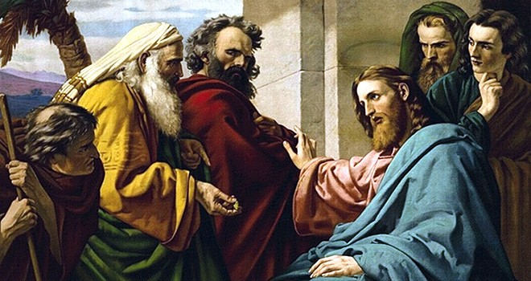

“E Jesus, respondendo, disse-lhes: Dai, pois, a César o que é de César, e a Deus o que é de Deus.” – (Marcos,12:17)

Em todo lugar do mundo, o homem encontrará sempre, de acordo com os seus próprios merecimentos, a figura de César, simbolizada no governo estatal. Maus homens, sem dúvida, produzirão maus estadistas.

Coletividades ociosas e indiferentes receberão administrações desorganizadas. De qualquer modo, a influência de César cercará a criatura, reclamando-lhe a execução dos compromissos materiais.  
É imprescindível dar-lhe o que lhe pertence. O aprendiz do Evangelho não deve invocar princípios religiosos ou idealismo individual para eximir-se dessas obrigações.

Se há erros nas leis, lembremos a extensão de nossos débitos para com a Providência Divina e colaboremos com a governança humana, oferecendo-lhe o nosso concurso em trabalho e boa-vontade, conscientes de que desatenção ou revolta não nos resolvem os problemas.

Preferível é que o discípulo se sacrifique e sofra a demorar-se em atraso, ante as leis respeitáveis que o regem, transitoriamente, no plano físico, seja por indisciplina diante dos princípios estabelecidos ou por doentio entusiasmo que o tente a avançar demasiadamente na sua época.  
Há decretos iníquos? Recorda se já cooperaste com aqueles que te governam a paisagem material.

Vive em harmonia com os teus superiores e não te esqueças de que a melhor posição é a do equilíbrio. Se pretendes viver retamente, não dês a César o vinagre da crítica acerba. Ajuda ­o com o teu trabalho eficiente, no sadio desejo de acertar, convicto de que ele e nós somos filhos do mesmo Deus.

Emmanuel, Pão Nosso, Psicografado por Chico Xavier, Cap. 102.