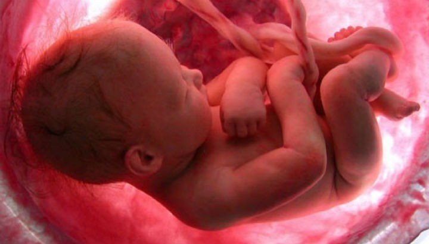

**“Constitui crime a provocação do aborto, em qualquer período da gestação?”**

  
“Há crime sempre que transgredis a lei de Deus. Uma mãe, ou quem quer que seja, cometerá crime sempre que tirar a vida a uma criança antes do seu nascimento, por isso que impede uma alma de passar pelas provas a que serviria de instrumento o corpo que se estava formando.”  
Allan Kardec. O livro dos Espíritos. Perg. 358