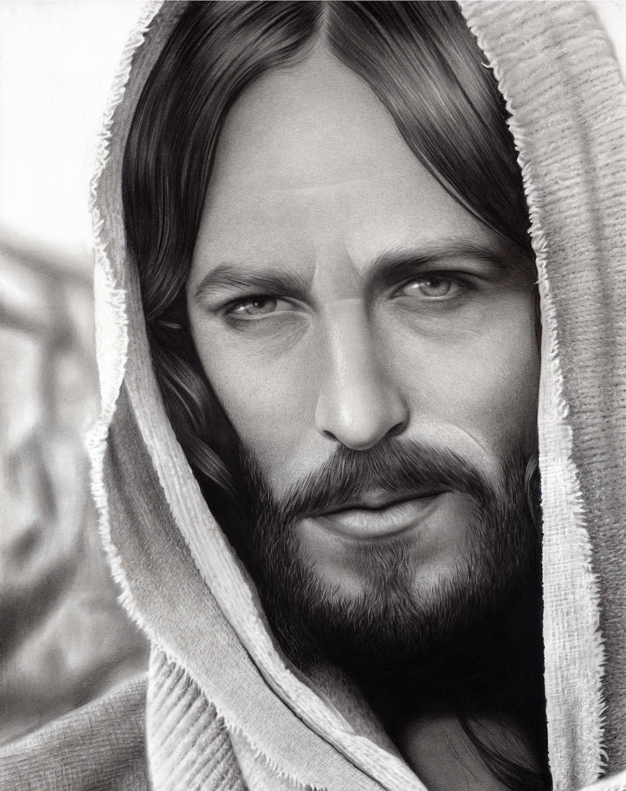

No seio excelso do Criador Incriado, nos cimos da evolução, pontificam os Cristos Divinos, os Devas Arcangélicos, cuja sublime glória e soberano poder superam tudo quanto de magnificente e formidável possa imaginar, por enquanto, a mente humana. São eles que, sob a inspiração do Grande Arquiteto do Universo, presidem, no Infinito, à construção, ao desenvolvimento e à desintegração dos orbes, fixando-lhes as rotas, as leis fisioquímicas e bio-matemáticas e gerindo seus destinos e os de seus habitantes. 

Os Cristos, Espíritos Puríssimos, não encarnam. Não têm mais nenhuma afinidade essencial com qualquer tipo de matéria, que é o mais baixo estágio da energia universal. Para eles, matéria é lama fecunda, que não desprezam, sobre a qual indiretamente trabalham através dos seus prepostos, na sublime mordomia da Vida, mas coisa com que não podem associar-se contextualmente, muito menos em íntimas ligações genéticas. Eles podem ir a qualquer parte dos Universos e atuar onde lhes ordene a Vontade Todo-Poderosa de Deus Pai; podem mesmo mostrar-se visualmente, por imenso sacrifício de amor, a seres inferiores e materializados, indo até ao extremo de submeter-se ao quase-aniquilamento de tangibilizar-se à vista e ao tato de habitantes de mundos inferiores, como a Terra; mas não podem encarnar, ligar-se biologicamente a um ovo de organismo animal, em processo absolutamente incompatível com a sua natureza e tecnicamente irrealizável.

A possibilidade de violentação das leis naturais é relativa e não chega até o ponto de permitir que um organismo celular de matéria densa resista, sem desintegrar-se instantaneamente, à mais abrandada vibração bioeletromagnética de um Espírito Crístico. Se é impraticável a um Espírito humano, inteligente e dotado de consciência, encarnar em corpo de irracional, por completa impossibilidade biológica de assimilação mútua entre a matriz perispirítica e o óvulo animal de outra espécie, para não falarmos também das impossibilidades psíquicas de semelhante absurdo de retrogradação evolutiva, muito menos poderia um Cristo encarnar em corpo humano terrícola. A distância evolucionária que separa um orangotango de um homem terrestre é bem menor que aquela que medeia entre um ser humano terrestre e um Cristo Divino.

Para apresentar-se visível e tangível na superfície da crosta terráquea, teve o Cristo Planetário de aceitar voluntariamente intraduzível tortura cósmica, indizível e imensa, ainda que quase de todo inabordável ao entendimento humano. Primeiro, obrigou-se à necessidade de abdicar, por espaço de tempo que para nós seria longuíssimo, da sua normal ilimitação de Espírito Cósmico e ao seu trono no Sol, sede do Sistema, transferindo-se do centro estelar para a fotosfera, onde lhe foi possível o primeiro e doloroso mergulho na matéria, através do revestimento consciente do seu mentespírito com um tecido energético de fótons. Depois, teve de imergir no próprio bojo do planeta Terra, em cuja ionosfera utilizou vastos potenciais eletromagnéticos para transformar seu manto fotônico em léptons e em quarks formadores de mésons e de bárions, estruturando átomos ionizados. Finalmente, concluindo a dolorosíssima operação de tangibilidade, revestiu esse corpo iônico com delicadíssima túnica molecular, estruturada à base de ectoplasma, combinado com células vegetais, recolhidas principalmente (como já captou a intuição humana) de vinhedos e trigais.

Não é tecnicamente de espantar o que dizemos, bastando lembrar as experiências de materialização da energia radiante, realizadas por Irene Curie e Frédéric Joliot, os quais verificaram que as radiações gama, de elevadíssima freqüência, conduzindo fótons de energia superior a um milhão de elétrons-volts, podem desaparecer ou transformar-se em fótons de menor energia, dando surgimento simultaneamente a um elétron positivo e a outro negativo, ao colidirem com o núcleo de um átomo pesado. Tudo absolutamente coerente com o previsto nas teorias da relatividade, no que respeita à inércia da energia.

E o oposto também é verdadeiro, como demonstraram as experiências de Jean Thibaud e Frédéric Joliot, pois quando a matéria absorve elétrons positivos, emite fótons de energia praticamente igual ao dobro do número de elétrons positivos incidentes. Certo é que, em razão da inércia da energia, a semelhança entre um fóton e um grão de matéria torna-se evidente, pois os elétrons, os prótons e os nêutrons transportam concentrações de energia de volume perfeitamente definido. A massa de um fóton iguala o quociente de sua energia (constante Planck multiplicada pela freqüência) pelo quadrado da velocidade da luz. Embora nossas toscas palavras e rudes considerações não possam, de nenhum modo, dar a mais pálida idéia do imensurável sacrifício do Cristo Divino para materializar-se entre os homens, convém aqui refletirmos um pouco sobre o que sabe a experiência humana, no campo dos tormentos a que está exposta no mundo a sensibilidade apurada.

Já nem queremos insistir no que representa uma redução de radiações gama, de 0,0001 milimícrons de comprimento de onda e freqüência da ordem 1021 por segundo, a radiações percebíveis pelo olho humano, de 0,8 mícrons a 0,4 mícrons de comprimento de onda e freqüência de cerca de 5.1014 por segundo.

O que avulta de pronto à nossa assustada percepção é o superlativo massacre de sensibilidade que se evidencia no fato de um Ser, não apenas de super-requintada, mas de divina delicadeza sensorial, expor-se ao inferno de baixas, odientas e agressivas vibrações terrestres, para respirar e agir, por inexcedí- vel amor, no clima superlativamente asfixiante de nossas humanas iniqüidades.  
Em face do muito de sublime já escrito na vasta literatura espírita-cristã, sobre a dor moral, em suas variadíssimas expressões, não examinaremos aqui esse primordial e nobilíssimo aspecto do sacrifício messiânico, mas insistiremos em chamar a atenção para a terrível realidade psicofísica do maior de todos os dramas de dor, que foi a materialização crística neste mundo de trevas e maldade; dor real inimaginável, jamais sofrida, na Terra, por qualquer Ser vivente, nem antes nem depois do Filho de Maria. O espectro da dor é temido pelos homens até os limites do pânico. Quem saberá, porém, formar idéia do que possa ser a dor de algum Arcanjo? Muitos esquecem que a evolução é, por natureza, aguçadora da sensibilidade; que não só os poderes da percepção, mas igualmente os da sensação, se ampliam e apuram, à medida que o Ser ascende na escala evolutiva. O simples paramécio, mero protozoário ciliado, sente e reage a diferenças de temperatura e de concentração de substâncias químicas.

O estigma, orgânulo flagelado, é sensível às variações da luz ambiente. Os metazoários, já possuidores de sistema nervoso, respondem ao calor e ao frio, à pressão e ao tato, a substâncias químicas, à luz e ao som. Todos os animais reagem a estímulos externos, como modificações de umidade, gravidade ou disponibilidade de oxigênio. Para alguns, como determinados répteis, mudanças de temperatura podem ser de conseqüências vitais.

A própria minhoca, que não tem olhos, acusa a presença de uma fonte luminosa. Na escala evolutiva, a capacidae sensorial não cessa de aperfeiçoar-se. Das medusas aos platelmintos, dos nematelmintos aos moluscos, dos protocordados aos vertebrados, o sistema nervoso evolui sempre, até atingir a complexidade que apresenta no organismo humano. Neste, muito além das sensações captadas e transmitidas pelos doze pares de nervos cranianos, bem sabem os estudiosos do sistema nervoso autônomo quantas e quão importantes são as manifestações psicossomáticas provocadas por transtornos emocionais.

À proporção que a densidade decresce, a sensibilidade se intensifica. No perispírito dos desencarnados, ela é muito maior do que no dos encarnados comuns, porque aqueles lidam com matéria mais rarefeita, mais plástica e, por isso, mais obediente às modelagens mentais. Sendo a literatura espírita riquíssima em esclarecimentos e exemplificações a esse respeito, não se justificaria entrássemos agora em considerações repetitivas, salvo para acrescentar novas anotações.

Limitar-nos-emos, portanto, a considerar que o plano espiritual imediatamente ligado ao crostal planetário não é senão a outra face deste último e sua continuação natural, em termos de sinalética invertida, ou seja, de antimatéria. Essa conscientização é importante para que se entenda melhor os problemas de ressonância entre os dois planos.   
Aos menos afeitos a estudos de Física, informamos que ressonância é, na bem elaborada definição de Horácio Macedo, “o fenômeno que ocorre quando um sistema oscilante (mecânico, elétrico, acústico, etc.) é excita  por um agente externo periódico com uma freqüência idêntica a uma das suas freqüências próprias. Nestas circunstâncias, há uma transferência fácil de energia da fonte externa para o sistema, cujas oscilações podem ter amplitude muito grande. Se não houver amortecimento, a amplitude pode atingir, em princípio, qualquer valor, por maior que seja; nos casos práticos, o amortecimento a limita.”

E há também a ressonância magnética, muito mais importante, para cuja definição, em linguagem humana corrente, valemo-nos da redação clara e simples do mesmo autor: “A transferência de energia de um campo eletromagnético para um sistema atômico ou subatômico, em presença de um campo magnético, pode ocorrer com núcleos ou com elétrons orbitais. (…)

Fornecendo-se ao núcleo radiação com certa freqüência, na presença do campo magnético, ocorre uma absorção ressonante. Esta absorção ou, como se faz correntemente, a emissão que se lhe segue, pode ser detectada num circuito apropriado e é o que constitui a ressonância magnética nuclear.”

Fato é que a interação entre os dois planos é tão grande que na realidade são um plano só. A Humanidade, em seu conjunto, constitui uma só grande família e se compõe de encarnados e desencarnados, em proporções que variam conforme as circunstâncias de cada época, todas essas circunstâncias devidamente controladas pela Vontade Sábia do Cristo Planetário, Governador Espiritual da Terra. Em razão disso, bens e males, progressos e problemas são partilhados entre encarnados e desencarnados, em processo de íntimo e ininterrupto intercâmbio.

O campo da cooperação e da inspiração, tanto quanto o das obsessões e do vampirismo, vem a ser, na verdade, um só campo de comunhão vital entre criaturas irmanadas pela natureza e pelo destino. O que realmente varia é sobretudo a conscientização das sensações e a sua essência moral.

Encerremos, porém, esta rápida digressão, pois o que nos propomos sublinhar aqui é que a condição de desencarnado outorga ao Espírito maiores poderes de sensibilidade consciente, na exata proporção da menor densidade do seu veículo psicossomático e do seu grau evolutivo.

Todas essas considerações valem também para os Espíritos encarnados quando em desdobramento sonambúlico e para os desencarnados em processo de materialização na Crosta.  
Impõe-se-nos a referência a tais situações, por serem tais eventos imensamente mais freqüentes do que os homens terrestres costumam supor.

Extremamente desatentos a tudo quanto não sejam os seus interesses imediatos e o seu “ego” personalístico, simplesmente não se apercebem de que lidam constantemente com pessoas, imagens e coisas de outro plano, momentaneamente percebidas, muita vez com a ajuda de seus próprios recursos ectoplasmáticos, sem que anotem a realidade e a natureza desses fenômenos, exceto quando, algumas raras vezes, a “estranheza” de certos acontecimentos lhes causa calafrios.

Assim é que verdadeiros agêneres são tachados de demônios ou assombrações. Entretanto, os “íncubos” e os “súcubos” da lenda nem sempre são seres imaginários e sim personagens muito reais do grande drama humano.

Há, porém, agêneres e agêneres. Tais seres são, por definição, criaturas fisiologicamente não geradas como o normal dos encarnados. Noutras palavras, seres que se mostram materializados aos olhos humanos, às vezes por longos períodos, que são sempre interrompidos, necessariamente, por variáveis interregnos de tempo. Em casos especiais, a freqüência com que aparecem dá uma poderosa impressão de continuidade.

Existem, contudo, outros seres, muito peculiares, que não são propriamente agêneres, mas que pertencem muito mais ao plano extrafísico do que ao plano que chamamos físico. Trata-se de criaturas sem dúvida humanas, mas cuja ligação biopsicofisiológica com & matéria densa a que chamamos “carne” é a mínima possível. São Espíritos sublimes, de imensa superioridade evolutiva, que só encarnam na Terra em raras e altíssimas missões, de singularíssima importância para a evolução da Humanidade.

O maior desses Espíritos foi a Mãe Maria de Nazaré, a Virgem Excelsa, Rainha dos Anjos, cuja presença material, na Crosta Terráquea, foi indispensável para a materialização do Messias Divino entre os homens. Coube a ela fornecer ao Mestre a base ectoplasmática necessária à sua tangibilização, servindo ainda de ponto de referência e de equilíbrio de todos os processos espirituais, eletromagnéticos e quimio-físicos que possibilitaram, neste orbe, a Presença Crística.

Tudo o que o Senhor Jesus sentiu, na sua jornada messiânica, repercutiu diretamente nela, na Santa das Santas, na Augusta Senhora do Mundo. Estrela Divina do Universo das Grandes Almas, também ela teve de peregrinar do paraíso excelso de sua felicidade para o nosso vale de lágrimas, a fim de ajudar e servir a uma Humanidade paupérrima de espiritualidade, da qual se fez, para sempre, a Grande Mãe, a Grande Advogada e a Grande.

Consideremos agora um fato de magna importância. Materializações se verificam nos mais diversos níveis e nos mais variados graus. E são normalmente parciais, em maior ou menor escala. Há materializações de luzes, de sons, de formas, de objetos, de partes de corpos perispirituais. Materializações integrais de psicossomas dificilmente ocorrem, exceto nos níveis mais baixos da evolução.

Mesmo nestes últimos casos, não são também integrais, no sentido mais rigoroso do termo, porque as entidades que nesse nível se tangibilizam têm sempre deformados e até necrosados importantes centros de sensibilidade, especialmente no tocante à consciência. São mutilados do espírito e, quase sempre, aleijados da mente e da forma, longe da completidão mentofísica de si mesmos.

O Cristo-Jesus, Senhor da Verdade e da Inteireza, foi o único Espírito absolutamente completo, com todas as suas faculdades plenamente desenvolvidas e em perfeito funcionamento, que se materializou totalmente na Terra, assumindo por inteiro a biologia e a morfologia de um Homem, com tudo o que compõe um organismo humano, sem faltar absolutamente nada, personificando o modelo físico e espiritual, perfeito por excelência, do Homo sapiens, na futura e mais elevada conformação biomentofísica que atingirá quando chegar ao seu mais alto grau de evolução terrestre.

Foi por essa razão que Jesus se intitulou, com a mais plena verdade e a mais inteira justiça, O FILHO DO HOMEM. Não o fez por mera força de expressão; disse uma soleníssima verdade, da mais extraordinária significação, pois como Homem Ideal, perfeito e íntegro, ninguém teve, como ele, neste mundo, todos os sentidos funcionando em grau máximo. Sua percepção, mesmo se quiséssemos vê-la do exclusivo ponto de vista da organização psicossomática humana, atingiu o mais alto nível, que outro ser humano, ou de aparência humana, jamais conseguiu.

Teve, portanto, sobradas razões para exclamar, como registrou o evangelista Marcos (9:19): “ó geração incrédula e perversa, até quando me fareis sofrer?” O sofrimento experimentado por Jesus, na preparação e no decurso de seu messianato, não teve, não tem e não terá similar, de qualquer ângulo que seja analisado, inclusive no que concerne à dor física, tal como a entendemos, em vista da sua inigualável sensibilidade orgânica.

Completamente irreal e terrivelmente injusto é, pois, o argumento de embuste, largamente usado pelos que não compreendem a absoluta impossibilidade da encarnação comum de um Ser Crístico e só conseguem ver uma grosseira pantomima na capacidade de sofrer de um agênere. A verdade, como vemos, é bem outra, incomparavelmente bela, justa, santa, lógica e real; a realidade do sublime amor daquele que é, de fato, o Caminho, a Verdade e a Vida.  
Áureo. _Universo e vida_. Psicografado por Hernani T. Sant’Anna. FEB.  cap.VII