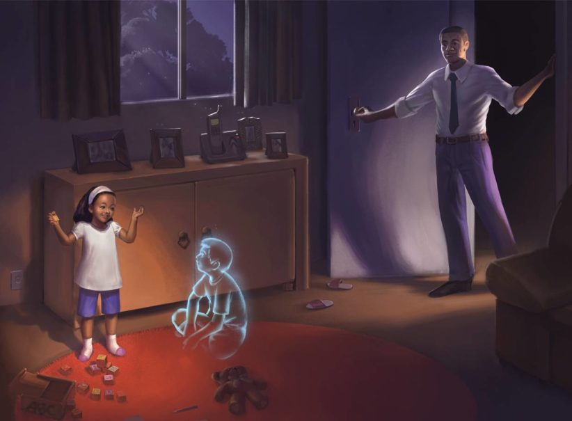
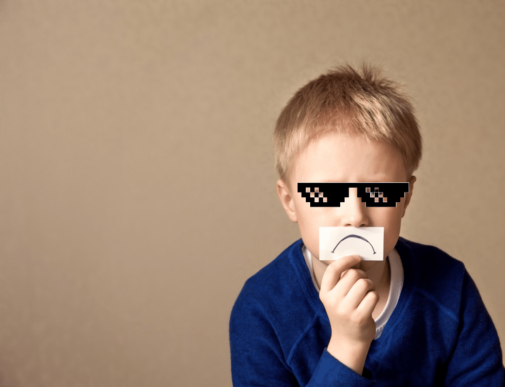
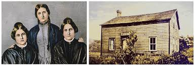

O Adolescente e os Fenômenos Psíquicos

Na infância, porque ainda em fase complementar da reencarnação, o Espírito desfruta relativa liberdade, que lhe permite mais amplo contato com a realidade causal, aquela que diz respeito ao mundo de onde procede.

Esse lugar permanece acessível ao seu trânsito, e as impressões mais fortes que dele são trazidas se exteriorizam pelo corpo físico.

Eclodem, então, nessa oportunidade, os fenômenos paranormais, propiciando as faculdades da clarividência e da clariaudiência, particularmente, e, sob mais direta indução dos Espíritos desencarnados, outras manifestações de natureza mediúnica propriamente ditas.

Não obstante, sob a proteção dos Guias Espirituais, a criança permanece vinculada à vida plena, tornando-se instrumento dúctil de comunicações medianímicas, mesmo que de forma inconsciente, o que lhe causa, em determinadas situações, receios e desequilíbrios compreensíveis.

Considerando-se, porém, a sua falta de estrutura psicológica, porque em fase de desenvolvimento orgânico e psíquico, ela não deve ser encaminhada para experimentações paranormais, auxiliando-se-lhe, entretanto, mediante os valiosos e oportunos recursos específicos da oração, da água magnetizada, das conversações edificantes, como terapia própria para a sua faixa de idade.

No período da adolescência, porém, em pleno desabrochar das forças sexuais, a mediunidade se apresenta pujante, necessitando de educação conveniente e diretriz adequada para ser controlada e produtiva.

No momento em que a glândula pineal libera os fatores sexuais complementares, e as demais do sistema endocrínico contribuem para o desenvolvimento da libido, a primeira, que era veladora da função genésica, transforma-se num fulcro de energia portador de possibilidades de captação parapsíquica, que dá lugar a uma variada gama de manifestações.

Os conflitos comportamentais do adolescente, naturais, nesse período, abrem espaço para um mais amplo intercâmbio com os Espíritos, que se comprazem em afligir e em perturbar, considerando a ignorância da realidade em que se demoram.

Tratando-se de ser humano em progresso com um passado a reparar, o adolescente é convidado ao testemunho evolutivo, por cujo meio se retempera no exercício do bem e das disciplinas morais, fortalecendo-se para desempenhos futuros de alto coturno.

Nesse estágio de capacitação intelectual, o intercâmbio psíquico com os desencarnados torna-se mais viável e fecundo, merecendo cuidados especiais, que orientem o sensitivo para o ministério de amor e de iluminação dele próprio, assim como do seu próximo e da sociedade como um todo.

É expressiva a relação dos adolescentes que foram convidados a atividades missionárias através da mediunidade, confirmando a existência do mundo espiritual e o seu intercâmbio incessante com as criaturas humanas que habitam o mundo físico.

Joana d’Arc, aos quatorze anos de idade, manteve demorados diálogos com os Espíritos que se diziam Miguel Arcanjo, Catarina e Margarida, considerados santos pela Igreja católica, que a induziram ao comando do desorganizado exército francês para as lutas contra os ingleses, culminando com a coroação de Carlos 7º, em Reims, que a abandonaria depois ao próprio destino de mártir…

Bernadette Soubirous, aos quatorze anos, na gruta de Massabiélle, em Lourdes, na França, teve dezoito contínuos encontros com uma Entidade luminosa, que lhe afirmou ser Maria de Nazaré.

Três crianças, na gruta da Iria, em Fátima, Portugal, igualmente mantiveram contato e dialogaram com outro ser espiritual, que informava ser a mesma Senhora.

Catarina e Margarida Fox tornaram-se instrumento da comunicação lúcida com o mundo espiritual, em Hydesville, nos Estados Unidos, e inauguraram a Era Nova para a comunicabilidade com os seres de além-túmulo.

Allan Kardec acompanhou e estudou as excelentes mediunidades das adolescentes irmãs Baudin, de Aline Carlótti, de Japhet e de Ermance Dufaux, que contribuíram expressivamente para as incomparáveis páginas de ciência, filosofia e religião que constituem a Codificação do Espiritismo.

Florence Cook, também com quatorze anos, buscou o apoio do notável físico Sir William Crookes, em Londres, para que a estudasse e investigasse exaustivamente, produzindo extraordinárias manifestações de ectoplasmia, nas quais se apresentava materializado o Espírito Katie King.

Daniel Dunglas Home, desde os dez anos de idade, tornou-se admirável médium de efeitos físicos, havendo sido investigado demoradamente por eminentes cientistas que lhe autenticaram as faculdades mediúnicas, o mesmo que fizeram inúmeras cortes européias pelas quais passeou a sua paranormalidade.

Mais recentemente, inumeráveis instrumentos mediúnicos deram início ao desdobramento das suas faculdades paranormais exuberantes, que brotaram na infância e atingiram o apogeu no período da adolescência, tornando-se verdadeiros exemplos dignos de ser seguidos, pela abnegação e edificação dos ideais do bem que realizaram e que prosseguem desenvolvendo.

É perfeitamente compreensível que, nessa fase de auto identificação, o adolescente desperte para o patrimônio que nele se encontra latente e que se exterioriza sob o aluvião de energias pujantes, a fim de canalizá-las para a sua completude, o seu perfeito equilíbrio psicofísico.

Inúmeros fenômenos, portanto, que ocorrem no desenvolvimento do adolescente — conflitos fóbicos, transtornos neuróticos e psicóticos, insegurança, insônia, instabilidade sexual, além das conhecidas causas genéticas, psicológicas, psicossociais, também podem ter sua origem nas obsessões, que são interferências de Espíritos sem orientação no comportamento do jovem, como desforços de dívidas pretéritas ou mecanismos de burilamento interior para o próprio progresso moral.

Da mesma forma que o desabrochar da adolescência exige valiosos contributos da família, da escola, da sociedade, a religião espírita é também convidada a brindar esclarecimentos e terapias para bem conduzir a paranormalidade, as manifestações mediúnicas que fazem parte da existência e se integram em a natureza humana.

A mediunidade é faculdade da alma que o corpo reveste de células para facultar o intercâmbio entre os Espíritos e as criaturas humanas, constituindo um sexto sentido, que integrará as funções orgânicas de todos os indivíduos.

O adolescente deve enfrentar os desafios de natureza parapsicológica e mediúnica com a mesma naturalidade com que atende as demais ocorrências do período de transição, trabalhando-se interiormente para crescer moral e espiritualmente, tornando a vida mais digna de ser vivida e com um significado mais profundo, que é o da eternidade do ser.

Joanna de Angelis, Adolescência e vida, cap. 20