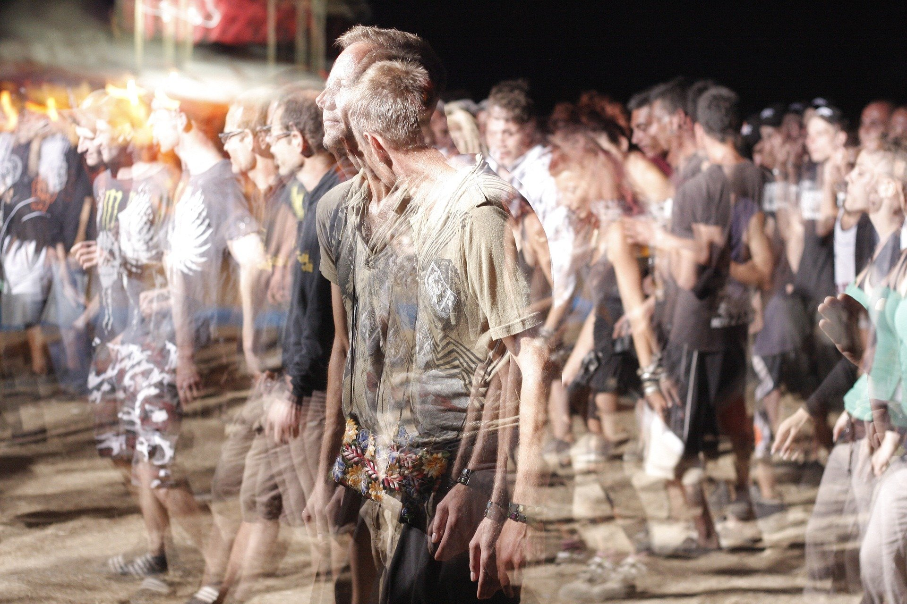

### E as festas? Podemos frequentá-las?

“O mundo nos faz inúmeros convites e a juventude se anima a aceitar quase todos. Até certo ponto, é valido conhecer de tudo, mas, sem de tudo fazer uso. Os lazeres são incontáveis, na pauta das atividades humanas. Porém, o comportamento deve pautar-se de bom senso, na escolha preferida. Quando se forma grupos e companheiros, ouve-se de tudo. Às vezes, até o que não se quer ouvir. É como se fosse uma mesa posta: há alimentos de difícil digestão para uns, que não os devem, portanto, ingerir. Assim são os assuntos. Eles são alimentos de todos os tipos. Se já conheces um pouco das ideias de Jesus, já podes escolher o que a consciência pede. Ouvir, podes ouvir de tudo, mas guardar somente o que é bom. As festinhas estimulam a alegria para todos que ali se reúnem. Podes ajudar os outros, mesmo nestes encontros festivos, cultivando a fraternidade e outros sentimentos elevados. São também um teste. Logo vão chegando as bebidas, vem a experimentação. O vício da bebida tem início no primeiro gole e, assim, o cigarro e as conversas improfícuas. Necessário não se deixar contaminar. O mundo está caminhando para a perfeição, em todos os seus aspectos, e as almas se encontram empenhadas com ele. O objetivo é crescer, e quem não atenta ao processo fica para trás, embaraçado na própria inércia. A inexperiência do jovem deve buscar inspiração na vivência dos pais. Consulta-os, no que tange aos acontecimentos nas festas, se ainda não sabes discernir com segurança. Se algum conflito te impede de falar em casa, sempre conhecemos alguém que nos possa ouvir e nos falar ao certo. Se és espírita, os livros são bons conselheiros, em todos os sentidos; busca-os nas horas de indecisões, que encontrarás o toque de compreensão para o que desejas saber.A doutrina dos Espíritos tem a sagrada missão de fazer reviver o cristianismo, nos dias atuais, para orientar a humanidade. Divulguemo-la onde estivermos, sem o azinhavre do fanatismo.As festinhas, sabemos, são momentos de descanso para o teu prolongado labor e os jovens têm necessidade destes encontros. A vida é convivência, é troca de experiência constantes. Mesmo sendo jovem, não te esqueças da oração, todos os dias. Ela te ajuda a guiar os teus passos, onde quer que seja. Não queremos pedir demais, no que se refere à tua reforma. Sabemos que todas as mudanças são demoradas, e elas andam pelas mãos do tempo, força de Deus em toda a Criação. Brinca, meu filho, mas aprende a brincar, para que tenhas paz no coração e tranquilidade na consciência.” 

Scheilla. _Chão de Rosas._ Psicografia de João Nunes Maia. 3.ed., p.152-155

### Condutas Importantes

“Pudésseis, meus amigos, não ter ocupação mais agradável que a de tornar os outros felizes! Quais são os festejos mundanos que poderíeis comparar às ditosas festas que celebrais, quando, tornando-vos representantes da Divindade, levais alegria a essas pobres famílias que conhecem da vida apenas dificuldades e amarguras \[…\].”  
 Allan Kardec. _O Evangelho Segundo o Espiritismo_. Editora Auta de Souza. 3.ed., Cap.13. item11. 

“Afastar-se de festas lamentáveis, como aquelas que assinalam a passagem do carnaval, inclusive as que se destaquem pelos excessos de gula, desregramento ou manifestações exteriores espetaculares. A verdadeira alegria não foge da temperança.”

André Luiz. _Conduta Espírita_. Psicografia de Francisco Cândido Xavier. 19.ed., p.129.