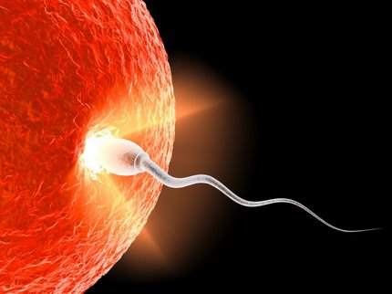
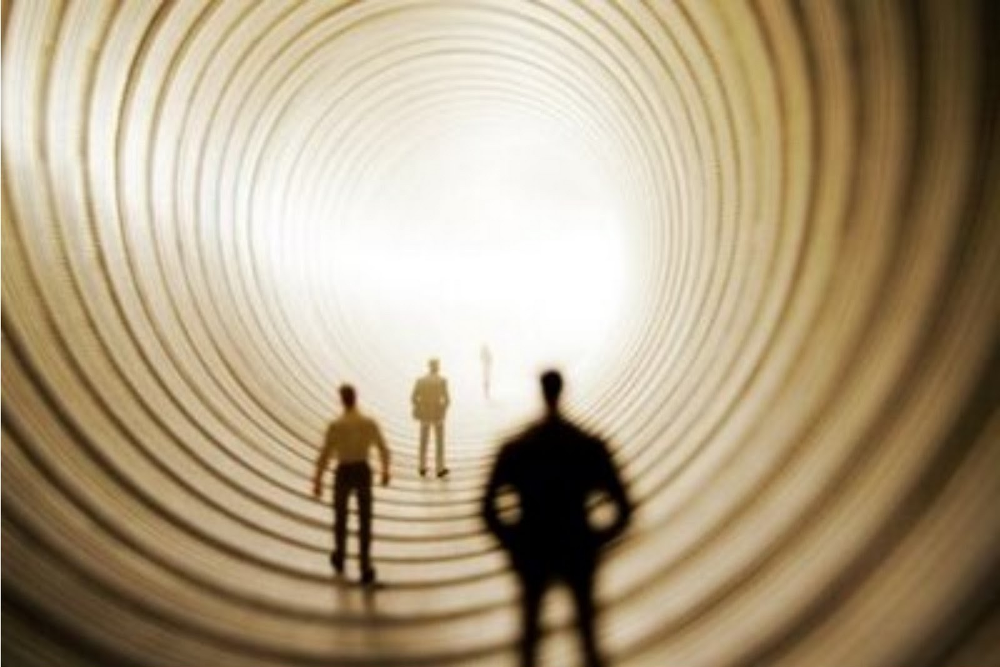

Portador de expressiva capacidade plasmadora, o perispírito registra todas as ações do Espírito através dos mecanismos sutis da mente que sobre ele age, estabelecendo os futuros parâmetros de comportamento, que serão fixados por automatismos vibratórios nas reencarnações porvindouras.

Corpo intermediário entre o ser pensante, eterno, e os equipamentos físicos, transitórios, por ele se processam as imposições da mente sobre a matéria e os efeitos dela em retorno à causa geratriz.

Captando o impulso do pensamento e computando a resposta da ação, a ele se incorporam os fenômenos da conduta atual do homem, assim programando os sucessos porvindouros, mediante os quais serão aprimoradas as conquistas, corrigidos os erros e reparados os danos destes últimos derivados.

Constituído por campos de força mui especiais, ele irradia vibrações específicas portadoras de carga própria, que facultam a perfeita sintonia com energias semelhantes, estabelecendo áreas de afinidade e repulsão de acordo com as ondas emitidas.

**O perispírito do reencarnante sincroniza com a vibração do espermatozóide compatível com as necessidades evolutivas**

Assim, quando por ocasião da reencarnação, o Espírito é encaminhado por necessidade evolutiva aos futuros genitores, no momento da fecundação o gameta masculino vitorioso esteve impulsionado pela energia do perispírito do reencarnante, que naquele espermatozóide encontrou os fatores genéticos de que necessitava para a programática a que se deve submeter.

A partir desse momento, os códigos genéticos da hereditariedade, em consonância com o conteúdo vibratório dos registos perispirituais, vão organizando o corpo que o Espírito habitará.

Como é certo que, em casos especiais, há toda uma elaboração de programa para o reencarnante, na generalidade, os automatismos vibratórios das Leis de Causalidade respondem pela ocorrência, que jamais tem lugar ao acaso.

Todo elemento irradia vibrações que lhe tipificam a espécie e respondem pela sua constituição.  
Espermatozóides e óvulos, em conseqüência, possuem campo de força específico, que propele os primeiros para o encontro com os últimos, facultando o surgimento da célula ovo.

Por sua vez, cada gameta exterioriza ondas que correspondem à sua fatalidade biológica, na programação genética de que se faz portadora.

Desse modo, o perispírito do reencarnante sincroniza com a vibração do espermatozóide que possui a mesma carga vibratória, sobre ele incidindo e passando a plasmar no óvulo fecundado o corpo compatível com as necessidades evolutivas, como decorrência das catalogadas ações pretéritas. Equilíbrio da forma ou anomalia, habilidades e destreza, ou incapacidade, inteligência, memória e lucidez, ou imbecilidade, atraso mental, oligofrenia serão estabelecidos desde já pela incidência das conquistas espirituais sobre o embrião em desenvolvimento.

**Qual o limite da Lei da hereditariedade no processo da reencarnação?**

Sem descartamos a hereditariedade nos processos da reencarnação, o seu totalitarismo, conforme entendem diversos estudiosos da Embriogenia e outras áreas da ciência, não tem razão de ser.

Cada Espírito é legatário de si mesmo. Seus atos e sua vida anterior são os plasmadores da sua nova existência corporal, impondo os processos de reabilitação, quando em dívida, ou de felicidade, se em crédito, sob os critérios da Divina Justiça.

Certamente, caracteres físicos, fisionômicos e até alguns comportamentais resultam das heranças genéticas e da convivência em família, jamais os de natureza psicológica que afetam o destino, ou de ordem fisiológica no mapa da evolução.

Saúde e enfermidade, beleza e feiúra, altura e pequenez, agilidade e retardamento, como outras expressões da vida física, procedem do Espírito que vem recompor e aumentar os valores bem ou mal utilizados nas existências pretéritas.

Além desses, os comportamentos e as manifestações mentais, sexuais, emocionais decorrem dos atos perpetrados antes e que a reencarnação traz de volta para a indispensável canalização em favor do progresso de cada ser.

As alienações, os conflitos e os traumas, as doenças congênitas, as deformidades físicas e degenerativas, assim como as condições morais, sociais e econômicas, são capítulos dos mecanismos espirituais, nunca heranças familiares, qual se a vida estivesse sob injunções do absurdo e da inconseqüência.

A aparente hereditariedade compulsória, assim como a injunção moral atuante em determinado indivíduo, fazendo recordar algum ancestral, explica-se em razão de ser aquele mesmo Espírito, ora renascido no clã, para dar prosseguimento a realizações que ficaram incompletas ou refazer as que foram perniciosas. Motivo este que libera “o filho de pagar pelos pais” ou avós, o que constituiria, se verdadeiro, uma terrível e arbitrária imposição da Justiça, que, mesmo na Terra, tem código penalógico mais equilibrado.

Os pensamentos largamente cultivados levam o indivíduo a ações inesperadas, como decorrência da adaptação mental que se permitiu. Desencadeada a ação, os efeitos serão incorporados ao modus vivendi posterior da criatura. E mesmo quando não se convertem em atitudes e realizações, por falta de oportunidade, aquelas aspirações mentais, vividas em clima interior, apresentam-se como formas e fantasmas que terão de ser diluídos por meio de reagentes de diferente ordem, para que se restabeleça o equilíbrio do conjunto espiritual.

Conforme a constância mental da idéia, aparece uma correspondente necessidade da emoção.  
Todos esses condicionamentos estabelecem o organograma físico, mental e moral da futura empresa reencarnacionista a que o Espírito se deve submeter, ante o fatalismo da evolução.

O conjunto – Espírito ou mente, perispírito ou psicossoma e corpo ou soma – é tão entranhadamente conjugado no processo da reencarnação que, em qualquer período da existência, são articulados ou desfeitos sucessivos equipamentos que procedem da ação de um sobre o outro. O Espírito aspira e o perispírito age sobre os implementos materiais, dando surgimento a respostas orgânicas ou a fatos que retornam à fonte original, como efeito da ação física que o mesmo corpo transfere para o ser eterno, concedendo-lhe crédito ou débito, que se incorpora à economia da vida planetária.

**O mundo mental modela o mundo físico**

O mundo mental, das aspirações e ideais, é o grande agente modelador do mundo físico, orgânico. Conforme as propostas daquele, têm lugar as manifestações neste.

Assim se compreende porque a Terra é mundo de “provas e expiações”, considerando-se que os Espíritos que nela habitam estagiam na sua grande generalidade em faixas iniciais, inferiores, portanto, da evolução.

À medida que o ser evolve, melhores condições estatui para o próprio crescimento, dentro do mesmo critério da lei do progresso, que realiza com mais segurança os mecanismos de desenvolvimento, de acordo com as conquistas logradas. Quanto mais adiantado um povo, mais fáceis e variados são-lhe os recursos para o seu avanço.

O pensamento, desse modo, é um agente de grave significado no processo natural da vida, representando o grau de elevação ou inferioridade do Espírito, que, mediante o seu psicossoma ou órgão intermediário, plasma o que lhe é melhor e mais necessário para marchar no rumo da libertação.  

(Manoel P. de Miranda. Temas da vida e da morte. Psicografado por Divaldo Pereira Franco. FEB.  2.ed., p.35 a 39)