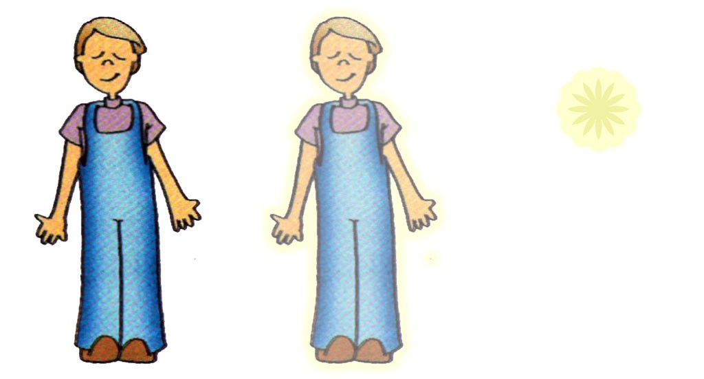
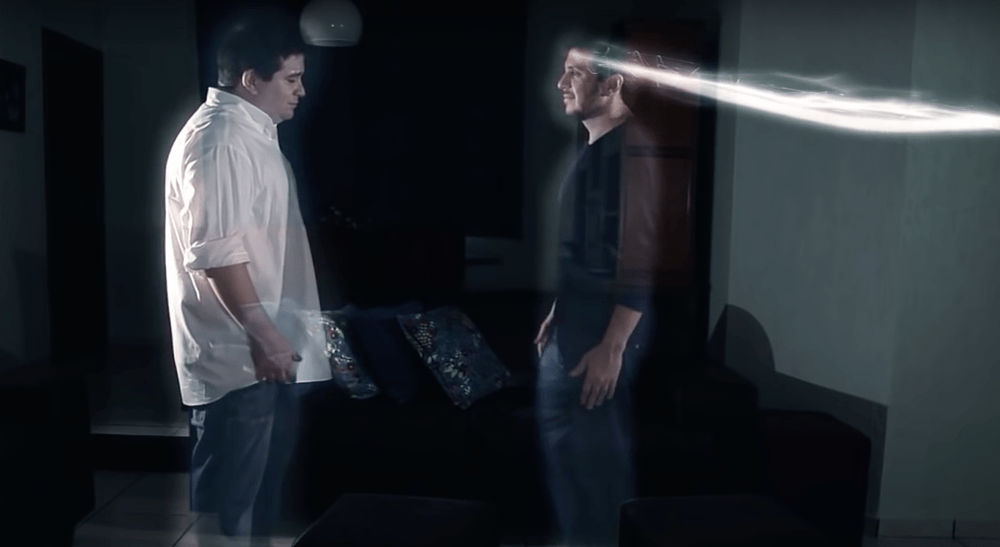

**Perispírito – envoltório do Espírito**

“Há no homem alguma outra coisa além da alma e do corpo?

´Há o laço que liga a alma no corpo.´

De que natureza é esse laço?

Semimaterial, isto é, de natureza intermédia entre o Espírito e o corpo. É preciso que seja assim para que os dois possam comunicar um com o outro. Por meio desse laço é que o Espírito atua sobre a matéria e reciprocamente.´” (Allan Kardec. O Livro dos Espíritos, perg. 135)

“O períspirito é, ainda, corpo organizado que, representando o molde fundamental da existência para o homem, subsiste, além do sepulcro.” (Emmanuel. Roteiro. Psicografia de Francisco Cândido Xavier. cap. 3-6)

**Comprovação da individualidade**

“Como podem os Espíritos, não tendo corpo, comprovar suas individualidades e distinguir-se dos outros seres espirituais que os rodeiam?

‘Comprovam suas individualidades pelo perispírito, que os torna distinguíveis uns dos outros, como faz o corpo entre os homens.’” (Allan Kardec. O Livro dos Espíritos, perg.94)

**Algumas propriedades do perispírito**

**“\[…\] O estudo das propriedades do perispírito, dos fluidos espirituais e dos atributos fisiológicos da alma abre novos horizontes à Ciência** e dá a chave de uma multidão de fenômenos incompreendidos até então, por falta de conhecimento da lei que os rege – fenômenos negados pelo materialismo, por se prenderem à espiritualidade, e qualificados e como milagres ou sortilégios por outras crenças.” (g.n.) (Allan Kardec. A gênese. cap. I, item 39-40)

**Sensibilidade**

“O perispírito é o órgão sensitivo do Espírito, por meio do qual este percebe coisas espirituais que escapam aos sentidos corpóreos. Pelos órgãos do corpo, a visão, a audição e as diversas sensações são localizadas e limitadas à percepção das coisas materiais; pelo sentido espiritual, ou psíquico elas se generalizam: o Espírito vê, ouve e sente, por todo o ser, tudo o que se encontra na esfera de irradiação do seu fluido perispirístico.” (Allan Kardec. A gênese, cap. XIV, item 22)

**Fio condutor do pensamento**

\[…\] é o intermediário de todas as sensações que o Espírito percebe e pelo qual transmite sua vontade ao exterior e atua sobre os órgãos corpo. Para nos servirmos de uma comparação material, diremos que é o fio elétrico condutor, que serve para a recepção e a transmissão do pensamento.” (Allan Kardec. O Livro dos médiuns, item 54)

**Conserva a personalidade e a memória**

“É (o perispírito) enfim, o guardião fiel, o acervo imperecível do nosso passado. Em sua substância incorruptível, fixaram-se as leis de nosso desenvolvimento, tornando-o por excelência o conservador de nossa personalidade, por isso que nele é que reside a memória.” (Gabriel Delanne. A Evolução Anímica, cap. I)

**Modelagem do corpo**

“\[…\] O perispírito é, pois, um organismo fluídico; é a forma preexistente e sobrevivente do ser humano, sobre a qual se modela o envoltório carnal, como uma veste dupla e invisível, constituída de matéria quintessenciada \[…\].” (Leon Denis. Depois da morte, 3ª parte, item XXI)

**Penetrabilidade**

“Outra propriedade do perispírito, peculiar essa à sua natureza etérea é a penetrabilidade. Matéria nenhuma lhe opõe obstáculo; ele as atravessa todas, como a luz atravessa corpos transparentes.” (Allan Kardec. Obras póstumas, 1ª parte, cap. 2, item 16)

**Ponderabilidade – o períspirito obedece a lei de gravidade**

“O perispírito é, ainda, corpo organização que, representando o molde fundamental da existência para o homem, subsiste, além do sepulcro, demorando-se na região que lhe é própria, de conformidade com o seu peso específico. \[…\]

O perispírito, quanto à forma somática, obedece a leis de gravidade, no plano a que se afina.” (Emmanuel. Roteiro. Psicografia de Francisco Cândido Xavier. cap. 6)

**Visibilidade, tangibilidade e opacidade**

“Está, em princípio, admitido que o Espírito pode dar ao seu perispírito todas as aparências; que, mediante uma modificação na disposição molecular, pode dar-lhe a visibilidade, a tangibilidade e, conseguintemente a opacidade. (Allan Kardec. O Livro dos médiuns, item 123)

**Luminescência**

“\[…\] Poderá então o perispírito mudar de aspecto, fazer-se brilhante, se tal for a vontade do Espírito e se este dispuser de poder para tanto.” (Allan Kardec. O Livro dos médiuns, item 123)

**Radiação**

“Acresce que, quanto mais elevado é um Espírito, tanto mais dilatada é a sua irradiação.” (Allan Kardec. O Livro dos médiuns, item 268)

**Flexibilidade e expansibilidade**

“\[…\] Mas a matéria sutil do perispírito não possui a tenacidade, nem a rigidez da matéria compacta do corpo; é, se assim podemos exprimir, flexível e expansível, donde resulta que a forma que toma, conquanto decalcada na do corpo, não é absoluta, amolga-se à vontade do Espírito, que lhe pode dar a aparência que entenda, ao passo que o invólucro sólido lhe oferece invencível resistência.”

(Allan Kardec. O Livro dos médiuns, item 56)