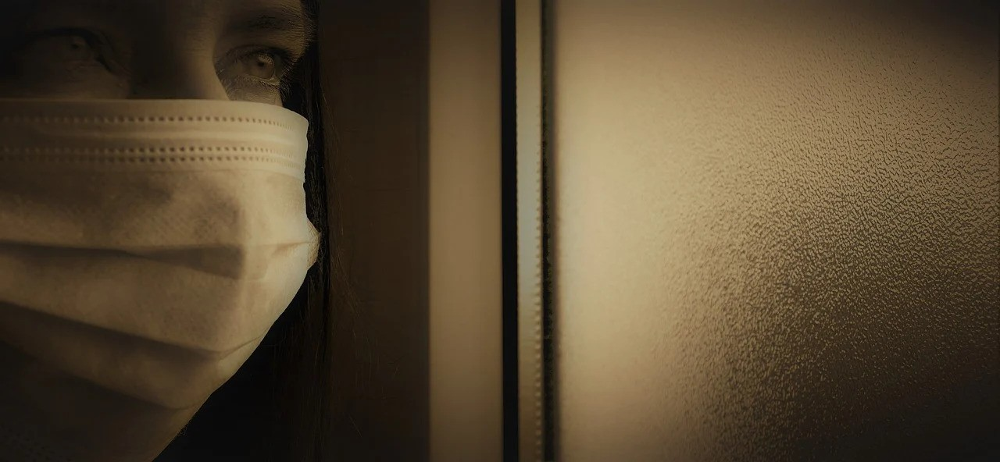

“Esses acontecimentos e outros de natureza sísmica e cósmica darão lugar a maior soma de sofrimento humano, enquanto facultarão também a presença dos apóstolos da caridade e do amor, da fraternidade e do bem, formando a família da misericórdia em socorro a todas as vítimas, sejam aquelas que padeçam a contaminação ou chorem as perdas afetivas e/ou as misérias de outras expressões.

Ninguém conseguirá fugir ao determinismo do sofrimento, embora não tenham diretamente razões, mas por solidariedade e compaixão.

Avizinha-se a hora em que das nossas colônias espirituais descerão ao planeta em desolação as equipes socorristas em nome de Jesus, mergulhando em reencarnações redentoras e atendimentos específicos durante a atual e as demais calamidades que venham a aconteccer.

Somente o sentimento de amor, conforme o expressou Jesus e o viveu, logrará modificar as paisagens humanas neste momento.

As esperanças cristãs estão centradas no Consolador com a sublime mensagem de Vida imperecível e o comportamento digno na vilegiatura carnal. Benfeitores abnegados recusam-se a ascender, de forma a continuarem auxiliando a Humanidade iluminada pelo Cruzeiro do Sul, mas que prefere as sombras da ignorância e da crueldade, teimando em olvidar que a jornada física é de efêmera duração.

Logo mais, formaremos nossas caravanas de socorro, porquanto já estão tomadas providências para receber os irmãos que desencarnarem sob a trágica tempestade viral.

## A obsessão – nuvem espiritual que semeia a desordem durante a pandemia

Recordemos da orientação do Senhor Jesus ao encaminhar os setenta à Galileia: ‘Eu vos mando como ovelhas brandas para conviver com lobos rapaces’…

Certamente se referia aos irmãos desencarnados, que se comprazem na geração do terror e das lamentáveis obsessões aos deambulantes do corpo físico. Nestes dias de horror, também eles, nossos irmãos infelizes, comprazem-se em atormentar antigos desafetos que se dizem do Senhor Jesus, a Quem perseguem tresvariados e odientos.\[…\]

Formando uma _nuvem espiritual,_ semeiam a desordem e a incompreensão nas almas já aturdidas em si mesmas, perseguindo-as com tenaz insistência.

Atividades severas nos aguardam em nome do amor, a fim de perseverarmos as nossas comunidades dos assaltos perigosos do mal em hordas asselvajadas e dispormos de condições para recebermos os recém-desencarnados que possamos trazer para nossos diversos setores socorristas.

Manoel Philomeno de Miranda. _No rumo do mundo de Regeneração._ Psicografia de Divaldo P. Franco. Capítulo 1