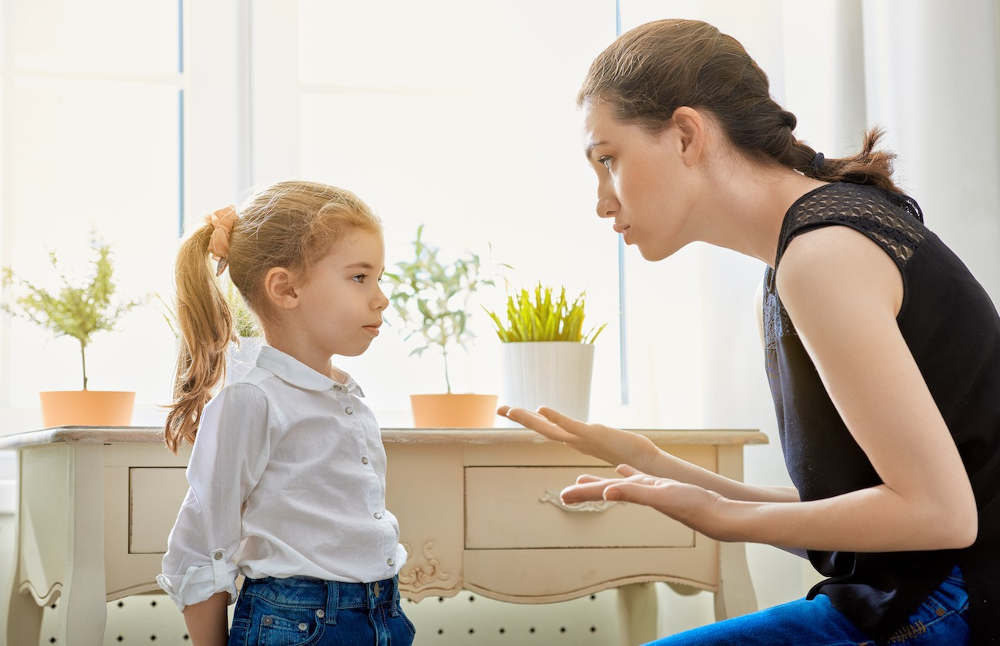

Desde a infância deve prepará-los para o trabalho e para a luta que os esperam.  
Desde os primeiros anos, deve ensinar a criança a fugir do abismo da liberdade, controlando-lhe as atitudes e concertando-lhe as posições mentais, pois que essa é a ocasião mais propícia à edificação das bases de uma vida.  
Ensinará a tolerância mais pura, mas não desdenhará a energia quando seja necessária no processo da educação…  
Sacrificar-se-à de todos os modos ao seu alcance…, pela paz dos filhos, ensinando-lhes que toda dor é respeitável, que todo trabalho edificante é divino, e que todo desperdício é falta grave.  
Ensinar-lhes-à o respeito pelo infortúnio alheio, para que sejam igualmente amparados no mundo, na hora de amargura que os espera, comum a todos os Espíritos encarnados.  
Buscará na piedosa Mãe de Jesus o símbolo das virtudes cristãs, transmitindo aos que a cercam os dons sublimes da humildade e da perseverança, sem qualquer preocupação pelas glorias efêmeras da vida material…

 (Emmanuel. O Consolador. Psicografado por Fancisco Cândido Xavier. FEB. perg.189)