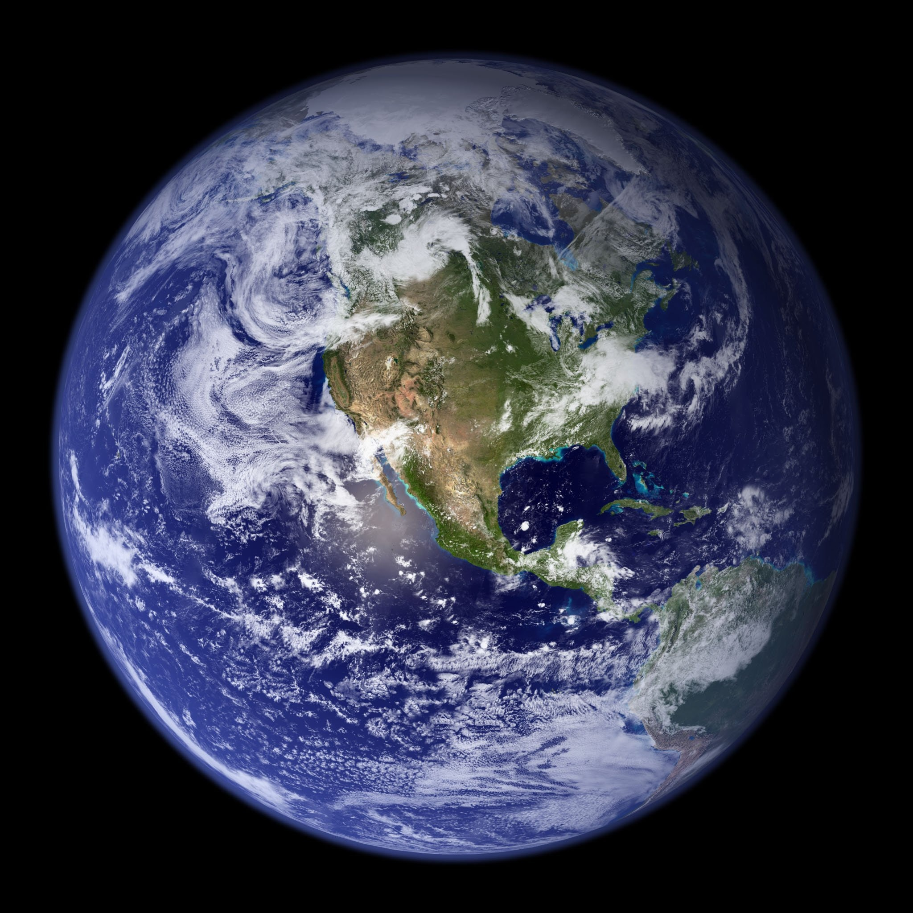
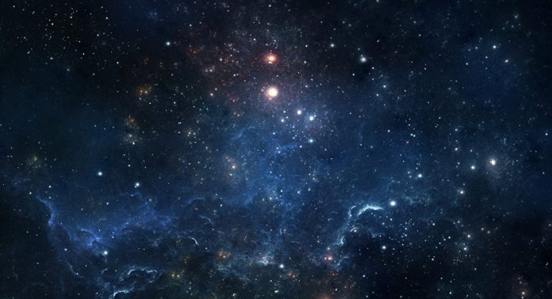

**Todos os globos que circulam no espaço são habitados?**

Sim e o homem terreno está bem longe de ser, como acredita, o primeiro em inteligência, bondade e perfeição. Há, entretanto, homens que se julgam espíritos fortes e imaginam que só este pequeno globo tem o privilégio de ser habitado por seres racionais. Orgulho e vaidade! Crêem que Deus criou o Universo somente para eles. (Allan Kardec. _O Livro dos Espíritos_, 33. ed., perg. 55.)

#### Diversas categorias de mundos

Do ensino dado pelos Espíritos, resulta que muito diferentes umas das outras são as condições dos mundos, quanto ao grau de adiantamento ou de inferioridade dos seus habitantes. (Allan Kardec. _O Evangelho segundo o Espiritismo_, 107. ed., p. 72-73.)

São assim classificados os mundos habitados:

*   Mundos primitivos, destinados às primeiras encarnações da alma humana;
*   Mundos de provas e expiações, onde domina o mal;
*   Mundos de regeneração, nos quais as almas que ainda têm o que expiar haurem novas forças;
*   Mundos ditosos, onde o bem sobrepuja o mal; e
*   Mundos Celestes ou divinos, habitações de Espíritos depurados, onde exclusivamente reina o bem.

A Terra pertence à categoria dos mundos de expiação e provas, razão por que aí vive o homem a braços com tantas misérias. (Allan Kardec, _O Evangelho Segundo o Espiritismo_, 107. ed., p. 72-73.)

#### A grande família universal

E dizer-se que só na nossa modesta galáxia existem mais de cem bilhões de sóis! Esses mundos incontáveis são, como disse Jesus, as muitas moradas da Casa do Eterno Pai. É neles que nascem, crescem, vivem e se aperfeiçoam os Filhos do Criador, a Grande Família Universal. São eles as grandes Escolas das Almas, as Grandes Oficinas do Espírito, as Grandes Universidades e os Grandes Laboratórios do Infinito… E são também — Deus seja louvado! — os berços da Vida. (Irmão Áureo, _Universo e Vida_, 4 ed., p. 31-33)

#### A nova geração

Para que na Terra sejam felizes os homens, preciso é que somente a povoem Espíritos bons, encarnados e desencarnados, que somente ao bem se dediquem. Havendo chegado o tempo, grande emigração se verifica dos que a habitam: a dos que praticam o mal pelo mal, ainda não tocados pelo sentimento do bem, os quais, já não sendo dignos do planeta transformado, serão excluídos, porque, senão, lhe ocasionariam de novo perturbação e confusão e constituiriam obstáculo ao progresso. Irão expiar o endurecimento de seus corações, uns em mundos inferiores, outros em raças terrestres ainda atrasadas, equivalentes a mundos daquela ordem, aos quais levarão os conhecimentos que hajam adquirido, tendo por missão fazê-las avançar. Substituí-los-ão Espíritos melhores, que farão reinem em seu seio a justiça, a paz e a fraternidade. (…) Em cada criança que nascer, em vez de um Espírito atrasado e inclinado ao mal, que antes nela encarnaria, virá um Espírito mais adiantado e propenso ao bem. (Allan Kardec, _A gênese_, 19 ed., p. 418)

#### O porvir

Os filhos da iniqüidade, empedernidos no crime e cristalizados no orgulho, deixarão as fronteiras fisiomagnéticas da Terra, em demanda das novas experiências a que fizeram jus; mas aqui, no orbe aliviado e repleto de escombros, uma nova idade de trabalho e de esperança nascerá, ao Sol da Regeneração e da Graça.

Nesse mundo renovado, a paz inalterável instituirá um progresso sem temores e uma civilização sem maldade. Os habitantes do planeta estarão muito longe da angelitude, mas serão operosos e sinceros, um tanto sofredores e endividados para com a Eterna Justiça, mas fraternos e dóceis à inspiração superior. O Estatuto dos Povos manterá o Parlamento das Nações, onde Excelsos Espíritos materializados designarão, em nome e por escolha do Cristo, os Governadores da Terra. Sem monarquias, oligarquias, plutocracias ou democracias, haverá apenas uma _Espiritocracia Evangélica_, fundada no celeste platonismo do mérito maior, do maior saber e da maior virtude, para o serviço mais amplo e mais fecundo. (Irmão Áureo, _Universo e Vida_, 4 ed., p. 168-169)

Quer saber mais? Estude o livro _**Conheça o Espiritismo**_: [http://www.editoraautadesouza.com.br/](http://www.editoraautadesouza.com.br/)