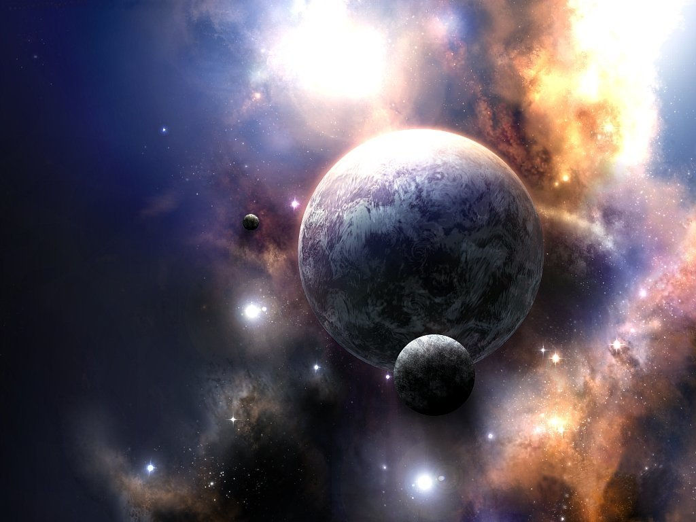

Enquanto o homem se encaminha para a Lua, estudando-a de perto, comove-nos pensar que a Doutrina Espírita se referia à pluralidade dos mundos habitados, precisamente há mais de um século.

Acresce notar, ainda, que os veneráveis orientadores da Nova Revelação, guiando o pensamento de Allan Kardec, fizeram-no escrever a sábia declaração: “Deus povoou de seres vivos todos os mundos, concorrendo esses seres ao objetivo final da Providência.”

Sabemos hoje que moramos na Via-Láctea — a galáxia comparável a imensa cidade nos domínios universais. Essa cidade possui mais de duzentos milhões de sóis, transportando consigo planetas, asteróides, cometas, meteoros, aluviões de poeira e toda uma infinidade de turbilhões energéticos.

Entre esses sóis está o nosso, modestíssimo foco de luz, considerando-se que Sírius, um de seus vizinhos, apresenta brilho quarenta vezes maior. E, acompanhando-o, a nossa Terra, com todo o cortejo de suas orgulhosas nações, tem a importância de uma “casa nos fundos”, visto que, se a Lua é satélite nosso, o Globo que nos asila é satélite pequenino desse mesmo Sol que nos sustenta.

Viajando a luz com a velocidade de trezentos mil quilômetros por segundo, gasta milhares de anos para atravessar, de um ponto a outro, o continente galáctico em que residimos.

Mas os espelhos telescópicos do homem já conseguem assinalar a existência de milhões e milhões de outras galáxias, mais ou menos semelhantes à nossa, a se espraiarem na vastidão do Universo.

Até agora, neste breve lembrete, nos reportamos simplesmente, ao campo físico observável pelos homens encarnados, atreitos, como é natural, ao raio reduzido da percepção que lhes é própria, sem nos referirmos às esferas espirituais mais complexas que rodeiam cada planeta, quanto cada sistema.

Nesse critério, vamos facilmente encontrar, em todos os círculos cósmicos, os seres vivos da asserção de Kardec, embora a instrumentação do homem não os divise a todos. Eles se desenvolvem através de inimagináveis graus evolutivos, cabendo-nos reconhecer que, em aludindo à pluralidade dos mundos habitados, não se deverá olvidar a gama infinita das vibrações e os estados múltiplos da matéria.

Temos, assim, no Espaço Incomensurável, mundos-berços e mundos-experiências, mundos-universidades e mundos-templos, mundos-oficinas e mundos-reformatórios, mundos-hospitais e mundos-prisões.

Saudamos, pois, o advento da nova era, em que o homem físico, valendo-se principalmente do rádio e do radar, do foguete e do cérebro eletrônico, pode incursionar além da Lua, auscultando, em regime de limitação.

É compreensível, as faixas de matéria em que psiquicamente se entrosa.  
E desejando-lhe paz, a fim de que prossiga em suas arrojadas e preciosas perquirições, podemos assegurar que em todos os planos a consciência acordada à luz da razão e da responsabilidade surpreenderá sempre, por base de todo aperfeiçoamento moral, o preceito do Cristo que coloca “o amor a Deus e ao próximo» como sendo o coração da vida, pulsando, invariável, no peito da Justiça Divina que manda, em toda parte, conferir a cada um segundo as próprias obras.

Emmanuel. **Religião dos Espíritos**. Psicografado por Francisco Cândido Chico Xavier. FEB. 8 ed., p.219.