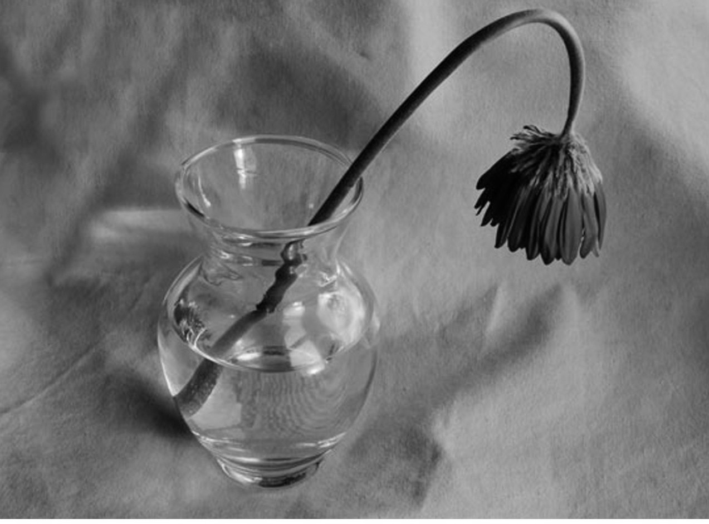

Com Claude Bernard, temos constatado a originalidade de processos da matéria organizada para fabricação das substâncias necessárias ao funcionamento vital, atribuindo essas propriedades aos órgãos dotados de uma virtude especial, inencontrável nos corpos brutos. A existência de uma força animante do organismo torna-se, porém, mais evidente ainda, ao examinarmos a evolução de todos os seres vivos.

Tudo o que tem vida nasce, cresce e morre. É fato geral que quase não padece exceção.\[i\] Mas, por que morrer? Excetuando-se os casos de acidentes ou de enfermidades que destroem irremediavelmente os tecidos, como se dá que, mantendo constantes as mesmas condições gerais, indispensáveis ao entretenimento da vida, isto é, a água, o ar, o calor e os alimentos, o ser depereça até à dissociação total?

Dizer que os órgãos se gastam é indicar apenas uma fase da evolução, é demonstrar um fato. Neste caso, pergunta-se: mas por que se gastam os órgãos e por que se mantêm perfeitos na idade viril, do mesmo passo que aumentam de energia na juventude?

São interrogativas diante das quais a ciência materialista emudece. Sem embargo, uma explicação se oferece e nós vamos expô-la.

Desde que admitamos na célula fecundada uma certa quantidade de força vital, tudo se torna compreensível.

A vida total de um indivíduo é o resultado de um trabalho a completar-se, trabalho esse mensurável pelas incessantes reconstituições da matéria desgastada pela função vital, e a força para isso necessária pode considerar-se como uma função contínua, que aumenta, atinge um máximo e baixa a zero.

Se projetamos no ar uma pedra, comunicamos à pedra a força dos nossos músculos. A pedra eleva-se rápida, a despeito da atração centrípeta, até que as duas forças contrárias se equilibrem. Depois, a atração predomina, a pedra cai e, quando chega ao ponto de partida, toda a energia a ela comunicada tem desaparecido.

Pode conceber-se que algo de análogo se passe com os seres vivos. O reservatório de energia potencial, proveniente dos genitores, e que se encontra na célula original, transforma-se em energia natural, à medida que organiza a matéria. De começo, a ação é assaz enérgica, a assimilação, o agrupamento das moléculas, ultrapassam a desassimilação, o indivíduo cresce; a seguir, vem o equilíbrio de perdas e ganhos: é a maturidade, a estabilidade do corpo, até que, chegada a senectude, esgotada a força vital, não mais suficientemente alimentados os tecidos, a morte sobrevém, o organismo desagrega-se, a matéria retorna ao mundo inorgânico.

Assim, pois, acreditamos haja uma certa quantidade de força vital distribuída por toda criatura que surge na Terra; e, como a geração espontânea não existe em nossa época,\[ii\] é por filiação que se transmite essa força, aliás, só manifesta nos seres animados.

Mas, não só na matéria e no seu condicionamento residem as propriedades da vida orgânica. Há que lhe presumir, ainda, uma força vital renovadora, ou seja, refectiva das partes destruídas. Daí, o absoluto erro dos sábios, que imaginam surpreender o segredo da vida em promovendo a síntese da matéria orgânica. Suponhamos que, em conseqüência de manipulações químicas, tão sábias e complicadas quanto as possamos imaginar, e movimentando todos os agentes físicos – calor, eletricidade, pressão, etc. –, chegássemos a fabricar protoplasma artificial…

Mas… a vida? Tê-la-ia tal produto? Não, certo, porque o que caracteriza a vida é a nutrição reparadora do dispêndio.

Essa massa protoplásmica há de ser inerte, insensível às excitações exteriores, qual se não dá com a massa viva. Mas, ainda supondo que assim não fora, só pudéramos justificá-lo em detrimento da estrutura íntima, destruindo-se. Essa massa artificial poderia subsistir a título precário, mas, uma vez exausta, não haveria como reproduzir-se, não viveria mais.

Citamos o protoplasma porque ele representa a matéria simples por excelência; mas, se tomássemos uma célula, a complicação aumentaria, visto que a célula tem forma determinada e a Ciência é absolutamente incapaz de explicar essa forma, como veremos dentro em breve.

Aqui, importa definir precisamente o que pensamos, para que fique bem clara a nossa concepção.

Máquina delicada e complexa é o corpo humano; os tecidos que o formam originam-se de combinações químicas muito instáveis, devido aos seus componentes; e nós não ignoramos que as mesmas leis que regem o mundo inorgânico regem os seres organizados. Assim, sabemos que, num organismo vivo, o trabalho mecânico de um músculo pode traduzir-se em equivalente de calor; que a força despendida não é criada pelo ser, e lhe provém de uma fonte exterior, que o provê de alimentos, inclusive o oxigênio; e que o papel do corpo físico consiste em transformar a energia recebida, albergando-a em combinações instáveis que a emanciparão à menor excitação apropriada, isto é, sob ação volitiva, ou pelo jogo de irritantes especiais dos tecidos, ou de ações reflexas.

Até aí, nada de mais explicável pelas leis físico-químicas.

Mas, quando ocorre uma dessas ações, quando a substância do músculo operante se destrói, é, então, que a força vital intervém para reconstituir o tecido, refazendo as células servidas à manifestação vital. Nisso está, precisamente, o que diferencia da matéria bruta o ser animado.

Na planta mais ínfima existe alguma coisa mais que no mineral, e essa alguma coisa não repara o corpo sempre nas mesmas condições. Essa refecção varia com a idade: integral na juventude, incompleta na velhice. É uma força que tende a diminuir, até que se extingue.

Há, portanto, uma força vital, inteiramente outra que as de nós conhecidas, mas, força que também não deixa de ser uma modificação da energia universal, tal como a eletricidade, que se distingue do calor ou do magnetismo, posto que estas duas forças não passem também de modalidades da mesma energia. Por si só, essa força vital nada engendraria, não lhe estivera a inteligência associada, a partir das manifestações mais rudimentares, por culminar no mais elevado complexo – o homem. Todo ser vivente possui uma parcela de inteligência rudimentaríssima, quanto a possamos imaginar nas formas vitais primitivas, mas que aumenta e especifica-se à proporção que galga a cadeia dos seres, para abrolhar na humanidade.

Teremos ocasião de voltar a este assunto tão relevante, tão logo tenhamos fixado o papel do perispírito nos seres animados.

A força vital por si só não bastaria para explicar a forma característica de todos os indivíduos, e tampouco justificaria a hierarquia sistematizada de todos os órgãos, sua sinergia em função de um esforço comum, visto serem eles, simultaneamente, autônomos e solidários. Neste ponto é que incide o ascendente da intervenção do perispírito, ou seja, de um órgão que possua as leis organogênicas, mantenedoras da fixidez do organismo, através das constantes mutações moleculares.

 Gabriel Delanne. A evolução anímica. Cap. 1.

\_\_\_\_\_\_\_\_\_\_\_\_\_\_\_\_\_\_\_\_\_\_\_\_\_\_\_\_\_\_\_\_\_\_\_\_\_\_\_\_\_\_\_\_\_\_\_\_\_

\[i\] Dizemos quase, porque organismos inferiores, como as moneras, que são uma simples célula, jamais se destroem, a não ser acidentalmente. De fato, o que sucede é que, depois de atingirem um certo volume, por efeito da nutrição, esses corpos de bipartem e os dois segmentos tornam-se dois seres distintos, a crescerem e se reproduzirem pelos mesmos processos. Nesse caso, não há morte, não se pode distinguir a geradora da gerada, nem saber em qual reside a individualidade. São, portanto, realmente imortais.

\[ii\] As experiências de Pasteur demonstraram à saciedade que, presentemente, todo indivíduo provém de um semelhante. Nada prova, porém, que assim tenha sido originariamente e que, em épocas prístinas, as condições vitais não pudessem variar a tal ponto que a monera engendrasse, mediante evoluções gradativas e ascendentes, o homem atual.