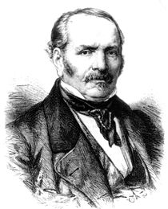

## **Deus – Jesus – Doutrina Espírita**

“Se a filosofia é a busca e a conquista da verdade absoluta, nenhuma ação humana especialmente aquelas direcionadas à educação, podem se considerar desvinculadas deste processo. **Como**, e **que verdade** se busca são as grandes questões.

Para sedimentar um trabalho sólido, sem se perder em divagações teóricas, esta proposta de Metodologia para Escola Espírita busca a verdade absoluta que é Deus, através dos caminhos confiáveis e seguros conhecidos pela humanidade: Jesus (“Eu sou o caminho, a Verdade e a Vida, ninguém vem ao Pai, senão por mim” – João 14:6) e a Doutrina Espírita (“Eu rogarei ao Pai, e Ele vos dará outro Consolador, para que fique eternamente convosco…” – João 14:15).

Todo o trabalho pedagógico aqui proposto sustenta-se nestas três incontestáveis e seguras verdades, conforme passamos a descrever.”

**Deus: Nossa essência e nossa destinação**

“Assim como o fluido mentomagnético envolve e penetra o organismo fisiopsicossomático do ser humano, que modela e comanda em suas mais íntimas estruturas, o Universo inteiro vive mergulhado e penetrado pelo fluido cósmico e vivificador que dinama da Mente Paternal de Deus.

Como já foi dito,  é no Eterno Pai que somos e vivemos. Ele é nossa vida e nossa luz, nossa essência e nossa destinação. Dele recebemos o dom do raciocínio e do movimento, da consciência e da vontade. Ele é a alma de nossa alma, a substância de nosso ser. Existimos e evoluímos para conhecê-Lo e nEle nos realizarmos na plenitude do Espírito, que é felicidade e harmonia, amor e poder. Viajamos para Ele desde tempos imemoráveis, do Cristal ao vírus, da alga ao cefalópode, da esponja à medusa, do verme ao batráquio, do lacertino ao mamífero, do pitecantropo ao homem.”

“Quanto mais aprendermos e crescermos, mais pequeninos nos sentimos na escala evolutiva dos seres, em face das excelsas grandezas que continuamente nos deparamos. Quando, porém nos voltamos para o Senhor de Tudo e de Todos, e sentimos vibrar dentro de nós o Espírito Divino do nosso Criador e Pai, reintegramo-nos na graça e na esperança, na alegria e na felicidade de existir, cônscios de que através do tempo-espaço de nossas limitações e de nossas dores, chegaremos um dia à intemporalidade ilimitada da perfeição, no Seio Paterno do Onipotente Amor de que provimos.”

**Jesus: Nosso Guia e Modelo**

625. Qual o tipo mais perfeito que Deus tem oferecido ao homem, para lhe servir de guia e modelo? 

“Jesus.”

“Para o homem, Jesus constitui o tipo da perfeição moral a que a Humanidade pode aspirar na Terra. Deus no-lo oferece como o mais perfeito modelo e a doutrina que ensinou é a expressão mais pura da lei do Senhor, porque, sendo ele o mais puro de quantos têm aparecido na Terra, o Espírito Divino o animava. Quanto aos que, pretendendo instruir o homem na lei de Deus, o têm transviado, ensinando-lhe falsos princípios, isso aconteceu por haverem deixado que os dominassem sentimentos demasiado terrenos e por terem confundido as leis que regulam as condições da vida da alma, com as que regem a vida do corpo. Muitos hão apresentado como leis divinas simples leis humanas estatuídas para servir às paixões e dominar os homens.” (Allan Kardec, _O Livro dos Espíritos_, perg. 6)

“Eu sou o caminho, a verdade e a vida, ninguém vem ao Pai, senão por mim.” (Almeida, João Ferreira de, A Bíblia Sagrada – 2ª edição João 14.6)

“Naturalmente, ninguém “vem ao Pai” deve significar que ninguém chegará ao estado superior de perfeição, a essa herança Divina, que já possuímos, fora dos seus ensinamentos, ou seja fora do amor que já resume inteiramente a Doutrina de Jesus, porque é o sentimento por excelência” (Kardec, Allan, _O Evangelho Segundo o Espiritismo,_ FEB, 97 ed.,1994)

Nota-se que Jesus não afirmou “Ninguém vai  ao Pai” mas sim “Ninguém vem ao Pai” (segundo as melhores e mais aceitas traduções do Evangelho), o que demonstra que Ele já chegou a este estado superior de perfeição.” (Alves, Walter Oliveira. Educação do Espírito. 2 ed. São Paulo, Ed. IDE)

**Doutrina Espírita: Poderoso Elemento de Moralização**

“\[…\] A Doutrina Espiritista é uma síntese gloriosa de fraternidade e de amor. O seu grande objeto é esclarecer a inteligência humana.” (Emmanuel, _O Consolador_, FEB,15 ed.,1991)

“\[…\] Ministrando a prova material da existência e da imortalidade da alma, iniciando-nos em os mistérios do nascimento, da morte, da vida futura, da vida universal, tornando-vos palpáveis as inevitáveis consequências do bem e do mal, a Doutrina Espírita, melhor do que qualquer outra, põe em relevo a necessidade da melhoria individual. Por meio dela, sabe o homem donde vem, para onde vai, por que está na Terra; o bem tem um objetivo, uma utilidade prática. Ela não se limita a preparar o homem para o futuro, forma-o também para o presente, para a sociedade. Melhorando-se moralmente, os homens prepararão na Terra o reinado da paz e da fraternidade.

A Doutrina Espírita é assim o mais poderoso elemento de moralização, por se dirigir simultaneamente ao coração, à inteligência e ao interesse pessoal bem compreendido.

Por sua mesma essência, o Espiritismo participa de todos os ramos dos conhecimentos físicos, metafísicos e morais. São inúmeros as questões que ele envolve, as quais, no entanto, podem resumir-se nos pontos seguintes que, considerados verdades inconcussas, formam o programa das crenças espíritas.” ( Allan Kardec, _Obras Póstumas,_ FEB_,_ 22 ed.,1987)

Retirado do livro: _Manual da Escola Espírita, Ed. Auta de Souza, 2007._