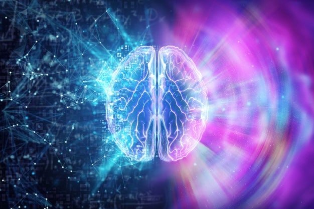

A hipótese de que o subconsciente é o responsável pelas personificações parasitárias e anômalas foi a primeira levantada contra a mediunidade, dando surgimento às conceituações negativas apressadas, como patologias inerentes ao indivíduo, por cujo intermédio pareciam comunicar-se as almas dos mortos. A histeria, por sua vez, foi posta para coadjuvar tão aberrante diagnóstico, que teria fundamento fisiológico no polígono cerebral, de Wundt, encarregado de arquivar os conflitos e as frustrações que se corporificariam como estados de alienação, credora de tratamento especializado, em detrimento da possibilidade de comunicação espiritual.

Mais tarde, o inconsciente de Freud, assumiu a responsabilidade por tal degradação da personalidade, que ocultava, na sua gênese, qualquer tipo de distúrbio da libido.

Além dessas explicações, foram adicionadas as hipóteses da fraude, da dissimulação, da telepatia, da hiperestesia, em vãs tentativas de negar a veracidade do intercâmbio entre os encarnados e desencarnados.

\[…\] Descartamos as inconscientes hipóteses da dissimulação e da fraude, porque são parte integrante de determinados caracteres morais do homem, sempre presentes nos diversos setores nos quais se encontram, e que, por aí remanesceram, não invalidam os valores legítimos e nobres das atividades de outra natureza.

A mediunidade é expressão fisiopsíquica inerente ao homem, por cujo meio é-lhe possível entrar em contacto com outras faixas vibratórias, além e aquém daquelas que são captadas pelos seus equipamentos sensoriais.

A percepção sensorial humana se encontra adstrita a pequena faixa de vibrações.

Somente as eletromagnéticas que transitam entre o vermelho, que é a mais baixa frequência visível, e o violeta que lhe é o oposto, portanto, a mais alta, podem ser  captadas em razão de permitirem vibrar as terminais do nervo óptico na retina. As micro-ondas, as caloríferas, as de rádio, porque não correspondem a frequências cuja ressonância atinjam a visão, não são percebidas, embora sejam portadoras da mesma natureza das cores registradas.

Assim, no imenso espectro de frequências que abrange as ondas longas de rádio, chegando aos raios gama e cósmicos, a limitada visão do homem apenas seleciona mui pequena faixa, conforme referido.

A audição, da mesma forma, é-lhe muito reduzida. Captando sons que ocorrem entre 16 e 20.000 vibrações por segundo, perde a criatura para os animais, com capacidade muito maior de percepção, qual lhes ocorre também, na área da visão. 

Não obstante, a desinformação ou má vontade teimam em associar à loucura e à neurose a presença dos registros mediúnicos.

As disposições pessoais para os desequilíbrios são inatas no homem, que neles estão em gérmen, assomando e predominando como psicopatologias em todos os campos de atividade nos quais se encontram esses indivíduos.

Desse modo, é destituído de realidade o conceito que se vulgariza entre os desconhecedores do Espiritismo e, por extensão, da mediunidade, que o exercício dessa predisposição leva o seu possuidor à desarmonia mental, ou propicia-lhe má sorte, desconcertos sociais e econômicos.

O desenvolvimento ou educação da mediunidade oferece uma instrumentalização a mais, um sexto sentido de grande valor para complementar a precariedade de recursos e funções de que dispõe o Espírito encarnado.

Certamente que um instrumento deixado ao abandono termina por perder a capacidade para a qual foi construída, danificando-se sob a ação perniciosa do tempo e do desmazelo. Com qualquer função sensorial ou paranormal ocorre o mesmo. O órgão não exercitado se atrofia, assim como a mediunidade não exercida perde os registros, a percepção paranormal.

De tal realidade, para se afirmar com leviana convicção que a mesma é geradora de danos e prejuízos vai um lago pego.

Os danos e insucessos, as dificuldades e os desafios, que o homem se vê compelido a enfrentar, resultam da sua conduta passada ou presente que lhe proporciona a colheita equivalente às ações distribuídas.

Convenhamos que a atividade mediúnica bem executada, posta a serviço do engrandecimento das criaturas e da sociedade – a mediunidade espírita – , propicia gozos e respeito que felicitam aquele que a aplica no bem, conforme é fácil de compreender-se, porquanto a ocorrência é idêntica nas demais faixas do comportamento humano.

Adicione-se que o médium diligente e generoso, sempre a serviço do bem e da iluminação das consciências, além das simpatias que grangeia entre as criaturas atraia a amizade e o devotamento dos Bons Espíritos, que passam a protegê-lo e guiá-lo com sabedoria, promovendo-o moral e espiritualmente, como efeito dos sentimentos de amor que os une na tarefa que fomenta o progresso de todos. 

Instrumento delicado, a mediunidade mais se afirma quanto mais exercida, granjeando melhores e mais sutis possibilidades como decorrência do exercício a que vai submetida.

Não procedem desse modo as alegações a respeito de que a mediunidade é miséria psicológica ou responsável pelos danos que afligem aquelas pessoas dotadas.

O conhecimento de tão peregrina função ou dom da vida auxilia o crescimento moral e o desenvolvimento psíquico, criando um clima de paz invejável que passa a desfrutar aquele que a respeita e a utiliza corretamente.

Allan Kardec afirmou com altas razões que ela é manifestação anômala, às vezes na personalidade humana, porque especial; jamais, porém, de natureza patológica, visto que “há médiuns de saúde robusta; os doentes o são por outras causas”.

(Manuel P. de Miranda. Temas da vida e da morte. Psicografado por Divaldo Pereira Franco. FEB. 2.ed. p.133 – 136)