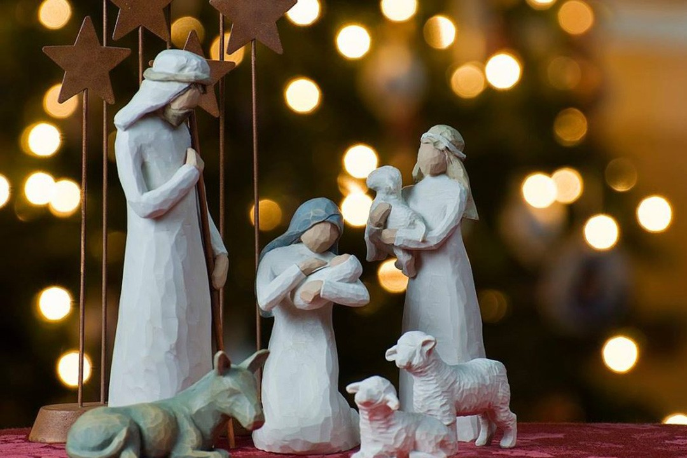

“Para a Doutrina Espírita e para Chico Xavier, que significação especial tem o Natal?”

Os espíritos amigos nos têm ensinado por muitas vezes que, ante o Natal, reformulamos os nossos votos de cristianização da nossa vida pessoal e coletiva, diante de Nosso Senhor Jesus Cristo, a quem nossas vidas estão entregues em nome de Deus.

Aquele que, em sua infinita misericórdia, nos conserva junto de Seu coração infinitamente amoroso, como tutelados no planeta terrestre, abençoando-nos, orientando-nos, tolerando-nos as fraquezas e encaminhando-nos para uma vida melhor.

Devemos com toda a sinceridade asseverar que sem Jesus Cristo em nossas vidas (seja qual for a interpretação que venhamos a dar aos Seus ensinamentos), não estaremos muito longe de uma regressão para as selvas.

Por isso mesmo, o Natal há de ser o coração de Nosso Senhor Jesus Cristo pulsando no mundo, assim como estamos vendo o coração maravilhoso de nosso Divino Mestre palpitando na alegria de toda São Paulo em festiva comemoração para a passagem no natalício d’Aquele que é o maior amor das nossas vidas”.

(Chico Xavier. Pinga-Fogo com Chico Xavier.  FEB.1ª.ed., p.137,139).