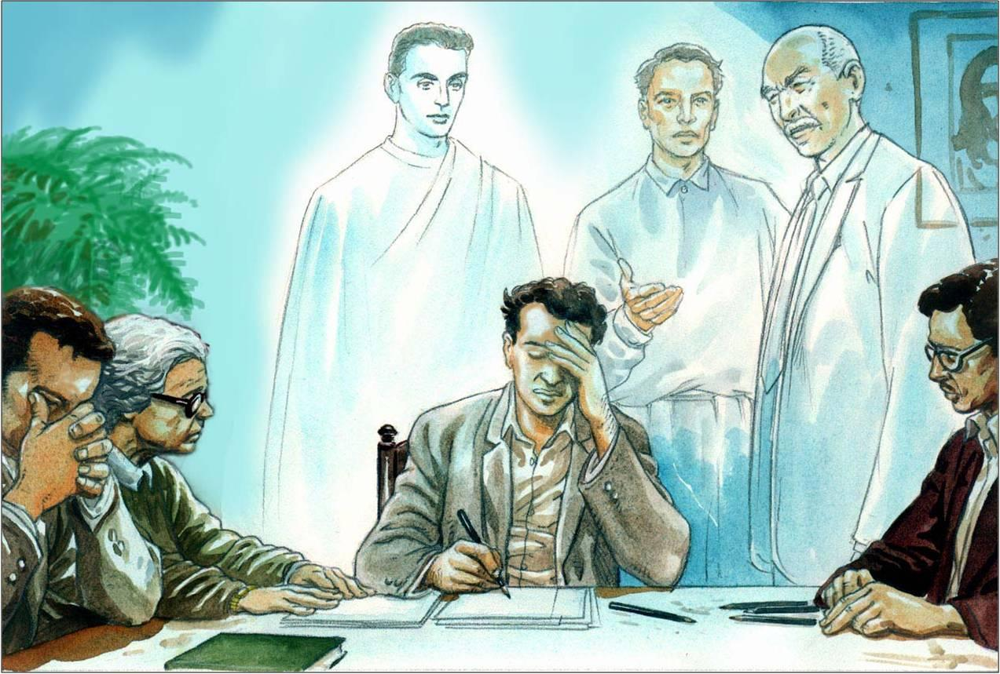

Os médiuns, em sua generalidade, não são missionários na acepção comum do termo; são almas que fracassaram desastradamente, que contrariaram sobremaneira, o curso das leis divinas, e que resgatam, sob o peso de severos compromissos e ilimitadas responsabilidades, o passado obscuro e delituoso.

O seu pretérito, muitas vezes, se encontra enodoado de graves deslizes e de erros clamorosos.

Quase sempre, são Espíritos que tombaram dos cumes sociais, pelos abusos do poder, da autoridade, da fortuna e da inteligência, e que regressam ao orbe terráqueo para se sacrificarem em favor do grande número de almas que desviaram das sendas luminosas da fé, da caridade e da virtude.

São almas arrependidas que procuram arrebanhar todas as felicidades que perderam, reorganizando, com sacrifícios, tudo quanto esfacelaram nos seus instantes de criminosas arbitrariedades e de condenável insânia.

**As oportunidades de sofrimento**

As existências dos médiuns, em geral, têm constituído romances dolorosos, vidas de amargurosas dificuldades, em razão da necessidade do sofrimento reparador; suas estradas no mundo, estão repletas de provações, de continências e desventuras.

Faz-se, porém, necessário que reconheçam o ascetismo e o padecer, como belas oportunidades que a magnanimidade da Providência lhes oferece, para que restabeleçam a saúde dos seus organismos espirituais, combalidos nos excessos de vidas mal orientadas, nas quais se embriagaram à saciedade com os vinhos sinistros dos vícios e do despotismo.

Humilhados e incompreendidos, faz-se mister que reconheçam todos os benefícios emanantes das dores que purificam e regeram, trabalhando para que representam, de fato, o exemplo da abnegação e do desinteresse, reconquistando a felicidade perdida.

**Necessidade de exemplificação**

Todos os médiuns, para realizarem dignamente a tarefa a que foram chamados a desempenhar no planeta, necessitam identificar-se com o ideal de Jesus, buscando para o alicerce de suas vidas o ensinamento evangélico, em sua divina pureza; a eficácia de sua ação depende do seu desprendimento e da sua caridade, necessitando compreender, em toda a amplitude, a verdade contida na afirmação do Mestre: “Dai de graça o que de graça receberdes.”

Devendo evitar, na sociedade, os ambientes nocivos e viciosos, podem perfeitamente cumprir seus deveres em qualquer posição social a que forem conduzidos, sendo uma de suas precípuas obrigações melhorar o seu meio ambiente com o exemplo mais puro de verdadeira assimilação da Doutrina de que são pregoeiros.

Não deverão encarar a mediunidade como um dom ou como um privilégio, sim como bendita possibilidade de reparar seus erros de antanho, submetendo-se, dessa forma, com humildade, aos alvitres e conselhos da Verdade, cujo ensinamento está, frequentemente, numa inteligência iluminada que se nos dirige, mas que se encontra igualmente numa provação que, humilhando, esclarece ao mesmo tempo o espírito, enchendo-lhe o íntimo com as claridades da experiência.

Emmanuel. Emmanuel. Psicografado por Francisco Cândido Xavier.  FEB. 24 ed., p.66-68.