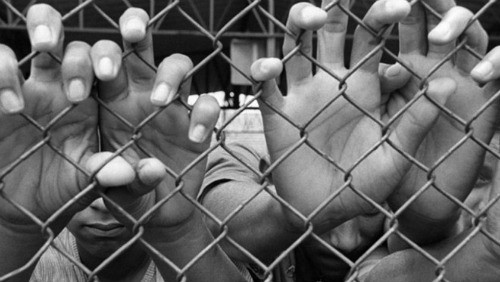

**Será que punir nossos jovens seria a melhor alternativa para acabar com a delinquência, perversidade e violência? Qual é a visão da Doutrina Espírita sobre a Redução da Maioridade Penal? Vejamos o que Joanna de Ângelis nos fala sobre o assunto.**

“A onda crescente de deliquência que se espalha por toda a Terra assume proporções catastróficas, imprevisíveis, exigindo de todos os homens probos e lúcidos acuradas reflexões. Irrompendo, intempestivamente, faz-se avassaladora, em vigoroso testemunho de barbárie, qual se loucura de procedência pestilencial se abatesse sobre as mentes, em particular grassando na inexperiente juventude, em proporções inimagináveis, aflitivas.

  
Sociólogos, educadores, psicólogos e religiosos preocupados com a expressiva mole de delinquentes de toda lavra, especialmente os perversos e violentos, aprofundam pesquisas, improvisam soluções, experimentam métodos mal elaborados, aderem aos impositivos da precipitação, oferecem sugestões que triunfam por um dia e sucumbem no imediato, tudo prosseguindo como antes, senão mais turbulento, mais inquietador.

Os milênios de cultura e civilização parece que nada contribuiíram a beneficio do homem que, intoxicado pela violência generalizada, adotou filosofias esdrúxulas, em tormentosa busca de afirmação , mediante o vandalismo e a obscenidade, em fugas espectaculares para as “origens”.

Numa visão superficial das consequênicias calamitosas desse estado sócio-moral decorrentes, asseveram alguns observadores que a delinquência, a perversidade e a violência fluem, abundantes, dos campos das guerras sujas e cruéis, engendradas pela necessidade da moderna tecnologia em libertar os países super-desenvolvidos do excesso de armamentos bélicos e dos equipamentos militares ultrapassados, gerando focos de conflitos a céus abertos entre povos em fases embrionárias de desenvolvimento ou subdesenvolvimento, martirizados e destroçados às expensas dos interesses econômicos alienígenas, dominadores arbitrários, no entanto, transitórios…

\[…\]

A leviandade de mestres e educadores imaturos, não habilitados moralmente para os relevantes misteres de preparação das mentes e caracteres em formação, contribui, igualmente, com larga quota de responsabilidade no capítulo da delinquência juvenil, da agressividade e da violênica vigentes, ameaçadoras, câncer perigoso a dizimar com crueldade o organismo social do Planeta.

A simples preocupação dos interessados – e a questão nos diz respeito a todos nós -, não resolve, se medidas urgentes e práticas, mediante uma política educativa generalizada, não se fizerem impor antes da erupção de males maiores e das suas consequências em progressão geométrica, apavorantes. Teríamos, então, as cidades transformadas em imensos palcos para o espetáculo cada vez mais rude de delinquência e dos famigerados comparsas.

\[…\] Tem-se procurado reprimir a deliquência sem se combaterem as causas fecundas da sua multiplicação. Muito fácil, parece, a tarefa repressiva, inútil, porém, quando não se transforma em um fator a mais para a própria violência.

A terapêutica para tão urgente questão há de ser preventiva, exigindo dos adultos que se repletem de amor nas inexauríveis nascentes da Doutrina de Jesus, a fim de que, moralizando-se, possam educar as gerações novas, propiciando-lhes clima salutar de sobrevivência psíquica e realização humana.

A valorização da vida e o respeito pela vida conduzirão pais, mestres, educadores, religiosos e psicólogos a uma engrenagem de entendimento fraternal com objetivos harmônicos e metódicos – exemplos capazes de sensibilizar a alma infantil e conduzi-la com segurança às metas felizes que devem perseguir.”

(Joanna de Ângelis. Após a Tempestade. Psicografado por Divaldo Franco. Cap. 7)