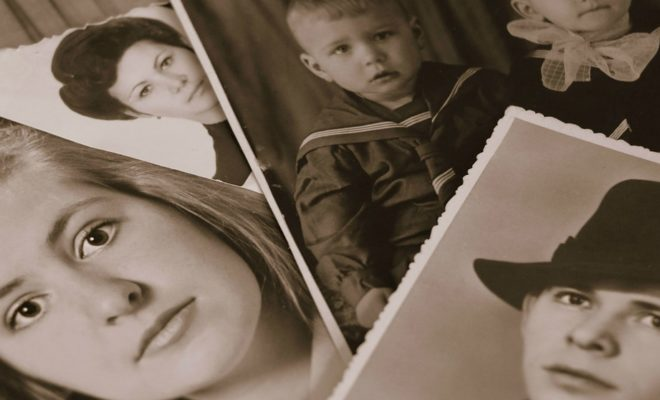
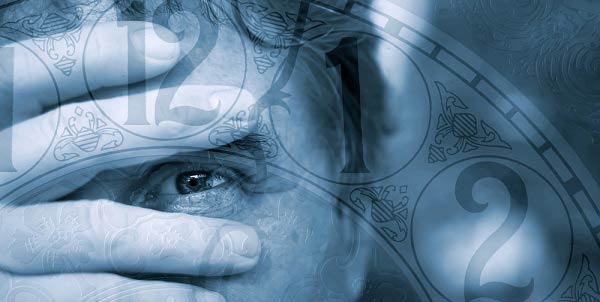

_**Podemos ter algumas revelações a respeito de nossas vidas anteriores?**_

_Nem sempre. Contudo, muitos sabem o que foram e o que faziam. Se se lhes permitisse dizê-lo abertamente, extraordinárias revelações fariam sobre o passado. (Allan Kardec, O livro dos Espíritos, perg.395)_

Muitos dos nossos amigos frequentemente nos procuram, quer  pessoalmente ou através de cartas que nos escrevem, a fim de solicitar informações sobre a reencarnação do próximo em geral e, em particular, a deles próprios. Nada poderemos, porém, acrescentar sobre o assunto às instruções dos Espíritos que organizaram os códigos do Espiritismo. Se, como ficou dito, a lei da Criação encobriu o nosso passado espiritual, será porque o seu conhecimento não traria vantagem para o nosso progresso, antes poderia prejudicá-­lo, como tão habilmente ficou assinalado por Allan  Kardec e seus colaboradores. Todavia, a observação de sábios investigadores das propriedades e forças da personalidade humana, e a prática dos fenômenos espíritas, dão­-nos a conhecer  substanciosos exemplos de que nem sempre o véu do esquecimento é totalmente distendido sobre a nossa memória normal, apagando as recordações de vidas anteriores, pois a verdade é que de quando em vez surgem indivíduos idôneos apresentando lembranças de suas existências passadas, muitas delas verificadas exatas por investigações criteriosas, e a maioria dos casos, senão a totalidade deles, revelando tanta lógica e firmeza nas narrativas, que impossível seria descrer­-se deles sem demonstrar desprezo pela honestidade do próximo. De outro lado, o fenômeno  de recordação de vidas passadas parece mais raro do que em verdade e, uma vez que podemos ter  estranhas reminiscências sem saber que elas sejam o  passado espiritual a se manifestar  timidamente às nossas faculdades, aliás, a maioria das pessoas que as recordam, ignorando os fatos espíritas, sofrem a sua pressão sem saberem, realmente, do que se trata, e por isso não participam a outrem o que com elas se passa.  
        O Espírito Dr. Adolfo Bezerra de Menezes, a quem tanto amamos, observou, em recentes instruções a nós concedidas, que nos manicômios terrestres existem muitos casos de suposta loucura que mais não são que estados agudos de excitação da subconsciência recordando  existências passadas tumultuosas, ou  criminosas, ocasionando o remorso no presente, o mesmo  acontecendo com a obsessão, que bem poderá ser o tumulto de recordações do passado enegrecido  pelos erros cometidos, recordações indevidamente levantadas pela pressão da vítima de ontem transformada em algoz do presente. Muitos chamados loucos, e também certo número de obsidiados, costumam asseverar que foram esta ou aquela personalidade já vivida e fizeram isto ou aquilo, narrando, por vezes, atos deploráveis. Bem poderá acontecer que tais narrativas nada mais sejam que reminiscências, talvez desfiguradas por alguma circunstância de momento, de um passado aflorando para o presente por entre choques traumáticos, causando a alteração nervosa ou mental.  
        A lei divina, que rege a condição do ser encarnado na Terra, estabeleceu o esquecimento  das migrações pretéritas, por se tratar do que mais convém ao comum das criaturas, sendo mesmo  essa a situação normal de cada ser, e, assim sendo, o fato de recordar produzirá choques morais por vezes intensos, na personalidade que assim se destaca, acarretando anormalidades que variam de grau, conforme a situação moral ou consciencial de cada um, pois só quem realmente recorda o próprio passado reencarnatório, no qual faliu, estará capacitado a compreender o desequilíbrio e a amargura que tal situação provoca. Ao que parece, o fato de recordar existências passadas constitui provação para as criaturas comuns, ainda pouco evolvidas, ou concessão ao mérito, nas de ordem mais elevada na escala moral. No primeiro caso, como foi dito acima, verifica-­se, não raro, uma espécie de obsessão, haja ou não haja o inimigo desencarnado a provocar a anormalidade, e, de qualquer forma, uma grande tristeza, um grande desânimo atingirá o que recorda, que pressentirá apenas espinhos e lágrimas no decorrer da existência. E assim como o Espírito desencarnado, de categoria inferior, muitas vezes sofre e se tumultua até à loucura, diante do desfile mental das próprias existências passadas desvirtuadas pelo crime, assim o encarnado se anormalizará sob os choques dos mesmos acontecimentos, por diminutos que sejam.

  
        Não obstante, existem também homens que recordam suas vidas passadas sem padecerem aqueles desequilíbrios, conservando-­se normais. Os médiuns positivos, ou seja, que possuam grandes forças intermediárias (eletromagnetismo, vitalidade, intensidade vibratória, sensibilidade superior, vigor mental em diapasão harmônico com as forças físico­cerebrais), serão mais aptos do que o normal das criaturas ao fenômeno de reminiscências do passado, por predisposições particulares, portanto. Assim sendo, e diante do  vasto noticiário que possuímos acerca do  empolgante acontecimento, temos o direito de deduzir que o fato de recordar o próprio passado  reencarnatório é uma faculdade que bem poderá ser  mediúnica, que, se bem desenvolvida e equilibrada, não alterará o curso da vida do seu  possuidor, mas, se ainda em elaboração e prejudicada por  circunstâncias menos boas, causará lamentáveis distúrbios, tal a mediunidade comum, já que o ser médium não implica a obrigatoriedade de ser espírita. Se aquele que recorda, e por isso sofre desequilíbrios vibratórios, procurar o remédio que o poderá aliviar, nas fontes fecundas do psiquismo, estará salvo de grandes dissabores. Se, ao contrário, desconhecer a origem dos fatos e se alhear do psiquismo, será considerado louco por todas as opiniões, até mesmo para a opinião do seu médico, embora não o seja realmente; e como o manicômio é o último recurso que lhe proporcionaria a cura, segue­-se que ele não se poderá curar.  
(Yvonne A. Pereira, _Recordações da mediunidade_, FEB, 12.ed., p.33-36)