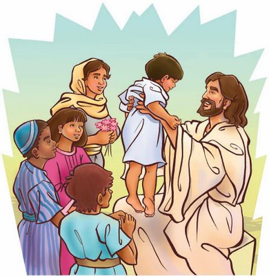

_Você considera importante a preparação da infância através da atividade de evangelização? Por que?_  
   
**Divaldo:** É de alta importância a tarefa da educação espírita das gerações novas. Colocamos aqui a expressão educação espírita, numa abrangência maior do que a da evangelização, porque a evangelização pura e simples pode parecer uma questão já colocada por determinadas doutrinas religiosas do passado. Mas a educação espírita, trazendo a evangelização infanto-juvenil à luz do Espiritismo, é tarefa de emergência, mais do que de urgência, porque a violência e a agressividade que hoje estão nas nossas ruas são fruto da falta de educação da massa, da educação espiritual de profundidade. Diz-se muito que tudo isso é o resultado, em linhas gerais, dos problemas sócio-econômicos. Os estudiosos especializados têm chegado às muitas conclusões. Lamentavelmente, ainda não temos, fora da área espírita, um sociólogo, um pedagogo, que tenha chegado à conclusão de que tudo isso resulta de fatores morais, que são os geradores do egoísmo e, por consequência, dos fatores sócio-econômicos. A base é, portanto, o problema moral.  
    A educação espírita das gerações novas vai criar uma mentalidade sadia, porque ensinará à criança, desde cedo, que o berço não é o início da vida é o começo do corpo. Falando-lhe de reencarnação, situando no seu devido lugar a tarefa preponderante do Cristianismo, a obra da educação das gerações novas preparará o novo mundo. É assim, de muita importância esse mister que os espíritas não devem deixar à margem.  
    Temos ouvido alguns confrades: ” Eu não forço os meus filhos, para a evangelização espírita, porque sou muito liberal.” Ao que poderia ajuntar: “Porque não tenho força moral.” Se o filho está doente, ele o força a tomar remédios; se o filho não quer ir à escola, ele o exige. Isto porque acredita no remédio e na educação. Mas não crê na religião, quando afirma:”Vou deixá-lo crescer, depois ele escolherá.” Isto representa o mesmo que o deixar contaminar-se pelo tétano ou outra enfermidade, para depois aplicar o remédio, elucidando-o: “Você viu que não deve pisar em prego enferrujado? Agora irei medicá-lo.” Ou, tuberculosos, falar-lhe dos preceitos da higiene e da saúde.  
    Se damos a melhor alimentação, o melhor vestuário, o melhor colégio, dentro das nossas possibilidades, aos filhos, porque não lhes damos a melhor religião, que é aquela que já elegemos? Que os filhos, quando crescerem, deixem-na, que optem depois. Cumpre aos pais o dever de dar o que há de melhor. Se eles encontraram , no Espiritismo, a diretriz de libertação, eis o melhor para dar, e não deixar os filhos escolherem, porque estes ainda não sabem discernir. Vamos orientá-los. Vamos “forçá-los”, motivando-os, levando-os, provando em casa, pelo nosso exemplo, que o Espiritismo é o que há de melhor. Não, como fazem muitos: obrigam os filhos irem à evangelização e, em casa, não mantém uma atitude espírita. É natural que os filhos recalcitrem, observando que tal não adianta, já que os pais dizem-se espíritas, mas na intimidade do lar decepcionam. Se, todavia, os pais são espíritas também em casa, eles irão, felizes, às aulas de evangelização da juventude, porque estão impregnados de exemplo.  (Divaldo Pereira Franco, _Diálogo_, p.61-64)