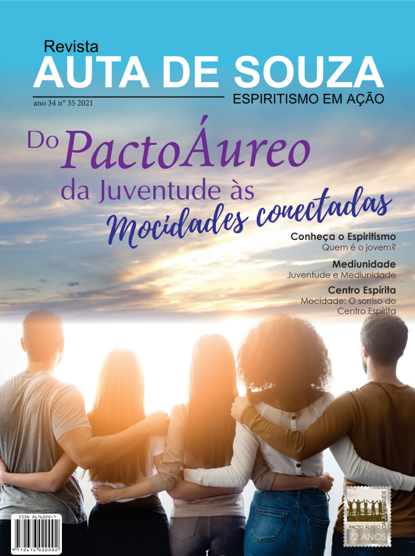
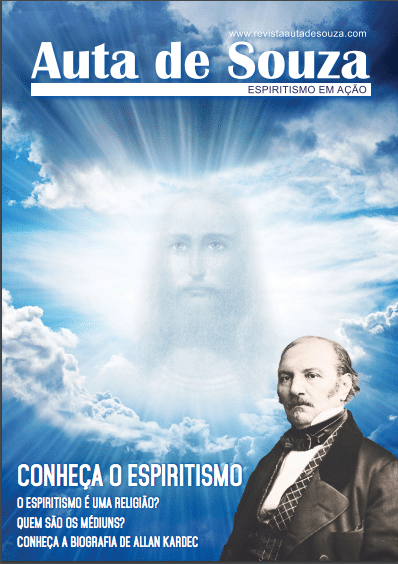
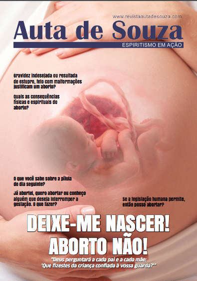
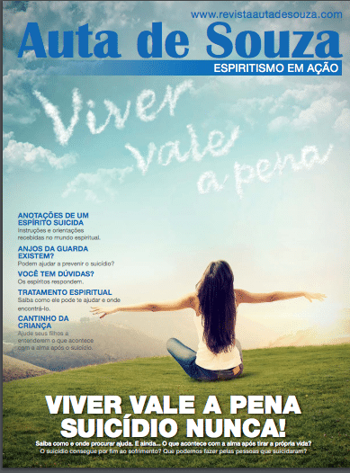
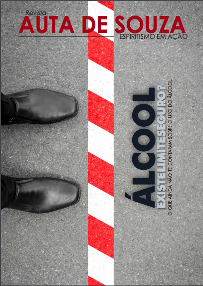
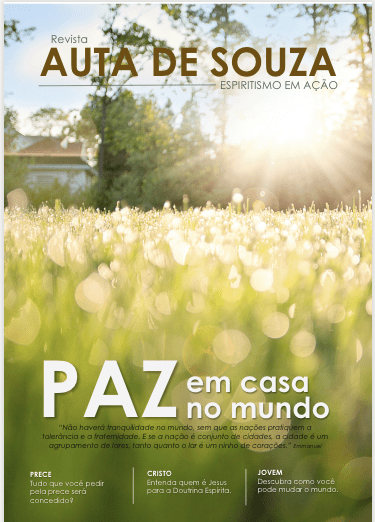
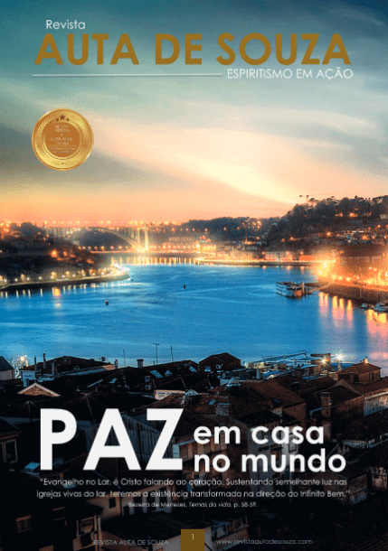
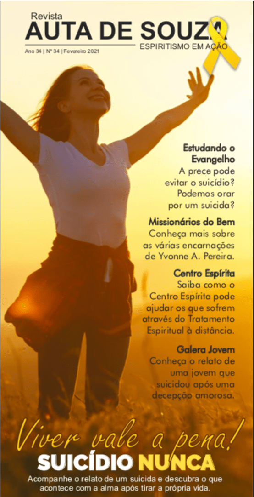

[Revista Auta de Souza – Mocidade Espírita](https://www.revistaautadesouza.com/wp-content/uploads/2021/11/Revista-Mocidade-12.11.2021.pdf)[Baixar](https://www.revistaautadesouza.com/wp-content/uploads/2021/11/Revista-Mocidade-12.11.2021.pdf)

**Mocidade Espírita**  

“O mundo espiritual se rejubila ante os encaminhamentos do programa da evangelização da juventude sobre a Terra. De tempos em tempos grupos de espíritos  
reencarnam com a tarefa de evangelização da humanidade. Basta recordarmos as primeiras iniciativas, no exterior e no Brasil, que já prenunciavam o que hoje é o Instituto do Jovem no Centro Espírita. Os tempos que passamos pedem programas de renovação das mentalidades tendo o Evangelho por roteiro.” Comissão de Mocidade (Editora Auta de Souza, Revista Auta de Souza, ano 34, n. 35, p. 14)

[Revista Auta de Souza – Conheça o Espiritismo](http://161.35.11.199/wp-content/uploads/2020/04/Revista_Auta_de_Souza_-Conheça-o-Espiritismo.pdf)[Baixar](http://161.35.11.199/wp-content/uploads/2020/04/Revista_Auta_de_Souza_-Conheça-o-Espiritismo.pdf)

**Conheça o Espiritismo**  
“Se me amais, guardai meus mandamentos; – e rogarei ao  
meu Pai e Ele vos enviará outro Consolador, a fim de que permaneça eternamente convosco: – O Espírito de Verdade que o mundo não pode receber, porque não o vê e nem o conhece.  
Mas, quanto a vós, ireis conhecê-Lo, porque permanecerá convosco e estará em vós. – Mas o Consolador, que é o Santo Espírito, que meu Pai enviará em meu nome, ensinar-vos-á todas as coisas e vos relembrará tudo o que vos tenho dito.” (S. João, 14:15-17, 26).

.

.

.

[Revista Auta de Souza – Deixe-me Nascer! Aborto Não!](http://161.35.11.199/wp-content/uploads/2020/04/Revista_Auta_de_Souza_-Aborto-1.pdf)[Baixar](http://161.35.11.199/wp-content/uploads/2020/04/Revista_Auta_de_Souza_-Aborto-1.pdf)

O aborto é sempre lamentável porque se já estamos na Terra com elementos  
anticoncepcionais de aplicação suave, compreensível e humanitário, porque é que havemos de criar a matança de crianças indefesas, com absoluta impunidade, entre as paredes de nossas casas? Isto é um delito muito grave perante a Providência Divina, porque a vida não nos pertence e sim ao poder divino.”

Emmanuel. Entender conversando. Psicografia de  
Francisco Cândido Xavier. FEB, 7. Ed. P.16-17

.

.

.

.

[Revista Auta de Souza – Viver vale a pena!](http://161.35.11.199/wp-content/uploads/2020/04/REVISTA_AUTA_DE_SOUZA-Suicidio.pdf)[Baixar](http://161.35.11.199/wp-content/uploads/2020/04/REVISTA_AUTA_DE_SOUZA-Suicidio.pdf)

“Tem o homem o direito de dispor da sua vida?  
‘Não; só a Deus assiste esse direito. O suicídio  
voluntário importa numa transgressão desta lei.’”  
(Allan Kardec, O livro dos Espíritos, pergunta 944, Editora FEB)

.

.

.

..

.

[Revista Auta de Souza – Álcool, Existe limite seguro?](http://161.35.11.199/wp-content/uploads/2020/05/Revista-Alcoolismo-01-09-.2-1-1.pdf)[Baixar](http://161.35.11.199/wp-content/uploads/2020/05/Revista-Alcoolismo-01-09-.2-1-1.pdf)

Vivemos o momento esperado das viagens interplanetárias, das grandes descobertas científicas, da preocupação maior com a preservação da natureza e dos animais. Assim, não podemos fechar os olhos para o grande mal que destróis vidas e famílias, causa desastres incontáveis e promove o lento suicídio. Um mal que teima estar presente em tantas reuniões familiares ou sociais, às vezes disfarçado como atrativo e convidado de honra: o álcool!  
  
.

.

.

.

.

[Revista Auta de Souza – Paz em casa Paz no mundo](http://161.35.11.199/wp-content/uploads/2020/05/Revista-Auta-de-Souza.-Culto-no-lar-1.pdf)[Baixar](http://161.35.11.199/wp-content/uploads/2020/05/Revista-Auta-de-Souza.-Culto-no-lar-1.pdf)

“Não haverá tranquilidade no mundo, sem que as nações pratiquem a tolerância e a fraternidade.E se a nação é conjunto de cidades, a cidade é um agrupamento de lares, tanto quanto o lar é um ninho de corações.”

Reconhecemos que o lar da atualidade vive a carência do Cristo na sua intimidade. Sofrendo a família a falta dessa Divina presença como cumprir a sua missão na implantação do Reino de paz na nova Terra?  
“Quando o ensinamento do Mestre vibra entre as quatro paredes de um templo doméstico, os pequeninos sacrifícios tecem a felicidade comum.”

.

.

.

.

[Revista Edição Especial Concafras Mundial – Paz em casa, paz no mundo.](http://161.35.11.199/wp-content/uploads/2020/06/Revista-CONCAFRAS-MUNDIAL-1.pdf)[Baixar](http://161.35.11.199/wp-content/uploads/2020/06/Revista-CONCAFRAS-MUNDIAL-1.pdf)

“A fraternidade, na rigorosa acepção do termo, resume todos os deveres dos homens, uns para com os outros; significa: devotamento, abnegação, tolerância, benevolência, indulgência, É, por excelência, a caridade evangélica e a aplicação da máxima: ‘Proceder para com os outros, como gostaríamos que os outros procedessem para conosco. É o oposto do egoísmo.”

.

.

.

.

.

.

[Revista Auta de Souza – Viver vale a Pena, Suicídio Nunca!](https://www.revistaautadesouza.com/wp-content/uploads/2021/04/Revista-Auta-de-Souza-ano-34-nº-34-2021.pdf)[Baixar](https://www.revistaautadesouza.com/wp-content/uploads/2021/04/Revista-Auta-de-Souza-ano-34-nº-34-2021.pdf)

Acompanhe o relato de um suicida e descubra o que acontece com a alma após tirar a própria vida.