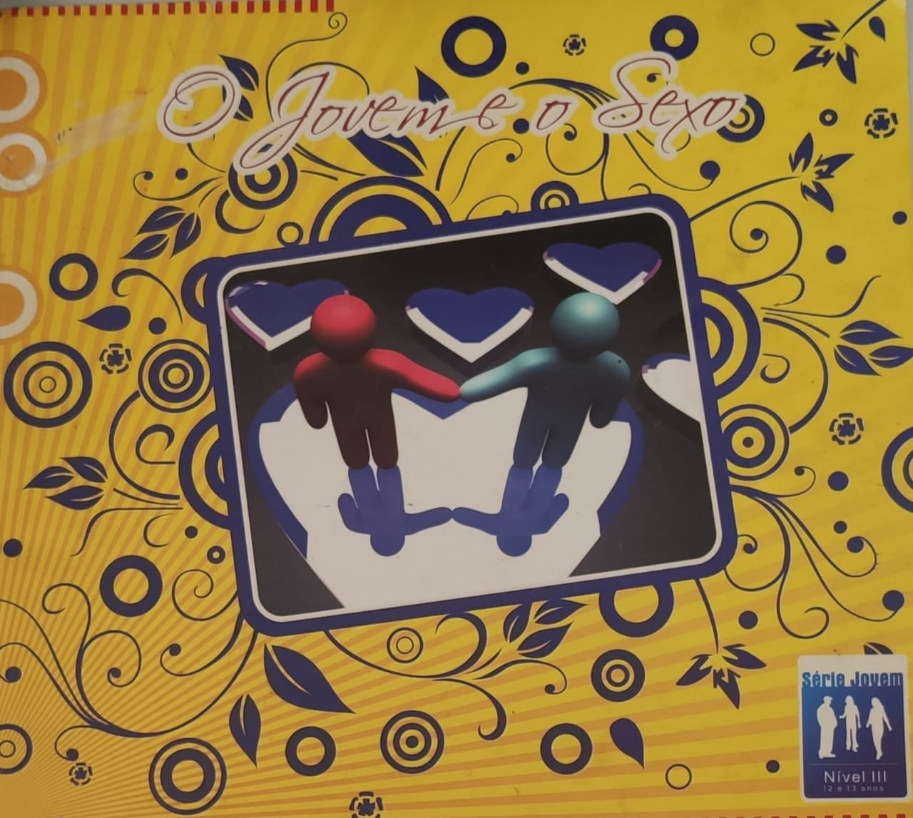

**Sexo**

“O sexo se define, desse modo, por atributo não apenas respeitável mas profundamente santo da Natureza, exigindo educação e controle.  
Por meio dele dimanam forças criativas, às quais devemos, na Terra, o instituto da reencarnação, o templo do lar, as bênçãos da família, as alegrias revitalizadoras do afeto e o tesouro inapreciável dos estímulos espirituais.”

Emmanuel. _Vida e sexo._ Psicografado por Francisco Cândido Xavier. FEB. Capítulo

 “Ignorar o sexo em nossa edificação espiritual seria ignorar-nos. Urge, no entanto, situá-lo a serviço do amor, sem que o amor se lhe subordine.”

 Emmanuel. _Religião dos Espíritos_. Psicografado por Francisco Cândido Xavier. FEB. Cap 53.

##  **Sexo Livre**

 “Relações sexuais, no entanto, envolvem responsabilidade. Homem ou mulher, adquirindo parceira ou parceiro para a conjunção afetiva, não conseguirá, sem dano a si mesmo, tão-somente pensar em si.”  
\[…\]  
“Conferir pretensa legitimidade às relações sexuais irresponsáveis seria tratar “consciências” qual se fossem “coisas”, e se as próprias coisas, na condição de objetos, reclamam respeito, que se dirá do acatamento devido à consciência de cada um?”   
Emmanuel. _Vida e sexo._ Psicografado por Francisco Cândido Xavier. FEB. Cap. 19. 

“Uma terceira pessoa em qualquer compromisso sexual é uma dificuldade a superar, nós não podemos esquecer que a lesão sentimental é talvez mais importante de que uma lesão física.”

Emmanuel. _Novo Mundo._ Psicografado por Francisco Cândido Xavier. FEB. Cap. “Chico Xavier e o Ano Internacional da Criança”.  

**Doenças Sexualmente Transmissíveis**  

“As enfermidades fazem parte dos elementos necessários à evolução dos Espíritos da Terra – ainda planeta de provas e expiações. Podemos adquirir doenças que têm como causas as faltas praticadas em vidas passadas ou foram por nós adquiridas na atual existência, mediante nosso livre-arbítrio. De uma forma ou de outra, temos, portanto, como exemplo, as doenças venéreas, que são, obviamente, transmitidas pelo ato sexual, embora não sejam fruto unicamente da relação sexual, propriamente dita, entre parceiros heterossexuais e homossexuais, mas também pelas carícias íntimas como o beijo e as relações transexuais. Na atualidade, apesar do grande avanço das ciências médicas, dos medicamentos eficazes, dos médicos especializados e da assistência hospitalar, as doenças transmitidas pelo ato sexual estão em crescimento gradativo, a cada ano que passa. Os pesquisadores acreditam que este fato se deve a uma maior liberdade sexual que ocorre em virtude da liberação dos costumes, dos uso indiscriminado dos contraceptivos e pela troca frequente de parceiros. Dentre estas, temos as manifestações poligâmicas, viciando o instinto sexual, lesando fatalmente as criaturas humanas, provocando inevitáveis enfermidades que atingem, de uma forma ou de outra, os campos físico, moral, psíquico e espiritual. Dentre as enfermidades que avassalam a vida orgânica, as doenças venéreas são, apesar de tudo, menos danosas para as criaturas que as sofrem, se as compararmos às consequências desagradáveis e tormentosas das enfermidades radicadas na organização espiritual.”

Walter Barcelos. _Sexo e Evolução_. FEB.  3.ed., p. 69-70 

## **O Relacionamento Responsável**

 _O amor verdadeiro_

“O amor real é expressão de maturidade, de firmeza de caráter, de coerência, de consciência de responsabilidade, que trabalham em favor dos envolvidos no sentimento que energiza, enriquecendo de aspirações pelo bom, pelo belo, pela felicidade. Envolve-se em ternura e não agride, sempre disposto a ceder, desde que do ato resulte o bem-estar para o ser amado.   
Rareia, como é natural, no período juvenil, que o tempo somente consolida mediante as experiências dos relacionamentos bem sucedidos. Há jovens capazes de amar em profundidade, sem dúvida, por serem Espíritos experientes nas lutas evolutivas, encontrando-se em corpos novos, em desenvolvimento, porém investidos da capacidade vigorosa de sentir e entender.”

Joanna de Ângelis. _Adolescência e vida_. Psicografado por Divaldo Franco. Leal. Cap. 7

Deseja saber mais sobre este assunto? Como abordá-lo com a juventude? Saiba mais neste livro desenvolvido para jovens de 12 à 13 anos: **O Jovem e o Sexo**, da Editora Auta de Souza.