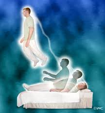

Sonâmbulos sublimes, temo-los no mundo honorificados no Cristianismo, por terem testemunhado, valorosos, a evidência do Plano Espiritual.

E muitos dos mais eminentes sofrem os efeitos de suas atividades psíquicas na própria constituição fisiológica, tolerando, muitas vezes, os tremendos embates das forças superiores, que glorificam a luz, com as forças inferiores que se enquistam nas trevas.

Paulo de Tarso, o apóstolo intrépido, após o comentário de suas próprias visões, fora do corpo denso, exclama na segunda carta aos coríntios: — “E para que me não exaltasse pelas excelências recebidas, foi-me concedido um espinho na carne…”

Antão, o venerado eremita do vilarejo de Coma, no Egito, intensivamente assaltado por Espíritos obsessores, e em estado cataléptico, é tido como morto, despertando, porém, entre aqueles que lhe velavam o suposto cadáver.

Francisco de Assis, o herói da humildade, ouve, prostrado de febre, em Spoleto, as vozes que lhe recomendam retorno à terra natal, para o cumprimento de sua missão divina.

Antônio de Pádua, o admirável franciscano, por várias vezes entra em sono letárgico, afastando-se do corpo para misteres santificantes.

Teresa de Ávila, a insigne doutora da literatura religiosa na Espanha, permanece em regime de parada cardíaca, por quatro dias consecutivos, acordando subitamente, entre círios acesos, quando já se lhe preparava conveniente sepulcro, no convento da Encarnação.

Medianeiros excelsos foram todos eles, pelas revelações que trouxeram do Plano Divino ao acanhado círculo humano.

Entretanto, fora do hagiológio conhecido, encontramos uma infinidade de sonâmbulos outros, em todas as épocas.

Sonâmbulos de inteligência enobrecida e sonâmbulos enfermos na atividade mental.

Sabe-se que Maomé recebia mensagens do Além, no intervalo de convulsões epileptóides.

Dante, apesar do monoideísmo político, registra impressões hauridas por ele mesmo, fora dos sentidos normais.

Através de profundas crises letárgicas, Auguste Comte escreve a sua Filosofia Positiva.

Frederica Hauff, na Alemanha, em princípios do século 19, doente e acamada, entra em contacto com a Esfera Espiritual.

Guy de Maupassant, em França, vê-se obsidiado pelas entidades desencarnadas que lhe inspiram os contos notáveis, habitualmente grafados por ele em transe.

Van Gogh, torturado, pinta, sob influências estranhas, padecendo acessos de loucura.

E além desses sensitivos, categorizados nas classes a que nos reportamos, surpreendemos atualmente os sonâmbulos do sarcasmo, que se valem de assunto tão grave, qual seja o sonambulismo magnético, para motivo de hilaridade, em diversões públicas, com evidente desrespeito à dignidade humana.

Todavia, igualmente hoje, com a bênção do Cristo, vemos a Ciência estudando a hipnose para aplicá-la no vasto mundo patológico em que lhe cabe operar, e a Doutrina Espírita a reviver o Evangelho, disciplinando e amparando os fenômenos da alma, no campo complexo da mediunidade, de modo a orientar a consciência dos homens no caminho da Nova Luz.

Emmanuel, Religião dos Espíritos, 8.ed., p.141