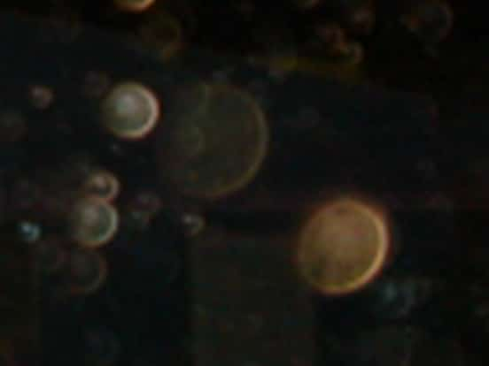
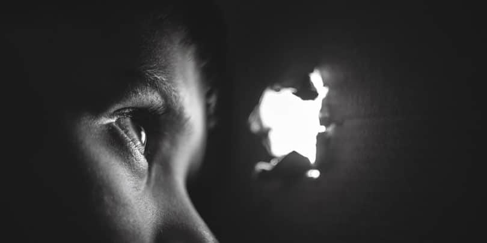

 **Os ovoides**  
  
“O perispírito se dilata ou contrai, se transforma, presta-se, numa palavra, a todas as metamorfoses, de acordo com a vontade que sobre ele atua.” 

Allan Kardec, O livro dos médiuns, 62.ed., item 56  
  
“Quando a revolta se cristaliza no monoideísmo, onde as ideias fixas funcionam como escoadouros de energia, em excessivo dispêncio de forças vitais, pode o espírito chegar facilmente à perda do psicossoma, ovoidizando-se, caso em que se reveste tão-só da túnica energética mental, à maneira de semente em regime de hibernação.” 

Áureo, Universo e vida, 4.ed., p.80  
  
“Inúmeros infelizes, obstinados na ideia de fazerem justiça pelas próprias mãos ou confiados a vicioso apego, quando desafivelados do carro físico, envolvem sutilmente aqueles que se lhes fazem objeto da calculada atenção e, auto hipnotizados por imagens de afetividade ou desforço, infinitamente repetidas por eles próprios, acabam em deplorável fixação monoideística, fora das noções de espaço e tempo, acusando, passo a passo, enormes transformações na morfologia do veículo espiritual, porquanto, de órgãos psicossomáticos retraídos, por falta de função, assemelham-se a ovoides, vinculados às próprias vítimas que, de modo geral, lhes aceitam, mecanicamente, a influenciação, à face dos pensamentos de remorso ou arrependimento tardio, ódio voraz ou egoísmo exigente que alimentam no próprio cérebro, através de ondas mentais incessantes.\[…\]  
No tocante à criatura humana, o obsessor passa a viver no clima pessoal da vítima, em perfeita simbiose mórbida, absorvendo-lhe as forças psíquicas, situação essa que, em muitos casos, se prolonga para além da morte física do hospedeiro, conforme a natureza e a extensão dos compromissos morais entre credor e devedor. 

André Luiz, Evolução em dois mundos, 11.ed., p. 117-118  
  
 **Ovoides e a vampirização de encarnados**  
  
“Evidentemente, as “formas ovoides” haviam sido trazidas pelos hipnotizadores que senhoreavam o quadro.  
Com a devida permissão, analisei a zona física hostilizada. Reparei que todos os centros metabólicos da doente apareciam controlados. A própria pressão sanguínea demorava-se sob o comando dos perseguidores.  
A região torácica apresentava apreciáveis feridas na pele e, examinando-as, cuidadoso, vi que a enferma inalava substâncias escuras que não somente lhe pesavam nos pulmões, mas se refletiam, sobremodo, nas células e fibras conjuntivas, formando ulcerações na epiderme.  
A vampirização era incessante. **As energias usuais do corpo pareciam transportadas às “formas ovóides”, que se alimentavam delas, automàticamente, num movimento indefinível de sucção.\[…\]**  
Por volta de vinte horas, um automóvel recebia o casal, que se fêz acompanhado por nós e pelo grande número de “ovoides”, ainda ligados à cabeça da enferma, sob processo de imantação.  
Margarida, pelo corpo perispirítico, jazia absolutamente presa, não só aos truculentos perturbadores que a assediavam, mas também à **vasta falange de entidades inconscientes**, que se caracterizavam pelo veículo mental, a se lhe apropriarem das forças, **vampirizando-a em processo intensivo**.  
Em verdade, já observara, por mim, grande quantidade de casos violentos de obsessão, mas sempre dirigidos por paixões fulminatórias. Entretanto, ali verificava o cerco tecnicamente organizado. 

André Luiz, Libertação, 13.ed., p. 115,119. Grifos nossos.