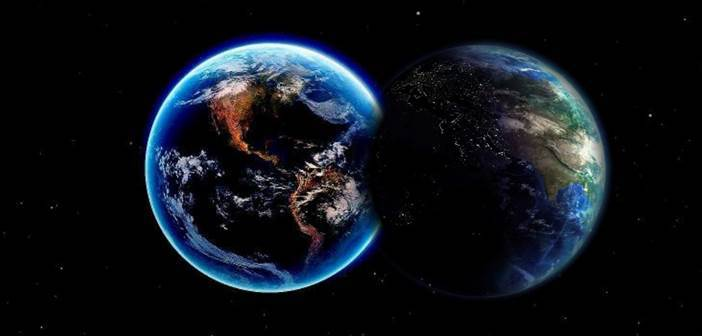

Vive-se, na Terra, o momento da grande transição de mundo de provas e de expiações, para mundo de regeneração.

As alterações que se observam são de natureza moral, convidando o ser humano à mudança de comportamento para melhor, alterando os hábitos viciosos, a fim de que se instalem os paradigmas da justiça, do dever, da ordem e do amor. \[…\]

Observam-se amiúde os pródromos dos sentimentos bons, quando alguém é vítima de uma circunstância aziaga, movimentando grupos de socorro, ao tempo que outras criaturas se transformam em seres-bomba, assassinando, fanática e covardemente outros que nada têm a ver com as tragédias que pretendem remediar por meios mais funestos e inadequados do que aquelas que pretendem combater.

Movimentos de proteção aos animais sensibilizam muitos segmentos da sociedade, no entanto, incontáveis pessoas permanecem indiferentes a milhões de crianças, anciãos e enfermos que morrem de fome cada ano, não por falta de alimento que o planeta fornece, mas por ausência total de compaixão e de solidariedade.

Fenômenos sísmicos aterradores sacodem o orbe com frequência, despertando a solidariedade de outras nações, em relação àquelas que foram vitimadas, enquanto, simultaneamente, armas ditas inteligentes ceifam outras centenas e milhares de vidas, a 

serviço da guerra, ou de revoluções intermináveis, ou de crimes trabalhados por organizações dedicadas ao mal. São esses paradoxos da vida em sociedade, que a grande transição que ora tem lugar no planeta irá modificar. \[…\]

As criaturas que persistirem na acomodação perversa da indiferença pela dor do seu irmão, que assinalarem a existência pela criminalidade conhecida ou ignorada, que firmarem pacto de adesão à extorsão, ao suborno, aos diversos comportamentos delituosos do denominado colarinho branco, mantendo conduta egotista, tripudiando sobre as aflições do próximo, comprazendo-se na luxúria e na drogadição, na exploração indébita de outras vidas, por um largo período não disporão de meios de permanecer na Terra, sendo exiladas para mundos inferiores, onde irão ser úteis limando as arestas das imperfeições morais, a fim de retornarem, mais tarde, ao seio generoso da mãe-Terra que hoje não quiseram respeitar. \[…\]

Desse modo, as grandes calamidades de uma ou de outra procedência têm por finalidade convidar a criatura humana à reflexão em torno da transitoriedade da jornada carnal em relação à sua imortalidade. As dores que defluem desses fenômenos denominados como flagelos destruidores, objetivam fazer a “Humanidade progredir mais depressa. Já não dissemos ser a destruição uma necessidade Transição Planetária para a regeneração moral dos Espíritos, que, em cada nova existência, sobem um degrau na escala do aperfeiçoamento? Preciso é que se veja o objetivo, para que os resultados possam ser apreciados. Somente do vosso ponto de vista pessoal os apreciais; daí vem que os qualificais de flagelos, por efeito do prejuízo que vos causam. Essas subversões, porém, são frequentemente necessárias para que mais pronto se dê o advento de uma melhor ordem de coisas e para que se realize em alguns anos o que teria exigido muitos séculos”.

Eis, portanto, o que vem ocorrendo nos dias atuais.

As dores atingem patamares quase insuportáveis e a loucura que toma conta dos arraiais terrestres tem caráter pandêmico, ao lado dos transtornos depressivos, da drogadição, do sexo desvairado, das fugas psicológicas espetaculares, dos crimes estarrecedores, do desrespeito às leis e à ética, da desconsideração pelos direitos humanos, animais e da Natureza.\[…\]

Contribuindo na grande obra de regeneração da Humanidade, Espíritos de outra dimensão estão mergulhando nas sombras terrestres, a fim de que, ao lado dos nobres missionários do amor e da caridade, da inteligência e do sentimento, que protegem os seres terrestres, possam modificar as paisagens aflitivas, facultando o estabelecimento do Reino de Deus nos corações.

Equipes de apóstolos da caridade no plano espiritual também descem ao planeta sofrido, a fim de contribuir em favor das mudanças que devem operar-se, atendendo aqueles que se encontram excruciados pela desencarnação violenta, inesperada, ou padecendo o jugo de obsessões cruéis, ou fixados em revolta injustificável, considerando-se adversários da Luz, membros da sanha do Mal, a fim de melhorar a psicosfera vigente, desse modo, facilitando o trabalho dos Mensageiros de Jesus. \[…\]

Não temos outro objetivo, senão estimular os servidores do Bem a prosseguirem no ministério, a qualquer custo, sem desânimo nem contrariedade, permanecendo certos de que se encontram amparados em todas as situações, por mais dolorosas se lhes apresentem. Manuel Philomeno de Miranda. Transição Planetária. Psicografia de Divaldo Pereira Franco. Introdução