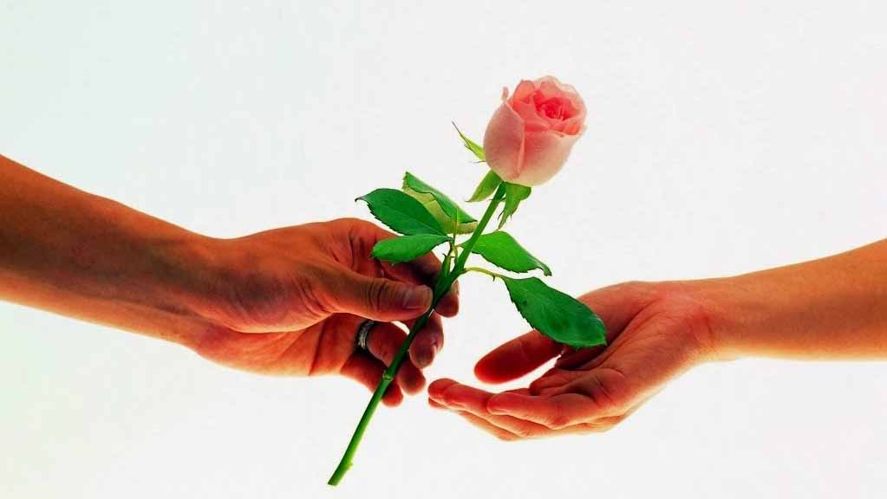

Dolorosa, sem dúvida, a união considerada menos feliz. E, claro, que não existe obrigatoriedade para que alguém suporte, a contragosto, a truculência ou o peso de alguém, ponderando­-se que todo espírito é livre no pensamento para definir­- se, quanto às próprias resoluções. Que haja, porém, equilíbrio suficiente nos casais unidos pelo compromisso afetivo, para que não percam a oportunidade de construir a verdadeira libertação. 

Indiscutivelmente, os débitos que abraçamos são anotados na Contabilidade da Vida, todavia, antes que a vida os registre por fora, grava em nós mesmos, em toda a extensão, o montante e os característicos de nossas faltas. A pedra que atiramos no próximo talvez não volte sobre nós em forma de pedra, mas permanece conosco na figura de sofrimento. E, enquanto não se remove a causa da angústia, os efeitos dela perduram sempre, tanto quanto não se extingue a moléstia, em definitivo, se não a eliminamos na origem do mal. Nas ligações terrenas, encontramos as grandes alegrias, no entanto, é também dentro delas que somos habitualmente defrontados pelas mais duras provações. Isso porque, embora não percebamos de imediato, recebemos, quase sempre, no companheiro ou na companheira da vida íntima, os reflexos de nós próprios.

É natural que todas as conjunções afetivas no mundo se nos figurem como sendo encantados jardins, enaltecidos de beleza e perfume, lembrando livros de educação, cujo prefácio nos enleva com a exaltação dos objetivos por atingir. A existência física, entretanto, é processo específico de evolução, nas áreas do tempo, e assim como o aluno nenhuma vantagem obterá da escola se não passa dos ornamentos exteriores do educandário em que se matricula, o espírito encarnado nenhum proveito recolheria do casamento, caso pretendesse imobilizar­-se no êxtase do noivado. Os princípios cármicos desenovelam-­se com as horas.

Provas, tentações, crises salvadoras ou situações expiatórias surgem na ocasião exata, na ordem em que se nos recapitulam oportunidades e experiências, qual ocorre à semente que, devidamente plantada, oferece o fruto em tempo certo. O matrimônio pode ser precedido de doçura e esperança, mas isso não impede que os dias subsequentes, em sua marcha incessante, tragam aos cônjuges os resultados das próprias criações que deixaram para trás.

A mudança espera todas as criaturas nos caminhos do Universo, a fim de que a renovação nos aprimore. A jovem suave que hoje nos fascina, para a ligação afetiva, em muitos casos será talvez amanhã a mulher transformada, capaz de impor­-nos dificuldades enormes para a consecução da felicidade; no entanto, essa mesma jovem suave foi, no passado – em existências já transcorridas –, a vítima de nós mesmos, quando lhe infligimos os golpes de nossa própria deslealdade ou inconsequência, convertendo-­a na mulher temperamental ou infiel que nos cabe agora relevar e retificar.

O rapaz distinto que atrai presentemente a companheira, para os laços da comunhão mais profunda, bastas vezes será provavelmente depois o homem cruel e desorientado, suscetível de constrangê-­la a carregar todo um calvário de aflições, incompatíveis com os anseios de ventura que lhe palpitam na alma. Esse mesmo rapaz distinto, porém, foi no pretérito – em existências que já se foram – a vítima dela própria, quando, desregrada ou caprichosa, lhe desfigurou o caráter, metamorfoseando-­o no homem vicioso ou fingido que lhe compete tolerar e reeducar.

Toda vez que amamos alguém e nos entregamos a esse alguém, no ajuste sexual, ansiando por não nos desligarmos desse alguém, para depois, somente depois surpreender nesse alguém defeitos e nódoas que antes não víamos, estamos à frente de criatura anteriormente dilapidada por nós, a ferir-­nos justamente nos pontos em que a prejudicamos, no passado, não só a cobrar-­nos o pagamento de contas certas, mas, sobretudo, a esmolar-­nos compreensão e assistência, tolerância e misericórdia, para que se refaça ante as leis do destino.

A união suposta infeliz deixa de ser, portanto, um cárcere de lágrimas para ser um educandário bendito, onde o espírito equilibrado e afetuoso, longe de abraçar a deserção, aceita, sempre que possível, o companheiro ou a companheira que mereceu ou de que necessita, a fim de quitar-­se com os princípios de causa e efeito, liberando-­se das sombras de ontem para elevar-se, em silenciosa vitória sobre si mesmo, para os domínios da luz. (Emmanuel. **Vida e sexo.** Cap.19)