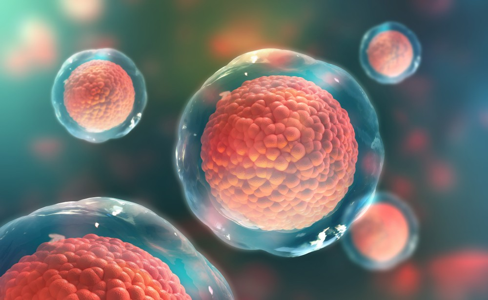
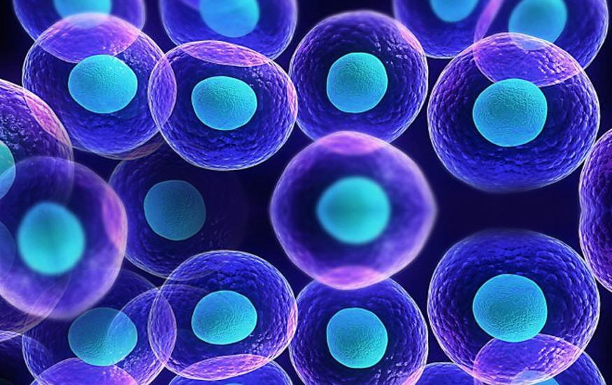

**Marlene Rossi Severino Nobre**, presidente da **Associação Médico-Espírita do Brasil**, analisa a polêmica sobre o emprego de células-tronco e oferece esclarecimentos espíritas:

**Reformador: Como avalia as pesquisas com células-tronco?** 

**Marlene:** Depende de que tipo de células-tronco estamos falando. Primeiramente é preciso lembrar que as células-tronco são indiferenciadas, quer dizer, em princípio, são capazes de gerar qualquer outra célula. Há dois tipos: a célula-tronco embrionária (CTE), retirada de embriões no início do seu desenvolvimento; e a célula-tronco adulta (CTA), obtida do cordão umbilical, da medula óssea ou de outros tecidos do corpo. As CTEs estão presentes no embrião do 5º ao 15º dia de vida. Para serem empregadas em pesquisa, há necessidade, portanto, de se destruir o embrião. A proposta que está sendo discutida, aqui no Brasil, é a da utilização em pesquisa dos embriões excedentes nas clínicas de reprodução assistida. A Associação Médico Espírita é contra a liberação dessas pesquisas com CTE, uma vez que, até o momento, não se pode ter certeza, se existe ou não Espírito ligado ao embrião. E isto porque a questão 344 de O Livro dos Espíritos afirma, com clareza, que a ligação do Espírito com a matéria se dá na concepção, isto é, no momento em que o gameta masculino se une ao feminino. Kardec afirma em A Gênese (cap. XI) que a ligação do Espírito com o embrião se dá de forma irresistível. Somos a favor das pesquisas, mas com células-tronco adultas, as que já existem nos tecidos do corpo, porque a aplicação delas evita a destruição de embriões, não causa rejeição, e são as únicas que têm demonstrado eficácia terapêutica, até o momento. O Brasil é um dos pioneiros no emprego das CTAs. Destacam-se os trabalhos já publicados pelo Dr. Hans Dohmman e o biólogo Radovan Borojevic, do Hospital Pró-Cardíaco, no Rio de Janeiro, e o Dr. Ricardo Ribeiro dos Santos, na Bahia, tratando de casos graves de insuficiência cardíaca com bons resultados.

**Reformador: Mas, afinal, e a polêmica sobre a utilização dos embriões congelados em pesquisa se, conforme se tem propalado, o destino final deles seria o lixo?**

**Marlene:** Não, o destino final deles não pode e não deve ser o lixo. O descarte é crime. Admitir isso seria “coisificar” o embrião. Desprezar a vida que existe nele. Para evitar que isto aconteça, a ANVISA exige o cadastro dos embriões não implantados. O que se deve fazer é uma melhor regulamentação na produção e no uso dos embriões, a fim de evitarem-se os excedentes. Além disso, hoje já há a possibilidade de se congelar óvulos, o que vai diminuir em muito a produção de excedentes. As clínicas de reprodução assistidas deverão ser fiscalizadas para se coibir a venda de óvulos ou a produção de embriões para a venda.  
**Reformador: Alguns pesquisadores afirmam que, após três anos de congelamento, os embriões ficam inviáveis. Isso é verdade?**

**Marlene:** Não, isso, em alguns casos, não é verdade. Basta ver casos concretos, como o que ocorreu com o menino do interior paulista, Vinícius Dorte, de 6 meses. Antes que ele fosse parar no útero da mãe, passou oito anos congelado num tanque de nitrogênio líquido (Folha de São Paulo, 9/3/2008). O mesmo 7 aconteceu com a menina Laina Beasley, norte-americana, nascida em 2005, e congelada por 13 anos. E há outros casos mais. É claro que o Espírito não está congelado, sua ligação com o embrião é tão-somente magnética. E se esses embriões tivessem sido enviados à pesquisa? Não se teria configurado o aborto? Como responderia, por exemplo, o pesquisador espírita, perante o plano espiritual, se impedisse a reencarnação desses Espíritos? Como dissemos, o embrião congelado pode ter e pode não ter Espírito ligado. Cabe a nós desenvolver e efetuar mais pesquisas.

**Reformador: As células-tronco embrionárias são as únicas que têm possibilidade de dar origem a todo e qualquer tipo de célula do nosso corpo?**

**Marlene:** Teoricamente, sim. Hoje, no entanto, já se sabe que a versatilidade da célula-tronco adulta é enorme. Na verdade, a Medicina só tem obtido bons resultados com o emprego delas. Inclusive, conseguiu-se ir além, produzir as próprias CTEs a partir de células adultas. Duas equipes conseguiram esse feito a partir de fibro-blastos (células dos músculos). Uma delas, da Universidade de Wiscosin-Madison, dos Estados Unidos, conduzida por James Thomson; a outra, da Universidade de Kyoto, no Japão, chefiada por Shynia Yamanaka. Além disso, é preciso não esquecer que as CTEs são muito instáveis, difíceis de ser cultivadas em laboratório. Quando implantadas em animais de experimentação, têm dado um alto índice de rejeição e de câncer. Uma pessoa que viesse a ser tratada com células-tronco embrionárias teria de tomar imunodepressores pelo resto da vida para evitar rejeição. Com o uso da CTA, isso não ocorre por ser retirada do próprio paciente.

**Reformador: E a esperança que tem sido dada a tantos doentes? Afinal, não foram eles que influíram na votação dos deputados, pensando numa cura futura?** 

**Marlene:** Tão cedo não se obterá resultado algum. Segundo Robert Winston, um dos principais especialistas em Bioética, do Reino Unido, em recente entrevista ao jornal inglês The Guardian, a população desconhece as dificuldades que estão por trás das pesquisas com a CTE. Ele também lamentou o fato de os defensores dessas pesquisas gerarem falsas esperanças e exagerarem na campanha utilizada para a sua aprovação.

**Reformador: Qual a questão bioética que mais choca no caso das pesquisas com CTEs?**

**Marlene:** A destruição de embriões humanos para pesquisas. Em uma terapia com CTE é preciso sacrificar cerca de 300 a 400 mil embriões. Além disso, o cultivo in vitro das CTEs necessita da presença de finíssimas camadas de tecidos retiradas dos fetos vivos de qualquer estágio, chamadas _Feeder layers_ e que são “produzidas” no Exterior e vendidas no mercado. Tudo isto implica dilemas éticos graves.

**Reformador: Se houver a liberação do emprego de células-tronco embrion****árias para pesquisa e tratamento, qual será o papel dos espíritas e do Movimento Espírita?**

**Marlene:** Só nos resta acatar a decisão do Supremo Tribunal Federal. O fato, porém, de ser legal não torna o procedimento moralmente aceito. Cada pesquisador deverá agir de acordo com a sua própria consciência. Cremos, no entanto, que a liberação dessas pesquisas vai expor os pontos frágeis das células que não estão sob o comando do modelo organizador biológico. Tudo indica que a célula-tronco embrionária é selvagem, indócil, porque não tem perispírito acoplado. Assim, embora antiético, quem sabe, esse procedimento, ao se tornar legal, permita chegar à conclusão de que existe algo extrafísico no material genético? Tudo é possível.”

Reformador, Maio de 2008