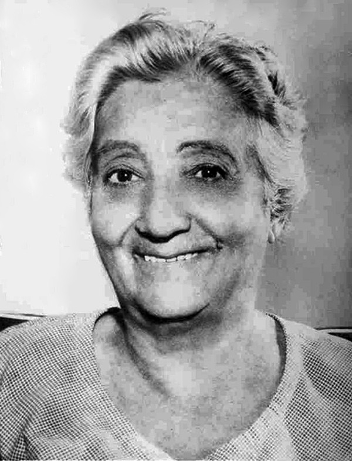
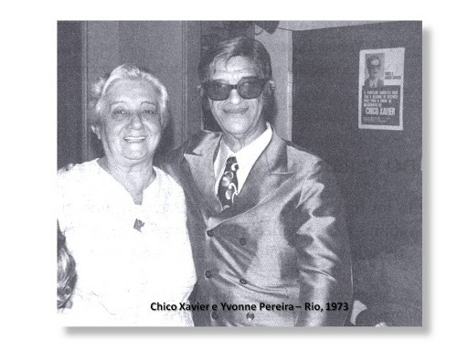

**Nascimento**

“Nasci a 24 de dezembro de 1900.”

“(…) num sítio nos arredores da Vila de Santa Teresa, município de Valença, Estado do Rio de Janeiro, hoje cidade de Rio das Flores.”

“Meus pais eram o então pequeno negociante Manoel José Pereira (filho) e sua esposa Elizabeth do Amaral Pereira.”

“Tive cinco irmãos mais moços do que eu e um mais velho, filho do primeiro matrimônio de minha mãe.”

**Criação**

“Até os dez anos de idade, (…), vivi principalmente, sob os cuidados de minha avó paterna, em vista das anormalidades experimentadas em minha infância com as reminiscências de minha passada existência, anormalidades que não me permitiam viver na casa paterna devido ao fato de minha mãe, rodeada de outros filhos, não dispor de possibilidades para atender aos meus incomodativos complexos trazidos de outras vidas.”

Yvonne do Amaral Pereira. _À luz do consolador_. p. 13

**Religião**

“Nasci em ambiente espírita(…).”

“Recebi, portanto, de meu próprio pai as primeiras lições de doutrina e prática de Espiritismo e Evangelho. Ele fazia, já naquele tempo, reuniões de estudos doutrinários com os filhos, semanalmente, o que a todos nós solidificou na Doutrina Espírita.”

“Ao completar 12 anos de idade, meu pai pôs em minhas mãos “O Evangelho segundo o Espiritismo” e “O Livro dos Espíritos”, de Allan Kardec, os quais me acompanharam na travessia da vida e que estudo até agora, sem jamais me cansar de sua leitura.”

Yvonne do Amaral Pereira. _À luz do consolador._ p. 14-15

**Mediunidade**

“Com um mês de idade, ia sendo enterrada viva devido a um fenômeno de catalepsia, ‘morte aparente’, que sofri, fenômeno que no decorrer de minha existência repetiu-se muitas vezes.”

“Aos 5 anos eu já via Espíritos e com eles falava, e assim continuei até os dias presentes.”

“Nunca desenvolvi a mediunidade, ela apresentou-se por si mesma, naturalmente, sem que eu me preocupasse em atrai-la(…)”

“A primeira vez que me sentei a mesa de sessão prática recebi uma comunicação do Espírito Roberto de Canalejas, tratando de suicídios(…). Antes, porém, já eu me desdobrava em corpo espiritual, pois também esta faculdade apresentou-se na infância.”

“Como médium psicógrafo trabalhei a vida inteira, desde 1926 até 1980, como receitista, assistida por entidade de grande elevação, como Bezerra de Menezes, Bittencourt Sampaio, Augusto Silva, Charles, Roberto de Canalejas(…)”

“Fui e até hoje sou médium conselheiro (…), psicoanalista e passista, assistida pelos mesmos Espíritos.”

“Como médium de incorporação não fui da classe de sonambúlicos, mas falante e tive especialidade para os casos de obsessão e suicidas(…).”

“Fui igualmente médium de efeitos físicos(materializações).”

“(…) minhas outras faculdades foram cultivadas com muito amor, perseverança e respeito, tendo eu seguido fielmente as prescrições de ´O Livros dos médiuns´sem nunca sofrer decepções ao obedecê-las.”

“Segui sempre as orientações dos livros básicos e dos próprios Guias que por mim velavam (…).”

“Falei na tribuna espírita assistida pelos mentores espiritualistas do ano de 1927 ao ano de 1971, 44 anos (…).”

“(…) minha maior tarefa no campo espírita foi através da mediunidade, principalmente no setor de receituário e passes para curas (…).”

“Pratiquei também a literatura mediúnica em livros, crônicas, contos, etc., (…). Colaborei em vários jornais do interior do país e também em ‘Reformador’(…), sob o pseudônimo de ‘Frederico Francisco’, em homenagem ao meu caro amigo Frederico Francisco Chopin.”

“Diariamente mantinha um significativo trabalho de passes e irradiações beneficentes onde quer que residisse. Eram verdadeiras sessões, que eu realizava a sós com Deus e os meus Guias, durante as quais orava pelos desencarnados e lia trechos de Doutrina Espírita ou de Evangelho oferecidos aos mesmos, pedindo a Jesus que os fizesse ouvi-los e co-participar de minhas preces.”

“Muitas vezes via-me rodeada dessas entidades durante esse trabalho, vi-as reconfortadas e satisfeitas, e assim consegui dilatar o meu coração em um grande amor por todas elas.”

“Nos meus quatorze e quinze anos, eu residia nas proximidades do Cemitério Municipal, na cidade fluminense de Barra Mansa, Estado do Rio de Janeiro. Aprazia-me , então, passar as tardes entre os túmulos (…) a título de passeio, a fim de ler na tranquilidade aprazível do local sagrado”.

“Frequentemente, assim sendo, eu percebia Espíritos sofredores ainda achegados aos próprios despojos carnais, que se decompunham sob a terra. Jamais os temi. Nunca me perturbaram ou causaram dano. Eu os amava e compreendia. Ao Espírito suicida (…) nada surpreende, nada atemoriza, nada desespera(…).”

Yvonne do Amaral Pereira. _À luz do consolador_. p. 18

## Memórias de um suicida

“Dentre suas múltiplas especialidades mediúnicas, avultou a psicografia através da qual renomados autores espirituais produziram obras, ao mesmo tempo edificantes e de refinado lavor literário, sobre a ciência e a moral espíritas.  
Também na imprensa espírita Yvonne A. Pereira serviu com inexcedível zelo, legando com seus artigos, invariavelmente fecundos e belos, um critério seguro para os serviços em tão delicado quão importante setor da seara do Espiritismo Cristão.”  
Dentre suas obras psicografadas, destacamos o livro _Memórias de um Suicida_, escrito pelo espírito de Camilo Cândido Botelho, sob orientação do Espírito Léon Denis. Ele “descreve a sua dolorosa experiência no plano espiritual após a desencarnação resultante de suicídio, transmitindo valiosos ensinamentos, especialmente aos que se deixam avassalar pela ideia de pôr termo à existência física.”  
  
Camilo Cândido Botelho. _Memórias de um Suicida_. Psicografia de Yvonne do Amaral Pereira. Editora: Federação Espírita Brasileira.

**Yvonne e sua contribuição na literatura e divulgação Espírita**

*   Memórias de um Suicida – 1954
*   Amor e Ódio- 1956
*   A tragédia de Santa Maria – 1957
*   Nas voragens do Pecado – 1960
*   Ressureição e Vida – 1963
*   Dramas da Obsessão – 1964
*   O Drama da Bretanha – 1974
*   Sublimação – 1974
*   O Cavaleiro de Numiers – 1976
*   Nas teias do infinito – 1977